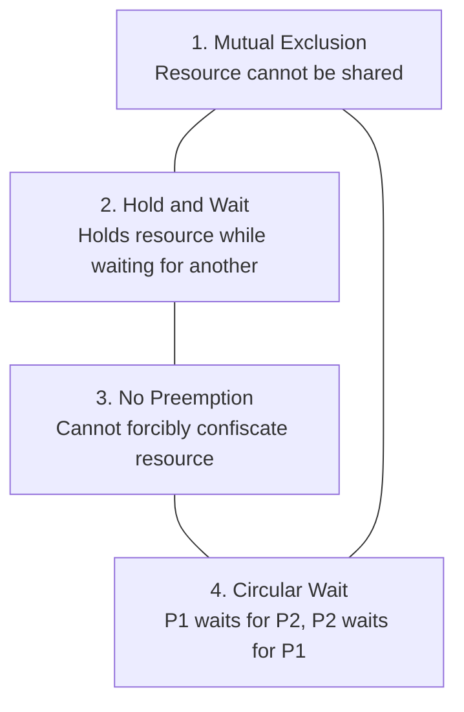

# Concurrency, Synchronization, Race Conditions & Deadlocks

> **Domain:** Core Computer Science  
> **Sub-Domain:** Operating Systems  
> **Interview Importance:** Very High / Frequent Technical Interview Topic  

---

## 1. Topic & Definitions

- **Concurrency vs. Parallelism:**
  - **Concurrency:** The ability of a system to manage multiple tasks by making progress on all of them over overlapping time periods (e.g., rapid context-switching on a single CPU core). It is about *structure*.
  - **Parallelism:** The ability to execute multiple tasks *simultaneously at the exact same physical instant* on distinct physical CPU cores. It is about *execution*.
- **Critical Section:** A segment of code that accesses shared mutable resources (shared memory, files, sockets, database records) that must not be concurrently accessed by more than one thread or process.
- **Race Condition:** An undesirable situation where the final state or output of an operation depends unexpectedly on the non-deterministic execution order, timing, or interleaving of concurrent threads.
- **Mutual Exclusion (Mutex):** A locking mechanism ensuring that only one thread can access a critical section at any given time. Has the concept of **ownership** (only the locking thread can unlock it).
- **Semaphore:** A signaling mechanism based on an integer counter that controls access to a finite number of shared resource instances:
  - **Counting Semaphore:** Initialized to integer $N$ (allowing up to $N$ concurrent threads).
  - **Binary Semaphore:** Initialized to 1; acts like a flag (can be signaled by threads other than the owner).
- **Deadlock:** A permanent blocking condition where two or more processes are unable to proceed because each is waiting for a resource currently held by another in a circular chain.

---

## 2. How It Works: The Synchronization Problem & Deadlock Conditions

### Visualizing a Race Condition (The Lost Update)

```text
Thread 1 (Withdraw $50)                         Thread 2 (Deposit $100)
Initial Balance in RAM: $100
        │                                               │
        ├─ 1. Read balance ($100)                       │
        │                                               ├─ 2. Read balance ($100)
        ├─ 3. Compute $100 - $50 = $50                  │
        │                                               ├─ 4. Compute $100 + $100 = $200
        ├─ 5. Write balance ($50) to RAM                │
        │                                               ├─ 6. Write balance ($200) to RAM
        ▼                                               ▼
Final Balance: $200! (Thread 1's withdrawal of $50 is completely lost due to interleaving)
```

### The 4 Coffman Conditions for Deadlock

A deadlock can **only** occur if **ALL FOUR** of the following conditions hold simultaneously:



1. **Mutual Exclusion:** At least one resource must be held in a non-shareable mode (exclusive access).
2. **Hold and Wait:** A process currently holding at least one resource is requesting additional resources held by other processes.
3. **No Preemption:** Resources cannot be forcibly confiscated from a process; they can only be released voluntarily by the holding process upon task completion.
4. **Circular Wait:** A closed chain of processes $\{P_0, P_1, \dots, P_n\}$ exists where $P_0$ waits for a resource held by $P_1$, $P_1$ waits for $P_2$, and $P_n$ waits for $P_0$.

---

## 3. Deadlock Handling Strategies

```text
+─────────────────────────────────────────────────────────────────────────────────+
|                           DEADLOCK HANDLING STRATEGIES                          |
+─────────────────────────────────────────────────────────────────────────────────+
        │
        ├─ 1. IGNORANCE (Ostrich Algorithm)
        │     • Assume deadlocks never occur. (Adopted by Linux and Windows for general
        │       user space because rare deadlocks cost less than runtime overhead).
        │
        ├─ 2. PREVENTION (Eliminate at least 1 of the 4 Coffman conditions)
        │     • Eliminate Hold & Wait: Require processes to request all resources at once.
        │     • Eliminate No Preemption: Forcibly preempt resources if request cannot be met.
        │     • Eliminate Circular Wait: Impose strict global numeric ordering on all resources;
        │       processes must acquire resources in strictly ascending numerical order.
        │
        ├─ 3. AVOIDANCE (Dynamic runtime safety evaluation)
        │     • Banker's Algorithm (Dijkstra): OS dynamically inspects maximum potential
        │       resource demands. Grants requests only if the resulting state is guaranteed
        │       to remain in a "Safe State" (a valid execution sequence exists).
        │
        └─ 4. DETECTION & RECOVERY
              • Wait-For Graph: Periodically inspect resource allocation graph for cycles.
              • Recovery: Process termination (kill cyclic processes) or resource preemption/rollback.
```

---

## 4. Key Differences & Comparisons

### Mutex vs. Binary Semaphore vs. Spinlock

| Feature | Mutex | Binary Semaphore | Spinlock |
| :--- | :--- | :--- | :--- |
| **Primary Nature** | Locking mechanism with ownership. | Signaling mechanism (Flag). | Busy-wait locking mechanism. |
| **Ownership** | **Strict:** Only the thread that acquired the lock can release it. | **None:** Any thread or interrupt handler can signal (`post`/`up`). | Strict ownership by acquiring thread. |
| **Sleeping vs Busy-Waiting** | Thread is put to sleep (blocked) by OS scheduler if locked. | Thread is put to sleep if semaphore value is 0. | Thread loops in a tight CPU cycle (**burns 100% CPU**) checking lock. |
| **Use Case** | Protecting critical sections in user-space threads. | Synchronizing asynchronous events (e.g. producer-consumer). | Low-latency kernel-level locks held for very few CPU cycles. |

---

## 5. Cybersecurity Relevance & Threat Vectors

### 1. TOCTOU (Time-of-Check to Time-of-Use) Vulnerabilities
- A fundamental software security vulnerability (CWE-367) resulting from non-atomic operations:
  ```text
  Step 1: Check   -> if (access(filePath, W_OK) == 0) // Checks if user has permission
  [RACE WINDOW]   -> Attacker swiftly replaces filePath with symlink to /etc/shadow
  Step 2: Use     -> fd = open(filePath, O_WRONLY)   // Kernel opens /etc/shadow with root privilege!
  ```
- **Remediation:** Use atomic file descriptors (`openat()`, `O_NOFOLLOW`) and never perform file checks by name prior to opening.

### 2. Double-Fetch Vulnerabilities in Kernel Drivers
- When a kernel driver copies a pointer from user space, checks a bounds/length variable, and then re-reads the data buffer from user space in a separate instruction, a malicious user-space thread running on a separate core can modify the length variable in between the two fetches, causing a heap overflow in kernel space.

### 3. Algorithmic Deadlock as Denial of Service (DoS)
- Attackers exploit application concurrency flaws by sending specially crafted concurrent requests designed to trigger circular wait locks in web servers or database transactions, freezing all worker threads and crashing the service.

---

## 6. Interview Takeaway: What to Say Under Pressure

### 🎙️ 60-Second Elevator Pitch
> *"Concurrency is managing multiple tasks out-of-order, while parallelism is executing multiple tasks simultaneously across physical cores. When concurrent threads access shared mutable data without synchronization, race conditions occur, leading to data corruption and security flaws like TOCTOU. We prevent this using mutual exclusion primitives like Mutexes and Semaphores. However, improper synchronization can introduce Deadlocks, where threads permanently block each other. Deadlocks require four Coffman conditions: Mutual Exclusion, Hold and Wait, No Preemption, and Circular Wait. The most practical engineering defense is breaking Circular Wait by enforcing a strict global resource acquisition ordering."*

### ⚠️ Common Traps & Gotchas
- **Trap:** Confusing a Mutex with a Semaphore.  
  *Correction:* Remember the **ownership principle**: *"A mutex is a lock that only the owner can unlock; a semaphore is a signal that any thread can trigger."*
- **Trap:** Believing a race condition only affects performance.  
  *Correction:* Emphasize that race conditions create critical security vulnerabilities, including authentication bypasses, double-spending in financial transactions, and privilege escalation via symlink race exploits.

### ❓ Expected Follow-Up Questions
1. **Q:** What is the difference between Deadlock and Livelock?  
   **A:** In a deadlock, processes are in a blocked/sleeping state waiting for resources. In a **livelock**, processes continuously change their state in response to each other (active CPU consumption), but neither makes any real progress.
2. **Q:** How do you solve the Dining Philosophers problem without deadlock?  
   **A:** By breaking circular wait (e.g. an asymmetric solution where odd philosophers pick left fork first, even philosophers pick right fork first) or limiting concurrent diners.
