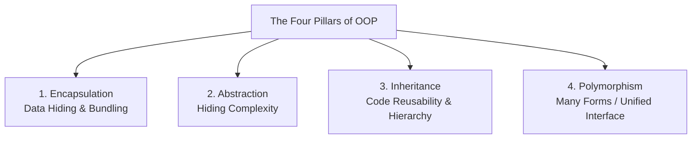

# The Four Pillars of Object-Oriented Programming (OOP)

> **Domain:** Core Computer Science  
> **Sub-Domain:** Software Engineering & OOP  
> **Interview Importance:** Foundational / High Frequency  

---

## 1. Topic & Definitions

- **Object-Oriented Programming (OOP):** A programming paradigm organized around the concept of **Objects**—instances containing both state (**Attributes / Fields**) and behavior (**Methods / Functions**)—rather than linear procedural actions.
- **Class vs. Object:**
  - **Class:** The abstract blueprint, user-defined type, or structural specification defining attributes and methods.
  - **Object:** A concrete, runtime instantiation of a class occupying physical memory on the heap.
- **Constructor & Destructor:**
  - **Constructor:** A specialized method automatically invoked during object instantiation to initialize state and allocate necessary resources.
  - **Destructor / Finalizer:** A method called immediately before an object is destroyed or garbage-collected to release unmanaged resources (e.g. file handles, sockets, database locks).

---

## 2. The Four Pillars Explained in Depth



### 1. Encapsulation (Data Hiding & State Protection)
- **Definition:** Bundling data (attributes) and the methods that operate on that data into a single unit (class), while restricting direct access to internal components from outside the class using **Access Modifiers** (`private`, `protected`, `public`).
- **Mechanism:** Internal fields are declared `private`; access and mutations occur strictly through controlled `getter` and `setter` methods containing business rules and validation logic.
- **Why It Matters in Security:** Enforces strict state integrity. External callers cannot directly corrupt or tamper with sensitive internal states (such as `is_authenticated = True` or `user_role = "admin"`).

---

### 2. Abstraction (Hiding Complexity Behind Clean Interfaces)
- **Definition:** Exposing only the essential interface features of an object while concealing the underlying implementation complexity and internal algorithms from the consumer.
- **Mechanism:** Implemented using **Abstract Classes** and **Interfaces**.
- **Analogy:** When you drive a car, you press the accelerator pedal. You do not need to know the fuel injection timing, spark plug firing sequence, or transmission gear ratio. The pedal is the *abstract interface*.

---

### 3. Inheritance (Hierarchical Code Reuse)
- **Definition:** A mechanism where a new class (derived / child / subclass) inherits properties and behaviors from an existing class (base / parent / superclass), establishing an `"IS-A"` relationship.
- **Types:**
  - **Single Inheritance:** Child inherits from one parent class.
  - **Multilevel Inheritance:** Class A $\rightarrow$ Class B $\rightarrow$ Class C.
  - **Hierarchical Inheritance:** Multiple child classes inherit from a single parent.
  - **Multiple Inheritance:** Child inherits from multiple parents (supported in C++, Python; disallowed in Java/C# to avoid the ambiguous **Diamond Problem**).

---

### 4. Polymorphism ("Many Forms" & Dynamic Dispatch)
- **Definition:** The ability of different classes to respond to the same method call in distinct, specialized ways via a unified common interface.
- **Two Fundamental Forms:**
  1. **Compile-Time Polymorphism (Static / Early Binding):** Method Overloading (same method name, different parameter signatures) and Operator Overloading. Resolved by the compiler at build time.
  2. **Runtime Polymorphism (Dynamic / Late Binding):** Method Overriding (subclass provides a specialized implementation of a method declared in its parent). Resolved at runtime via the **Virtual Method Table (vtable)**.

---

## 3. Key Differences: Abstraction vs. Encapsulation

| Evaluation Dimension | Abstraction | Encapsulation |
| :--- | :--- | :--- |
| **Core Intent** | **Hiding complexity** (Focuses on *WHAT* an object does). | **Hiding internal data** (Focuses on *HOW* an object does it safely). |
| **Implementation** | Achieved via Abstract Classes and Interfaces. | Achieved via Access Modifiers (`private`, `protected`) and Getters/Setters. |
| **Design Level** | Outer architectural and interface design level. | Inner class implementation level. |
| **Security Implication** | Reduces cognitive surface area and decouples components. | Prevents unauthorized tampering with object memory/state. |

---

## 4. Cybersecurity Relevance & Threat Vectors

### 1. Insecure Deserialization (CWE-502)
- OOP languages serialize live objects into byte streams (e.g. Python `pickle`, Java `ObjectInputStream`, PHP `unserialize()`).
- When untrusted user data is deserialized back into an object without validation, the runtime invokes object constructors or magic methods (e.g., `__reduce__()`, `readObject()`), leading to **Remote Code Execution (RCE)**.

### 2. Mass Assignment Vulnerabilities
- Occurs when web frameworks automatically map incoming JSON/HTTP request parameters directly to object fields without checking encapsulation rules:
  ```json
  POST /api/user/profile
  { "name": "Bob", "is_admin": true }
  ```
- If the `User` class does not protect `is_admin` via private encapsulation or a Data Transfer Object (DTO) allowlist, Bob silently promotes himself to administrator.

### 3. Virtual Table (vtable) Hijacking in Memory Corruption
- In C++, runtime polymorphism uses a hidden pointer inside each object (`vptr`) pointing to the class's table of function pointers (`vtable`).
- Attackers who find a heap buffer overflow or Use-After-Free flaw overwrite the object's `vptr` to point to a fake vtable controlled by shellcode, hijacking control flow upon the next virtual method call.

---

## 5. Interview Takeaway: What to Say Under Pressure

### 🎙️ 60-Second Elevator Pitch
> *"Object-Oriented Programming is built on four core pillars: Encapsulation bundles data and methods while hiding internal fields behind access modifiers to prevent unauthorized state tampering; Abstraction hides complex implementation details behind clean interfaces; Inheritance enables hierarchical code reuse through parent-child relationships; and Polymorphism allows a single interface to take multiple forms across subclasses via compile-time overloading or runtime overriding using virtual method tables. In secure application development, encapsulation prevents mass-assignment privilege escalation, abstraction reduces architectural attack surfaces, and careful object lifecycle management prevents memory leaks and insecure deserialization vulnerabilities."*

### ⚠️ Common Traps & Gotchas
- **Trap:** Confusing Method Overloading with Method Overriding.  
  *Correction:* **Overloading** is compile-time polymorphism where methods share the same name but have different parameter types/counts within the same class. **Overriding** is runtime polymorphism where a child class replaces a parent class method with the exact same signature.
- **Trap:** Confusing Encapsulation with Abstraction.  
  *Correction:* Encapsulation is about **data protection** (keeping variables private); Abstraction is about **simplification** (exposing high-level contracts while hiding complex mechanics).
