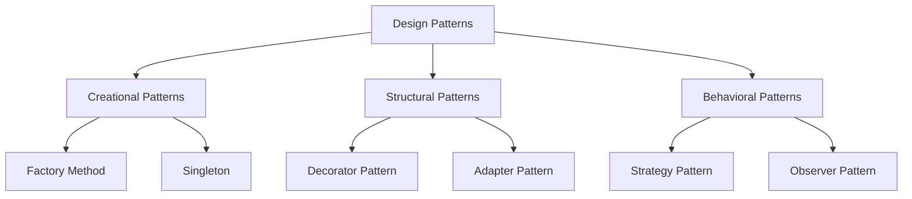

# SOLID Principles, Design Patterns & Architecture Security

> **Domain:** Core Computer Science  
> **Sub-Domain:** Software Architecture & Object-Oriented Design  
> **Interview Importance:** Very High / Senior Engineering & Architecture Interviews  

---

## 1. Topic & Definitions

- **SOLID Principles:** Five fundamental software design principles formulated by Robert C. Martin (Uncle Bob) to create maintainable, decoupled, understandable, and resilient software architectures.
- **Design Patterns:** Reusable, time-tested architectural solutions to common recurring problems in software engineering, classified into **Creational**, **Structural**, and **Behavioral** categories.

---

## 2. The 5 SOLID Principles & Their Cybersecurity Value

```text
+─────────────────────────────────────────────────────────────────────────────+
|                              SOLID PRINCIPLES                               |
+─────────────────────────────────────────────────────────────────────────────+
| S - Single Responsibility Principle  | A class should have one, and only    |
|                                      | one, reason to change.               |
|──────────────────────────────────────┼──────────────────────────────────────|
| O - Open/Closed Principle            | Software entities should be open for |
|                                      | extension, but closed for            |
|                                      | modification.                        |
|──────────────────────────────────────┼──────────────────────────────────────|
| L - Liskov Substitution Principle    | Subtypes must be substitutable for   |
|                                      | their base types without breaking    |
|                                      | application correctness.             |
|──────────────────────────────────────┼──────────────────────────────────────|
| I - Interface Segregation Principle  | Clients should not be forced to      |
|                                      | depend on interfaces they do not use.|
|──────────────────────────────────────┼──────────────────────────────────────|
| D - Dependency Inversion Principle   | Depend upon abstractions, not        |
|                                      | concrete implementations. High-level |
|                                      | modules shouldn't depend on low-level|
+─────────────────────────────────────────────────────────────────────────────+
```

### 1. Single Responsibility Principle (SRP)
- **Concept:** Every module or class should be responsible for exactly one actor or business concern.
- **Security Impact:** Prevents accidental privilege or logic cross-contamination. If a single `UserManager` class handles password hashing, database queries, PDF receipt generation, and email notifications, a bug in PDF rendering can compromise password hashing memory. Isolating security-critical logic (e.g. `PasswordHasher`, `TokenIssuer`) into dedicated single-responsibility classes simplifies security audits and narrows the attack surface.

---

### 2. Open/Closed Principle (OCP)
- **Concept:** Write code so that new features can be added by writing new classes (extension) without modifying existing, tested, and audited source code (closed for modification).
- **Security Impact:** Security algorithms and authentication handlers that have undergone rigorous cryptographic review do not need to be modified when supporting a new authentication provider (e.g., adding WebAuthn). You write a new class implementing the existing `IAuthenticator` interface, leaving proven cryptographic code untouched.

---

### 3. Liskov Substitution Principle (LSP)
- **Concept:** If $S$ is a subtype of $T$, objects of type $T$ may be replaced with objects of type $S$ without altering any desirable properties of the program (correctness, invariants, exceptions).
- **Security Impact:** Subclasses must not weaken pre-conditions or strengthen post-conditions. If a base class `DataAccess` requires an authentication token, a subclass `CachedDataAccess` must not silently bypass token validation. Violations of LSP lead directly to **Authentication and Authorization Bypasses**.

---

### 4. Interface Segregation Principle (ISP)
- **Concept:** Prefer small, fine-grained, client-specific interfaces over massive, "fat" multi-purpose interfaces.
- **Security Impact:** Directly mirrors the **Principle of Least Privilege**. A reporting service only needs read permissions; forcing it to depend on a massive `IUserAccountService` that exposes `deleteUser()` or `resetPassword()` grants unnecessary capability exposure. Splitting into `IUserReader` and `IUserAdmin` enforces minimal privilege contracts.

---

### 5. Dependency Inversion Principle (DIP)
- **Concept:** High-level policy modules should not depend on low-level detail modules; both must depend on abstractions (interfaces).
- **Security Impact:** Decouples core business logic from external infrastructure (e.g. databases, third-party authentication services, hardware HSMs). Enables seamless security testing via mocks and permits hot-swapping vulnerable third-party components without rewriting core business logic.

---

## 3. Essential Design Patterns in Security Architecture



### 1. The Strategy Pattern (Pluggable Security Algorithms)
- **Intent:** Defines a family of algorithms, encapsulates each one, and makes them interchangeable at runtime.
- **Security Application:** Selecting cryptographic ciphers or password hashing algorithms dynamically:
  ```text
  [ PasswordHasher ] ──► Depends on [ IHashStrategy ]
                                            │
                                            ├──► [ Argon2idStrategy ] (Current standard)
                                            ├──► [ BcryptStrategy ]   (Legacy compatibility)
                                            └──► [ PBKDF2Strategy ]   (FIPS compliance)
  ```

### 2. The Decorator Pattern (Security Wrappers & Middleware)
- **Intent:** Attaches additional responsibilities and behaviors to an object dynamically without altering its structure.
- **Security Application:** Constructing HTTP middleware pipelines where security features (Authentication, Rate Limiting, CORS headers, Audit Logging) transparently wrap core request handlers:
  ```text
  Client Request ──► [ RateLimiterDecorator ]
                           │
                           ▼
                     [ AuthenticationDecorator ]
                           │
                           ▼
                     [ AuditLoggerDecorator ]
                           │
                           ▼
                     [ Core Business Handler ]
  ```

### 3. The Singleton Pattern & Its Security Pitfalls
- **Intent:** Ensures a class has only one instance and provides a global access point to it (e.g., Database Connection Pool, Configuration Manager).
- **Security Pitfalls:**
  - **Global Mutable State:** If authentication session state is stored in a Singleton, concurrent user requests corrupt each other's credentials.
  - **Thread-Safety Race Conditions:** Requires **Double-Checked Locking** with volatile variables; otherwise, race conditions spawn duplicate instances.

---

## 4. Interview Takeaway: What to Say Under Pressure

### 🎙️ 60-Second Elevator Pitch
> *"SOLID principles provide the architectural foundation for clean, maintainable, and secure software. SRP isolates critical components like cryptography into dedicated modules; OCP enables adding new security mechanisms without touching audited code; LSP ensures subclasses cannot weaken security checks; ISP enforces the Principle of Least Privilege by breaking fat interfaces into granular contracts; and DIP decouples high-level policy from low-level infrastructure via abstractions. Key design patterns like Strategy enable swappable cryptographic algorithms, Decorators implement zero-overhead security middleware pipelines, and Observers decouple real-time security telemetry and SIEM logging from business logic."*

### ⚠️ Common Traps & Gotchas
- **Trap:** Confusing Dependency Inversion (the principle) with Dependency Injection (the technique).  
  *Correction:* **Dependency Inversion (DIP)** is the high-level design principle stating that high-level modules should depend on abstractions. **Dependency Injection (DI)** is a concrete design pattern/technique (passing dependencies via constructors) used to achieve Dependency Inversion.
- **Trap:** Promoting Singletons unconditionally.  
  *Correction:* Mention that while Singletons are useful for connection pools or configuration registries, they represent global state, hinder unit testing, and introduce concurrency bottlenecks and session leakage risks in multi-threaded web servers.
