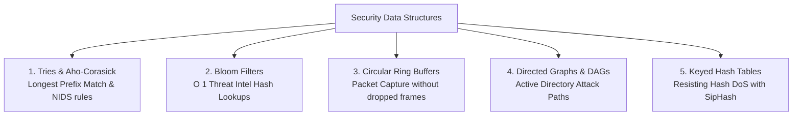

# Data Structures in Security Tools, Threat Detection & Algorithmic Exploits

> **Domain:** Core Computer Science & Applied Cybersecurity  
> **Sub-Domain:** Data Structures in Security Engineering  
> **Interview Importance:** Very High / Distinguishes Junior from Senior Candidates  

---

## 1. Topic & Definitions

- **Security Engineering Data Structures:** Specialized data structures chosen to meet extreme throughput, low latency, and memory constraints in network intrusion detection systems (NIDS), packet analyzers, threat intelligence lookups, and identity graph analysis.
- **Algorithmic Complexity Attack:** An attack where an adversary crafts adversarial inputs designed to force an algorithm from its average-case time complexity (e.g. $O(1)$ or $O(N \log N)$) into its catastrophic worst-case bound (e.g. $O(N^2)$ or $O(2^N)$), causing a severe CPU or memory Denial of Service.

---

## 2. Real-World Security Data Structures



### 1. Tries (Prefix Trees) in IP Routing & NIDS Pattern Matching
- **Longest Prefix Match (LPM) in IP Routing:** When a router evaluates where to forward a packet to `192.168.1.145`, it searches its routing table for the most specific CIDR prefix (`/24` vs `/16`). Standard lists take $O(N)$. A **Binary Trie** evaluates bit-by-bit in $O(32)$ constant steps for IPv4.
- **Aho-Corasick String Matching (Snort & Suricata):**
  - Modern NIDS rule sets contain over 50,000 regex and string signatures for malware.
  - Scanning a packet payload by running 50,000 separate string searches takes $O(K \times N)$ time.
  - The **Aho-Corasick algorithm** compiles all 50,000 signatures into a single finite state machine Trie with failure transitions. It scans the incoming packet in a single linear pass ($O(N)$), matching all 50,000 patterns simultaneously!

---

### 2. Bloom Filters in Threat Intelligence & Malware Lookups
- **The Problem:** A SOC needs to check incoming file hashes against VirusTotal's database of 800 million known malware SHA-256 hashes. Storing 800 million 32-byte hashes in a local hash table requires over 30 GB of RAM.
- **The Solution:** A **Bloom Filter**—a space-efficient probabilistic data structure.
  - Consists of a bit array of $m$ bits, all initially set to `0`.
  - Uses $k$ independent hash functions ($h_1, h_2, \dots, h_k$).
  - When inserting an element, calculate $k$ hashes and set those bits to `1`.
  - When querying: calculate $k$ hashes. If **ANY bit is 0**, the item is **DEFINITIVELY NOT PRESENT** (100% certainty).
- **The Golden Mathematical Guarantee:**
  - **Zero False Negatives:** If the Bloom filter says a hash is NOT malware, it is guaranteed clean.
  - **Small False Positive Rate (e.g. 1%):** If the Bloom filter says "Malicious", the endpoint queries the full remote database to confirm.
  - Requires only a few megabytes of RAM instead of 30 GB!

```text
Bit Array: [ 0 | 1 | 0 | 0 | 1 | 0 | 1 | 0 ]
Hash(file.exe): Hash1=1, Hash2=4, Hash3=6 -> All bits are 1 -> "POSSIBLY MALICIOUS" (Check DB)
Hash(clean.exe): Hash1=0, Hash2=2, Hash3=5 -> Bit 0 is ZERO -> "GUARANTEED CLEAN" (Instant skip!)
```

---

### 3. Circular Ring Buffers in Packet Capture (Wireshark / tcpdump)
- **The Problem:** A 10 Gbps network interface receives millions of packets per second. If the capture tool allocates heap memory (`malloc`) for each incoming packet, memory fragmentation and garbage collection cause massive packet drops.
- **The Solution:** Pre-allocated **Circular Ring Buffers** in kernel shared memory (`AF_PACKET` with `PACKET_MMAP`).
  - Producers (NIC driver) write packets sequentially into fixed slots in the ring.
  - Consumers (packet analyzer) read packets from the tail.
  - Zero dynamic heap allocation at runtime; eliminates dropped frames under peak DDoS traffic.

---

### 4. Directed Graphs & DAGs in Active Directory Attack Path Analysis
- **BloodHound & Neo4j:** Active Directory security relies on graph theory.
  - **Vertices ($V$):** Users, Groups, Computers, Domain Controllers, OUs.
  - **Edges ($E$):** `MemberOf`, `AdminTo`, `GenericAll`, `ForceChangePassword`, `HasSession`.
- **Finding Attack Paths:** Attackers and red teams run **Breadth-First Search (BFS)** or **Dijkstra's Shortest Path Algorithm** on the AD graph:
  ```text
  [ Compromised User ] ──(MemberOf)──► [ HelpDesk Group ]
                                              │
                                       (GenericAll ACL)
                                              ▼
                                     [ Server Admin ] ──(AdminTo)──► [ Domain Controller (SYSTEM) ]
  ```
  BloodHound reveals hidden transitive privilege relationships that human administrators cannot see.

---

## 3. Algorithmic Vulnerabilities: The Hash DoS Attack

```text
Normal Hash Table Insertion:
Hash(Key 1) -> Bucket 2 (O(1))
Hash(Key 2) -> Bucket 7 (O(1))
Hash(Key 3) -> Bucket 4 (O(1))

Adversarial Hash DoS Attack:
Attacker crafts 50,000 keys that all hash to Bucket 0!
Hash(BadKey 1) -> Bucket 0
Hash(BadKey 2) -> Bucket 0 (Appended to linked list)
...
Hash(BadKey 50,000) -> Bucket 0 (List length = 50,000!)
Lookup / Insertion time degrades from O(1) to O(N^2)!
Result: A tiny 2 MB HTTP POST request freezes a multi-core web server at 100% CPU for 10 minutes!
```

### The Fix: SipHash
- Modern web engines (Python, Ruby, Rust, Linux kernel) replaced predictable hash algorithms (like DJB2 or MurmurHash) with **SipHash**, a cryptographically strong pseudo-random function (PRF) initialized with a random per-process secret seed.
- Attackers cannot precompute colliding keys because they do not know the server's runtime seed.

---

## 4. Regular Expression Denial of Service (ReDoS)

- When an unanchored regex contains nested quantifiers with overlapping states (e.g., `(a+)+$`), the underlying **Non-Deterministic Finite Automaton (NFA)** engine exhibits **Catastrophic Backtracking**.
- Processing a malicious string like `aaaaaaaaaaaaaaaaaaaaaaaaaaaa!` takes $O(2^N)$ exponential steps, freezing web application worker threads.
- **Defense:** Use linear-time DFA-based regex engines like Google's **RE2** which guarantee $O(N)$ execution time.

---

## 5. Interview Takeaway: What to Say Under Pressure

### 🎙️ 60-Second Elevator Pitch
> *"Data structures dictate the performance and attack resistance of security systems. In network intrusion detection, Tries and the Aho-Corasick algorithm allow firewalls to match tens of thousands of attack signatures against incoming packet payloads in a single linear $O(N)$ pass. Bloom filters provide $O(1)$ probabilistic set membership with zero false negatives, enabling endpoints to evaluate millions of malicious file hashes with minimal RAM. In identity security, Active Directory attack graphs are analyzed using graph traversal algorithms like BFS and Dijkstra in BloodHound to uncover lateral movement paths. Finally, understanding data structure limits is essential to prevent Algorithmic Denial of Service attacks—such as using SipHash to defeat Hash DoS collisions and RE2 finite automata to prevent catastrophic ReDoS backtracking."*

### ⚠️ Common Traps & Gotchas
- **Trap:** Claiming a Bloom Filter can replace a database entirely.  
  *Correction:* Bloom filters are **probabilistic filters**. They guarantee zero false negatives, but have a controllable false positive rate (they might say an item exists when it doesn't). You still need the primary database to confirm suspected hits and cannot delete items from a standard Bloom filter.
- **Trap:** Believing Hash DoS is an issue of the network layer.  
  *Correction:* Hash DoS is an **application-layer algorithmic exploit** attacking how the web server or runtime library resolves hash collisions in its HTTP parameter map.
