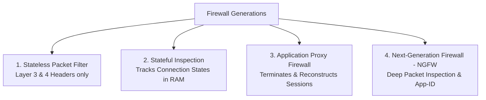

# Firewalls Architecture: Packet Filtering, Stateful Inspection & NGFW

> **Domain:** Networking Fundamentals & Network Security  
> **Sub-Domain:** Network Security Perimeter Devices  
> **Interview Importance:** Very High / Foundational Security Infrastructure  

---

## 1. Topic & Definitions

- **Firewall:** A network security device that monitors, filters, and controls incoming and outgoing network traffic based on predetermined security policies and rulesets. It acts as the primary barrier between a trusted internal network and untrusted external networks.
- **Access Control List (ACL):** A sequential set of permit or deny statements applied to router/firewall interfaces, evaluated from top to bottom with an **Implicit Deny Any** at the end.
- **State Table:** An internal dynamic memory table maintained by stateful firewalls that tracks active Layer 4 TCP connections, UDP pseudo-sessions, and sequence numbers.

---

## 2. Generations of Firewall Architectures



### 1. Generation 1: Stateless Packet Filtering Firewalls
- **How It Works:** Inspects packets individually in complete isolation. Evaluates each packet against rules based solely on header fields: Source IP, Destination IP, Source Port, Destination Port, and Protocol (TCP/UDP/ICMP).
- **Major Weakness:** Cannot distinguish whether an incoming packet is a response to an internally initiated session or an unsolicited external probe. If internal hosts browse the web, the administrator must open all inbound ports above 1024, leaving the network vulnerable.

### 2. Generation 2: Stateful Inspection Firewalls
- **How It Works:** Maintains a dynamic **State Table** recording the 5-tuple, connection states (SYN_SENT, ESTABLISHED), and sequence numbers.
- **The Core Advantage:** When an internal host initiates an outbound TCP handshake to `google.com:443`, the firewall records the session in its state table. When Google's response packet arrives, the firewall validates that it matches an active outbound session and **automatically permits the return traffic**.
- Inbound ports do not need to be left open!

```text
[ Internal Host (10.0.0.5:54321) ] ── (Outbound SYN) ──► [ Stateful Firewall ] ──► [ Web Server ]
                                                                   │
                                                      Creates State Table Entry:
                                                      Src: 10.0.0.5:54321 | Dst: 93.184.216.34:443
                                                      State: ESTABLISHED | Seq/Ack Window
                                                                   │
[ Internal Host ] ◄── (Permits return traffic) ──────── [ Evaluates return ACK ] ◄── [ Web Server ]
```

### 3. Generation 3: Application Proxy Firewalls
- **How It Works:** Acts as an intermediary (man-in-the-middle). The client establishes a connection with the proxy; the proxy terminates the connection, inspects the application payload, and initiates a brand-new separate connection to the destination server.
- Provides deep inspection but introduces substantial latency.

### 4. Generation 4: Next-Generation Firewalls (NGFW)
Modern enterprise standard (Palo Alto Networks, Fortinet FortiGate, Check Point):
- **Deep Packet Inspection (DPI):** Inspects the actual application data payload, not just port numbers.
- **Application Identification (App-ID):** Identifies the application regardless of port or protocol. If an attacker runs SSH over Port 443 or BitTorrent over Port 80, the NGFW detects the application signature and blocks it.
- **SSL/TLS Decryption & Inspection:** Decrypts inbound and outbound encrypted traffic to scan for hidden malware and command-and-control beacons.
- **Integrated Security Modules:** Combines Firewall, Intrusion Prevention System (IPS), Antivirus, and Threat Intelligence feeds in a single hardware appliance.

---

## 3. Comparison Matrix: Firewall Types

| Feature | Stateless Packet Filter | Stateful Inspection | Next-Generation Firewall (NGFW) |
| :--- | :--- | :--- | :--- |
| **OSI Layer** | Layer 3 & Layer 4 | Layer 3 & Layer 4 | **Layers 3 through Layer 7** |
| **State Table Tracking?**| ❌ No | ✅ **Yes** | ✅ **Yes** |
| **Payload Inspection** | ❌ None (Headers only) | ❌ None (Headers only) | ✅ **Deep Packet Inspection (DPI)** |
| **Identifies Apps on Non-Std Ports?**| ❌ No (Tricked by port) | ❌ No | ✅ **Yes (App-ID signatures)** |
| **TLS/SSL Decryption** | ❌ No | ❌ No | ✅ **Yes (Forward proxy decryption)**|
| **Latency / Performance**| Fastest (Wire-speed) | Fast | Higher compute overhead (Hardware ASICs)|

---

## 4. Firewall Rule Evaluation Logic

1. **Top-to-Bottom Execution:** Rules are processed strictly in numerical order from rule 1 downward.
2. **First Match Wins:** As soon as a packet matches a rule's criteria (Permit or Deny), the action is taken immediately, and rule evaluation stops.
3. **Implicit Deny Any:** At the very end of every firewall ruleset sits an unwritten default rule:
   `DENY ANY ANY (Drop all traffic that did not match an explicit permit rule)`.

---

## 5. Cybersecurity Relevance & Threat Vectors

### 1. Port Hopping & Evasion of Traditional Firewalls
- Legacy stateful firewalls allow any traffic on allowed ports (e.g. outbound Port 443).
- Malware authors exploit this by running Command & Control (C2) servers (e.g., Cobalt Strike, Metasploit reverse shells) over Port 443 or Port 53.
- Traditional firewalls see port 443 and allow it. Only an **NGFW** inspects the handshake and blocks non-HTTPS traffic on port 443.

### 2. State Table Exhaustion Attacks
- An attacker floods a stateful firewall with millions of spoofed TCP SYN packets or UDP datagrams.
- The firewall fills its state table memory tracking fake connections, crashing the appliance or causing it to fail open/fail closed (**Denial of Service**).

---

## 6. Interview Takeaway: What to Say Under Pressure

### 🎙️ 60-Second Elevator Pitch
> *"Firewalls enforce network perimeter boundaries by filtering traffic according to policy rules evaluated sequentially with an implicit deny. Stateless firewalls inspect only Layer 3 and 4 headers in isolation. Stateful firewalls track connection lifecycles in an internal state table, dynamically allowing return traffic for established sessions without leaving inbound ports exposed. Next-Generation Firewalls (NGFW) operate up to Layer 7, performing Deep Packet Inspection and SSL decryption to identify applications regardless of port (App-ID) while integrating intrusion prevention systems to block malware and evasion attempts over allowed ports like 443."*

### ⚠️ Common Traps & Gotchas
- **Trap:** Believing a stateful firewall inspects web application attacks like SQL Injection.  
  *Correction:* A standard Layer 4 stateful firewall only verifies TCP states and port numbers; it does not inspect HTTP payloads. To stop SQL Injection or XSS, you need a **Web Application Firewall (WAF)** or an **NGFW** with deep Layer 7 inspection enabled.
- **Trap:** Forgetting the "First Match" rule order.  
  *Correction:* Placing a broad `Permit Any` rule at line 2 will completely nullify specific deny rules configured at line 10.
