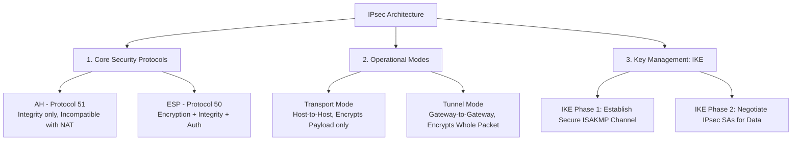

# VPNs, IPsec Architecture, Wireless Security (WPA3) & Zero Trust (ZTNA)

> **Domain:** Networking Fundamentals & Enterprise Security  
> **Sub-Domain:** Encrypted Tunnels, Wi-Fi Protocols & Zero Trust Architecture  
> **Interview Importance:** Very High / Modern Security Engineering Core  

---

## 1. Topic & Definitions

- **Virtual Private Network (VPN):** An encrypted tunnel created over an untrusted public network (like the Internet) that securely extends a private network, providing confidentiality, data integrity, and authentication for transmitted data.
- **IPsec (Internet Protocol Security):** A suite of open cryptographic protocols operating at Layer 3 (Network Layer) that provides end-to-end security services for IP communications.
- **WPA3 (Wi-Fi Protected Access 3):** The modern IEEE 802.11 wireless security standard replacing WPA2, introducing **Simultaneous Authentication of Equals (SAE)** to defeat offline password-cracking attacks.
- **Zero Trust Network Architecture (ZTNA):** A security model based on the principle **"Never trust, always verify."** Treats all network traffic as untrusted, eliminating implicit trust based on network location (inside vs outside the corporate office).

---

## 2. IPsec VPN Architecture Deep Dive

IPsec operates at Layer 3, securing all upper-layer protocols (TCP, UDP, ICMP) transparently.



### 1. AH vs. ESP

| Protocol | Protocol Number | Encryption (Confidentiality)? | Integrity & Authentication? | NAT Traversal (NAT-T) Compatible? |
| :--- | :---: | :---: | :---: | :---: |
| **AH** (Authentication Header) | **51** | ❌ **NO (Cleartext)** | ✅ Yes (Includes outer IP header) | ❌ **INCOMPATIBLE** (NAT rewriting breaks checksum!) |
| **ESP** (Encapsulating Security Payload)| **50** | ✅ **YES (AES-GCM)** | ✅ Yes (Excludes outer IP header) | ✅ **Compatible via NAT-T** (UDP Port 4500) |

> 💡 **Interview Rule:** In modern production environments, **ESP is used almost exclusively**. AH is obsolete because it fails to encrypt data and breaks when traversing NAT gateways.

### 2. Transport Mode vs. Tunnel Mode

```text
ORIGINAL IP PACKET:
[ Original IP Header (Src: 10.0.0.5, Dst: 10.0.0.9) ] [ TCP Header ] [ Application Data ]

TRANSPORT MODE (Host-to-Host / End-to-End):
[ Original IP Header ] [ ESP Header ] [ ENCRYPTED: TCP Header + Data ] [ ESP Trailer ] [ ESP Auth ]
(Only payload is encrypted; original IP addresses remain visible to eavesdroppers!)

TUNNEL MODE (Gateway-to-Gateway / Site-to-Site VPN):
[ New IP Header (Gateway A -> Gateway B) ] [ ESP Header ] [ ENCRYPTED: Entire Original IP Packet ] [ ESP Trailer ]
(The entire original packet—including internal private IPs—is encrypted inside a new public IP packet!)
```

### 3. Internet Key Exchange (IKEv1 / IKEv2 - UDP Port 500)
- **Phase 1:** Negotiates a secure, authenticated management channel (**ISAKMP SA**) using Diffie-Hellman key exchange and pre-shared keys or digital certificates.
- **Phase 2 (Quick Mode in IKEv1):** Uses the secure Phase 1 channel to negotiate the actual **IPsec SAs** (transform sets, encryption algorithms) used to encrypt real application traffic.

---

## 3. Wireless Security Evolution: WEP to WPA3

```text
+─────────────────────────────────────────────────────────────────────────────+
|                          WIRELESS SECURITY TIMELINE                         |
+─────────────────────────────────────────────────────────────────────────────+
| WEP (Wired Equivalent Privacy - 1999):                                      |
|   • Flaw: Static 24-bit Initialization Vector (IV) paired with stream       |
|     cipher RC4. Keystream reuse allows full key cracking in < 5 minutes.    |
|─────────────────────────────────────────────────────────────────────────────|
| WPA2 (Wi-Fi Protected Access 2 - 2004):                                     |
|   • Standard: AES-CCMP encryption.                                          |
|   • Flaw: 4-Way Handshake exposes Message Integrity Code (MIC). Attackers   |
|     sniff the handshake and crack pre-shared keys (PSK) offline using       |
|     dictionary attacks. Vulnerable to KRACK (Key Reinstallation Attack).    |
|─────────────────────────────────────────────────────────────────────────────|
| WPA3 (Wi-Fi Protected Access 3 - 2018):                                     |
|   • SAE (Simultaneous Authentication of Equals / Dragonfly Handshake):      |
|     Replaces 4-way PSK handshake. Eliminates offline dictionary attacks!    |
|     An attacker must interactively guess online with the AP each time.      |
|   • Forward Secrecy: Compromising the Wi-Fi password today cannot decrypt   |
|     past recorded wireless traffic.                                         |
|   • Protected Management Frames (PMF): Disallows deauthentication frames,   |
|     preventing rogue AP deauth disconnect attacks.                          |
+─────────────────────────────────────────────────────────────────────────────+
```

### WPA-Personal (PSK) vs. WPA-Enterprise (802.1X)
- **WPA-Personal (PSK):** Every user shares the same pre-shared Wi-Fi password. (High risk if an employee leaves the company).
- **WPA-Enterprise (802.1X / RADIUS):** Each user authenticates with unique individual enterprise credentials (Active Directory / LDAP username & password or client digital certificates) via **EAP-TLS**, managed by a centralized **RADIUS** server.

---

## 4. Zero Trust Network Access (ZTNA) vs. Traditional VPNs

```text
TRADITIONAL VPN MODEL ("Castle and Moat"):
Remote User ──► [ Authenticates to VPN Gateway ] ──► [ GRANTED ACCESS TO ENTIRE INTERNAL NETWORK! ]
Once inside the perimeter, the user has implicit trust and can scan all subnets (High Lateral Movement Risk).

ZERO TRUST ARCHITECTURE (ZTNA):
Remote User ──► [ Identity-Aware Proxy / ZTNA Broker ] ──► [ Access granted ONLY to Specific App X ]
                • Verifies User Identity (MFA)
                • Evaluates Device Health & Posture
                • Verifies Context (Location, Time, Risk)
                • Micro-tunnels strictly to App X; all other internal resources remain INVISIBLE!
```

---

## 5. Interview Takeaway: What to Say Under Pressure

### 🎙️ 60-Second Elevator Pitch
> *"IPsec provides Layer 3 encryption and authentication using two core protocols: AH for unencrypted integrity, and ESP for authenticated encryption using AES-GCM in either Transport mode (host-to-host) or Tunnel mode (gateway-to-gateway, wrapping the entire packet in a new IP header). IKE negotiates keys via Phase 1 and Phase 2 security associations. In wireless security, WPA3 supersedes WPA2 by introducing Simultaneous Authentication of Equals (SAE) to defeat offline dictionary attacks on pre-shared keys, alongside Protected Management Frames to block deauthentication attacks. Enterprise security is actively transitioning away from traditional VPNs—which grant overly broad network access upon connection—toward Zero Trust Network Access (ZTNA), which enforces continuous device posture verification and restricts user access strictly to individual authorized applications."*

### ⚠️ Common Traps & Gotchas
- **Trap:** Confusing IPsec Transport Mode and Tunnel Mode.  
  *Correction:* Transport mode encrypts **only the payload** (retaining original IP headers; used for host-to-host). Tunnel mode wraps the **entire original packet** inside a brand new IP header (used for Site-to-Site VPN gateways).
- **Trap:** Thinking WPA3 allows offline hash cracking.  
  *Correction:* In WPA2, an attacker can capture the 4-way handshake and test millions of passwords per second offline on GPUs. WPA3's SAE Dragonfly handshake mathematically **prevents offline cracking**; every single password guess requires an active, interactive handshake with the Access Point.
