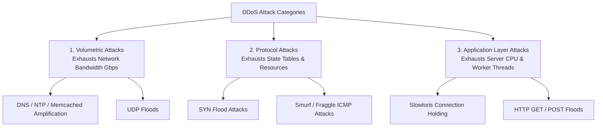

# Network Attacks: Sniffing, Spoofing, MITM & DDoS Architectures

> **Domain:** Networking Fundamentals & Offensive Security  
> **Sub-Domain:** Network Attack Vectors & Denial of Service  
> **Interview Importance:** Very High / Core Security Analyst & Engineering Competency  

---

## 1. Topic & Definitions

- **Packet Sniffing:** Passively intercepting and reading raw data packets traversing a computer network by placing the Network Interface Card (NIC) into **Promiscuous Mode**.
- **Spoofing:** Falsifying identifying metadata in network protocols (IP address, MAC address, email header, or DNS response) to impersonate a legitimate host or deceive a target system.
- **Man-in-the-Middle (MitM):** An active attack where an adversary secretly relays, intercepts, and potentially alters communications between two parties who believe they are communicating directly.
- **Session Hijacking:** Exploiting an active authenticated session by guessing or stealing session identifiers or predicting TCP sequence numbers to assume the identity of a legitimate user.
- **DoS vs. DDoS:**
  - **DoS (Denial of Service):** An attack originating from a **single source** aimed at making a machine or network resource unavailable to legitimate users.
  - **DDoS (Distributed Denial of Service):** A coordinated attack originating from **thousands or millions of distributed compromised devices (a Botnet)** flooding target infrastructure with traffic, exhausting bandwidth, memory, or CPU capacity.

---

## 2. Taxonomy of Denial of Service (DDoS) Attacks

DDoS attacks are categorized into three distinct architectural tiers:



---

### 1. Volumetric Attacks (Bandwidth Exhaustion)
- **Primary Metric:** Gigabits per second (Gbps).
- **Mechanism:** The attacker floods the target's Internet access pipe with sheer volumes of junk traffic, overwhelming transit links and edge routers.
- **Reflection & Amplification Attacks:**
  - The attacker sends small requests with a **spoofed victim source IP** to open public servers (reflectors) that generate disproportionately massive responses.
  - **Memcached Amplification:** 1 request byte $\to$ up to **50,000 response bytes** (50,000x amplification factor!).
  - **DNS Amplification:** Querying for `ANY` or large `TXT` records via public open resolvers.

---

### 2. Protocol Attacks (State Table & Buffer Exhaustion)
- **Primary Metric:** Packets per second (Pps).
- **Mechanism:** Exploits weaknesses in Layer 3 and Layer 4 protocols to exhaust state table memory in firewalls, load balancers, and operating system kernels.
- **SYN Flood Attack:** Exhausts the target's TCP SYN backlog queue by sending continuous SYN packets with forged IP addresses without sending the completing ACK. (Mitigated via **SYN Cookies**).
- **Smurf Attack (Legacy):** Attacker sends an ICMP Echo Request (ping) with the victim's spoofed source IP to a network's broadcast address (`255.255.255.255`). All hosts on the subnet reply simultaneously to the victim. (Mitigated by routers dropping directed broadcasts).

---

### 3. Application Layer Attacks (Layer 7 Resource Starvation)
- **Primary Metric:** Requests per second (Rps).
- **Mechanism:** Generates seemingly legitimate HTTP/HTTPS requests that force the application to perform expensive database queries, cryptographic decryptions, or file lookups, consuming 100% CPU and exhausting thread pools.
- **Slowloris Attack:**
  - Sits on Layer 7. An attacker opens hundreds of HTTP connections to a web server (e.g. Apache) and transmits partial HTTP headers extremely slowly (e.g. sending one header field every 15 seconds):
    ```http
    GET / HTTP/1.1\r\n
    Host: target.com\r\n
    X-Header: foo\r\n   [...wait 15s...]
    X-Header: bar\r\n   [...wait 15s...]
    ```
  - The web server keeps each socket connection open in memory waiting for the terminating double CRLF (`\r\n\r\n`).
  - **Impact:** Exhausts the web server's maximum connection pool (`MaxClients`) using virtually **zero bandwidth** from a single laptop!
  - **Mitigation:** Deploy an event-driven reverse proxy (Nginx, Envoy) or Cloudflare WAF that buffers headers until complete before delegating to backend worker threads.

---

## 3. Session Hijacking & TCP Sequence Number Prediction

```text
Client (IP A)                                                Server (IP B)
  │                                                               │
  ├────── Data Segment (Seq = 1000, Ack = 5000, Length = 100) ───►│
  │◄───── ACK Segment  (Ack = 1100, Seq = 5000) ──────────────────┤
  │                                                               │
  │    [ ATTACKER INJECTS SPOOFED PACKET: Seq = 1100, Ack = 5000 ]│
  │    (Contains malicious shell command; spoofed from IP A)      │
  │ ─────────────────────────────────────────────────────────────►│
  │                                                               │ Executes command!
```

- In classic unencrypted TCP sessions (Telnet, rlogin), if an attacker can predict the next Sequence and Acknowledgment numbers, they can inject malicious commands directly into the active connection, hijacking the session.
- **Mitigation:** Cryptographically random Initial Sequence Number (ISN) generation in modern OS kernels, and enforcing transport encryption via **TLS** or **SSH**.

---

## 4. Master Defense & Mitigation Architecture

| Attack Vector | Primary Mitigation Strategy |
| :--- | :--- |
| **Packet Sniffing** | Enforce end-to-end encryption (TLS 1.3, SSH, IPsec); use switched networks with 802.1X. |
| **IP Spoofing** | **Unicast Reverse Path Forwarding (uRPF)** on edge routers; BCP 38 egress filtering. |
| **ARP Poisoning** | **Dynamic ARP Inspection (DAI)** and DHCP Snooping on Layer 2 switches. |
| **DNS Spoofing** | **DNSSEC** cryptographic response signing; Source Port Randomization. |
| **Volumetric DDoS** | Upstream scrubbers / Cloud mitigation providers (Cloudflare, AWS Shield, Akamai Anycast). |
| **SYN Flood** | **SYN Cookies** enabled in OS kernel; TCP state proxying on edge firewalls. |
| **Slowloris** | Aggressive HTTP header timeouts; Nginx/HAProxy reverse proxy buffering; WAF rate limiting. |

---

## 5. Interview Takeaway: What to Say Under Pressure

### 🎙️ 60-Second Elevator Pitch
> *"Network attacks target confidentiality via sniffing, authenticity via spoofing and Man-in-the-Middle injections, and availability via Denial of Service. DDoS attacks span three distinct layers: Volumetric attacks like DNS amplification exhaust raw bandwidth pipes in Gbps; Protocol attacks like SYN floods exhaust firewall and OS connection state tables in Pps; and Application Layer attacks like HTTP floods and Slowloris exhaust server thread pools and database CPU in Rps without requiring high bandwidth. Mitigations follow defense-in-depth: BCP 38 anti-spoofing and uRPF defeat reflection attacks, SYN cookies protect transport handshakes, and cloud Anycast scrubbing services absorb multi-terabit volumetric floods before they reach local enterprise links."*

### ⚠️ Common Traps & Gotchas
- **Trap:** Confusing Slowloris with a volumetric HTTP flood.  
  *Correction:* An HTTP flood bombards the server with thousands of completed requests per second. **Slowloris** sends incomplete headers at a drip rate (bytes per minute), consuming all available worker threads while using virtually zero network bandwidth.
- **Trap:** Believing a local firewall can protect against volumetric DDoS.  
  *Correction:* If an adversary sends 100 Gbps of traffic down a 10 Gbps ISP link, your local firewall will drop the packets, but your Internet pipe is already 100% saturated! Volumetric DDoS **must be absorbed upstream** by ISP scrubbing centers or Cloudflare/AWS Anycast networks.
