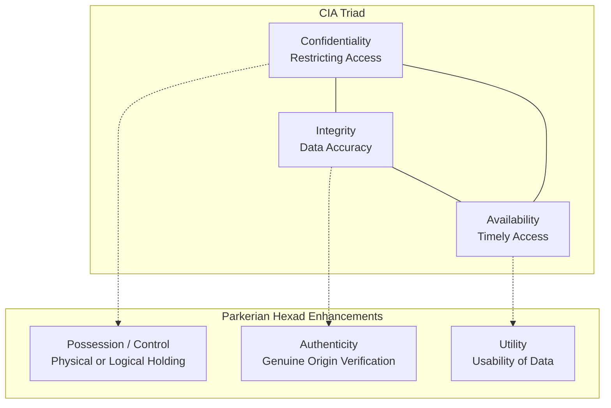

# The CIA Triad, Parkerian Hexad & AAA Security Framework

> **Domain:** Cybersecurity Fundamentals  
> **Sub-Domain:** Security Principles & Governance  
> **Interview Importance:** Foundational / High-Frequency Opening Technical Question  

---

## 1. Topic & Definitions

- **Information Security (InfoSec):** The practice of protecting information and information systems from unauthorized access, use, disclosure, disruption, modification, or destruction.
- **The CIA Triad:** The foundational security model designed to guide policies and controls within an organization across three core pillars: **Confidentiality**, **Integrity**, and **Availability**.
- **The Parkerian Hexad:** An expanded 6-element security framework formulated by Donn B. Parker in 1998, addressing subtle limitations of the traditional CIA triad by introducing **Authenticity**, **Possession / Control**, and **Utility**.
- **AAA Framework:** The architectural security model defining identity management: **Authentication** (verifying identity), **Authorization** (evaluating permissions), and **Accounting** (tracking actions).
- **Non-Repudiation:** The assurance that the sender of a message or the performer of an action cannot deny the authenticity of their signature or transmission.

---

## 2. The CIA Triad vs. Parkerian Hexad



### The CIA Triad Components

| Pillar | Definition & Objective | Real-World Threat / Breach | Primary Defenses & Controls |
| :--- | :--- | :--- | :--- |
| **Confidentiality** | Ensuring that sensitive information is inaccessible to unauthorized individuals, entities, or processes. | Data exfiltration, packet sniffing, credential dumping, unauthorized database queries. | - Encryption at rest (AES-256) & in transit (TLS 1.3)<br>- Access control lists (RBAC/ABAC)<br>- Data Loss Prevention (DLP) |
| **Integrity** | Preserving the accuracy, completeness, and trustworthiness of data and systems over their entire lifecycle. | Data tampering, MITM packet modification, unauthorized SQL updates, malware injection. | - Cryptographic hashing (SHA-256)<br>- Digital signatures (RSA/ECDSA)<br>- File Integrity Monitoring (FIM / Tripwire) |
| **Availability** | Ensuring that authorized users have timely and reliable access to information, applications, and assets when needed. | DDoS attacks, ransomware file locking, hardware failure, power grid collapse, accidental data deletion. | - High Availability (HA) clusters & load balancing<br>- Redundant power & RAID storage<br>- Regular, offline air-gapped backups |

---

### The Parkerian Hexad: Why 3 Pillars Aren't Enough
1. **Possession / Control:**
   - *Scenario:* An attacker steals an encrypted backup tape containing trade secrets. The attacker cannot decrypt the data (Confidentiality is preserved), cannot alter the data (Integrity is preserved), and the company has redundant tapes (Availability is preserved).
   - Under the CIA Triad, no pillar was violated! Yet, a major security breach occurred: the organization lost **Possession and Control** of its physical media.
2. **Authenticity:**
   - Refers to the true origin and attribution of the data. Ensuring an email claiming to originate from the CEO was truly drafted by the CEO, rather than an imposter with a forged header.
3. **Utility:**
   - Refers to the data's **usability**. If an encrypted database key is lost, the data remains complete (Integrity intact) and readable if keys are found, but has zero immediate **Utility** to business operations.

---

## 3. The AAA Framework & Non-Repudiation

```text
User initiates transaction
            │
            ▼
1. AUTHENTICATION (AuthN): "Who are you?"
   • Validates credentials (Password + TOTP MFA Token).
            │
            ▼
2. AUTHORIZATION (AuthZ): "What are you permitted to do?"
   • Checks policy/role: Does user have write permission to /finance/payroll?
            │
            ▼
3. ACCOUNTING (Auditing): "What did you do, and when?"
   • Generates immutable, timestamped audit log: "User Alice transferred $5,000 at 14:02 UTC."
            │
            ▼
NON-REPUDIATION ENFORCED:
User Alice cannot claim: "I never made this transaction!" because the action was signed
with her private digital key and recorded in the tamper-resistant accounting audit log.
```

---

## 4. Balancing Security: The Security vs. Usability Tradeoff

```text
MAXIMUM SECURITY                                                     MAXIMUM USABILITY
(Air-gapped mainframe in vault,                                      (No passwords, zero MFA,
16-factor biometric auth, no internet)                               open public Wi-Fi access)
◄────────────────────────────────────────────────────────────────────────────────────────────►
                                 OPTIMAL BALANCE POINT
                       (Single Sign-On, Passkeys, Risk-based MFA)
```

- If security controls are excessively cumbersome, employees actively bypass them (e.g. writing passwords on sticky notes or emailing sensitive files to personal Gmail to work from home).
- Saltzer and Schroeder's principle of **Psychological Acceptability** mandates that security controls must remain intuitive and usable.

---

## 5. Cybersecurity Relevance & Threat Vectors

### 1. Ransomware Attacks Against Availability and Confidentiality
- Modern **Double-Extortion Ransomware** attacks multiple pillars:
  - First, they exfiltrate sensitive customer databases (**Confidentiality breach**).
  - Second, they encrypt local disks and wipe shadow copies (**Availability breach**).
  - Threatening to publish stolen data if the ransom to restore availability is not paid.

### 2. Digital Signature Bypasses & Non-Repudiation Failure
- If an enterprise fails to protect administrative private keys (e.g. storing them in unencrypted GitHub repositories), an attacker signs malicious software updates with the enterprise certificate (e.g. SolarWinds supply-chain breach), obliterating non-repudiation and software integrity.

---

## 6. Interview Takeaway: What to Say Under Pressure

### 🎙️ 60-Second Elevator Pitch
> *"The foundational model of cybersecurity is the CIA Triad: Confidentiality restricts data access to authorized entities via encryption and RBAC; Integrity guarantees data accuracy and tamper-resistance via cryptographic hashing and digital signatures; and Availability ensures continuous system access through redundancy, load balancing, and backups. The Parkerian Hexad extends this to six pillars by adding Authenticity of origin, physical Possession/Control, and Utility of data. These principles are operationally enforced via the AAA framework—Authentication verifying identity, Authorization enforcing permissions, and Accounting logging actions to guarantee Non-Repudiation."*

### ⚠️ Common Traps & Gotchas
- **Trap:** Confusing Authentication with Authorization.  
  *Correction:* Always state the exact definitions: **Authentication** is proving *identity* ("Who are you?"); **Authorization** is verifying *entitlements* ("What are you allowed to access?").
- **Trap:** Believing encryption guarantees Integrity.  
  *Correction:* Traditional encryption provides **Confidentiality only**. An attacker can intercept and flip bits in ciphertext (bit-flipping attack). To guarantee Integrity alongside Confidentiality, you must use Authenticated Encryption (AEAD, like AES-256-GCM) or pair encryption with an HMAC.
