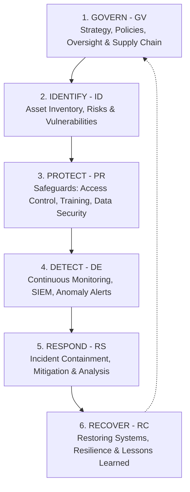

# Security Frameworks & Compliance: NIST CSF 2.0, ISO 27001 & SOC 2

> **Domain:** Cybersecurity Fundamentals  
> **Sub-Domain:** Governance, Risk, Compliance & Frameworks  
> **Interview Importance:** Very High / Management & Senior Engineering Technical Interviews  

---

## 1. Topic & Definitions

- **Security Framework:** A structured, standardized set of guidelines, practices, and controls designed to help organizations establish, manage, benchmark, and mature their cybersecurity posture.
- **Compliance vs. Security:**
  - **Compliance:** Satisfying minimum regulatory or statutory legal mandates (e.g. PCI-DSS, HIPAA). It is a checklist representing a snapshot in time.
  - **Security:** The continuous, real-world operational capability to defend against, detect, and survive sophisticated threat actors.
  > *"Compliance does not equal security, but strong security makes compliance straightforward."*

---

## 2. NIST Cybersecurity Framework (NIST CSF 2.0)

Originally created by the National Institute of Standards and Technology for critical infrastructure, NIST CSF is globally adopted across commercial enterprises. The modern **CSF 2.0** update introduces the overarching **GOVERN** function:



### The 6 Core Functions Detailed:
1. **Govern (GV):** Establishes organizational context, risk management strategy, security policies, roles, and third-party supply-chain risk governance.
2. **Identify (ID):** Understanding the cybersecurity risks to systems, people, assets, data, and capabilities. Creating hardware and software inventories.
3. **Protect (PR):** Implementing safeguards to prevent or contain the impact of potential cybersecurity events (Identity management, access control, data encryption, security awareness training).
4. **Detect (DE):** Developing and implementing activities to identify the occurrence of a cybersecurity event in real time (Continuous logging, SIEM correlation, EDR telemetry).
5. **Respond (RS):** Executing actions regarding a detected cybersecurity incident (Incident containment, eradication, stakeholder communication).
6. **Recover (RC):** Restoring capabilities and services impaired due to a cybersecurity incident, conducting post-incident debriefs, and rebuilding trust.

---

## 3. ISO/IEC 27001 & The ISMS Lifecycle

- **ISO/IEC 27001:** The leading international standard that specifies requirements for establishing, implementing, maintaining, and continually improving an **Information Security Management System (ISMS)**.
- **The Plan-Do-Check-Act (PDCA) Continuous Improvement Cycle:**
  ```text
  PLAN (Establish ISMS context, scope, risk assessment)
    │
    ▼
  DO (Implement risk treatment plan and Annex A controls)
    │
    ▼
  CHECK (Conduct internal audits, monitor metrics, management review)
    │
    ▼
  ACT (Implement corrective actions and continuous improvements)
  ```
- **ISO 27001:2022 Annex A Controls:**
  The revised 2022 standard organized 93 security controls into 4 logical themes:
  1. **Organizational Controls** (37 controls: policies, asset management, cloud governance).
  2. **People Controls** (8 controls: background screening, remote working, NDA).
  3. **Physical Controls** (14 controls: security perimeters, clean desk policies).
  4. **Technological Controls** (34 controls: access control, cryptography, secure coding, DLP).

---

## 4. Key Differences: NIST CSF vs. ISO 27001

| Dimension | NIST CSF | ISO/IEC 27001 |
| :--- | :--- | :--- |
| **Primary Nature** | Voluntary guidance framework; flexible roadmap. | Formal international standard requiring strict certification. |
| **Certification** | Organizations do **not get certified** in NIST CSF. | Organizations undergo rigorous external accredited audits to achieve formal certification. |
| **Target Audience** | Broad: any organization seeking to mature security posture. | Global enterprises, B2B vendors proving security to prospective enterprise customers. |
| **Structure** | 6 Core Functions (Govern, Identify, Protect, Detect, Respond, Recover). | Mandatory Management Clauses (4-10) + Annex A Controls. |
| **Cost** | Free and publicly accessible. | Standards documents must be purchased from ISO. |

---

## 5. Major Regulatory Compliance Mandates

```text
+─────────────────────────────────────────────────────────────────────────────+
|                         REGULATORY COMPLIANCE MATRIX                        |
+─────────────────────────────────────────────────────────────────────────────+
| SOC 2 (Service Organization Control 2 - AICPA):                             |
|   • Focus: Cloud SaaS vendors proving controls across 5 Trust Services      |
|     Criteria: Security, Availability, Processing Integrity, Confidentiality,|
|     and Privacy.                                                            |
|   • SOC 2 Type I: Evaluates the SUITABILITY OF CONTROL DESIGN at a single   |
|     specific point in time (e.g., as of June 30).                           |
|   • SOC 2 Type II: Evaluates the OPERATING EFFECTIVENESS OF CONTROLS over a  |
|     minimum testing period of 6 to 12 months. (Much more rigorous!).        |
|─────────────────────────────────────────────────────────────────────────────|
| PCI-DSS (Payment Card Industry Data Security Standard):                     |
|   • Mandatory for any organization that stores, processes, or transmits     |
|     cardholder data. Mandates network isolation of Cardholder Data          |
|     Environment (CDE), tokenization, encryption, quarterly ASV scans.       |
|─────────────────────────────────────────────────────────────────────────────|
| GDPR (General Data Protection Regulation - EU):                             |
|   • Global privacy mandate protecting EU citizens' personal data.           |
|   • Key requirements: Explicit consent, Right to be Forgotten, Data        |
|     Minimization, and mandatory 72-hour breach notification to authorities. |
|─────────────────────────────────────────────────────────────────────────────|
| HIPAA (Health Insurance Portability and Accountability Act - US):           |
|   • Enforces Privacy and Security Rules protecting Electronic Protected     |
|     Health Information (ePHI) across healthcare entities and BAs.           |
+─────────────────────────────────────────────────────────────────────────────+
```

---

## 6. Interview Takeaway: What to Say Under Pressure

### 🎙️ 60-Second Elevator Pitch
> *"Security frameworks provide the blueprint for enterprise defense. NIST CSF 2.0 organizes security into six continuous functions: Govern, Identify, Protect, Detect, Respond, and Recover, offering a flexible roadmap for risk management. In contrast, ISO/IEC 27001 is a formal international management standard centered around an Information Security Management System (ISMS) and audited against 93 Annex A controls for third-party certification. In cloud B2B environments, SOC 2 reports validate controls against Trust Services Criteria—where a Type I report verifies design at a point in time, and a Type II report tests operating effectiveness over six to twelve months. Finally, regulations like PCI-DSS and GDPR mandate that technical architectures incorporate data minimization, tokenization, and strict breach reporting."*

### ⚠️ Common Traps & Gotchas
- **Trap:** Confusing SOC 2 Type I with Type II.  
  *Correction:* **Type I** assesses control design on a single calendar day (*"Do you have a policy written?"*). **Type II** audits real-world operational evidence over a continuous period of 6 to 12 months (*"Did you actually perform code reviews and enforce MFA for every employee over the entire year?"*).
- **Trap:** Claiming "Our company is certified in NIST CSF."  
  *Correction:* You cannot be certified in NIST CSF. NIST is a voluntary guidance framework with tiers, not an accredited certification scheme like ISO 27001.
