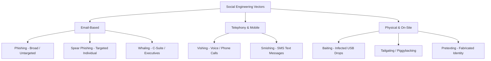

# Social Engineering Tactics, Psychological Triggers & Attack Vectors

> **Domain:** Cybersecurity Fundamentals  
> **Sub-Domain:** Human Factors & Social Engineering  
> **Interview Importance:** High / Core Security Awareness & Initial Access Concept  

---

## 1. Topic & Definitions

- **Social Engineering:** The psychological manipulation of individuals into performing actions, divulging confidential credentials or information, or granting unauthorized physical/logical access.
- **Why It Works:** Technical defenses (firewalls, encryption) do not protect against human psychological vulnerabilities. As Bruce Schneier famously observed: *"Amateurs hack systems, professionals hack people."*

---

## 2. Psychological Triggers Exploited by Social Engineers

Adversaries rely on six fundamental psychological influence triggers (codified by Dr. Robert Cialdini):

```text
+─────────────────────────────────────────────────────────────────────────────+
|                     PSYCHOLOGICAL INFLUENCE TRIGGERS                        |
+─────────────────────────────────────────────────────────────────────────────+
| 1. AUTHORITY:     Impersonating executives (CEO), law enforcement, or IT    |
|                   auditors. Victims comply due to ingrained obedience.       |
|─────────────────────────────────────────────────────────────────────────────|
| 2. URGENCY:       Creating artificial time pressure ("Account suspended in  |
|                   15 minutes!"). Prevents victims from rational analysis.   |
|─────────────────────────────────────────────────────────────────────────────|
| 3. FEAR / INTIMIDATION: Threatening disciplinary action, lawsuits, or firings|
|                   if demands are not immediately met.                       |
|─────────────────────────────────────────────────────────────────────────────|
| 4. GREED / REWARD:Promising free gifts, cryptocurrency windfalls, or massive |
|                   employment bonuses.                                       |
|─────────────────────────────────────────────────────────────────────────────|
| 5. SOCIAL PROOF / LIKING: Fabricating familiarity ("Alice in Accounting sent|
|                   me to help you with this file"). Exploits desire to please|
|─────────────────────────────────────────────────────────────────────────────|
| 6. SCARCITY:      Claiming an opportunity is limited to the first 5 people. |
+─────────────────────────────────────────────────────────────────────────────+
```

---

## 3. Social Engineering Attack Vectors Master Matrix



### Detailed Breakdown of Attack Vectors

| Attack Vector | Target & Method | Typical Real-World Scenario | Defensive Countermeasures |
| :--- | :--- | :--- | :--- |
| **Phishing (Mass)** | Broad, untargeted spam sent to thousands. Generic lures. | Fake Netflix or Microsoft password reset emails with typosquat domains. | Secure Email Gateway (SEG), SPF/DKIM/DMARC, spam filters. |
| **Spear Phishing** | Highly customized email targeting a specific individual, department, or company using OSINT. | An email to the HR team with an attached resume containing a macro virus. | Contextual email warning banners, sandboxing attachments, employee training. |
| **Whaling (CEO Fraud / BEC)** | High-value targets: C-suite executives, CFOs, Board members. High financial payout. | **Business Email Compromise (BEC):** Attacker impersonates CEO emailing CFO: *"Wire $2.5M to Vendor X for confidential merger immediately."* | Multi-party authorization policies for wire transfers, verbal out-of-band verification. |
| **Vishing (Voice Phishing)**| Phone calls using spoofed caller ID and social engineering scripts. | Attacker calls claiming to be IT Support: *"We detect malware on your laptop; read me your 6-digit MFA code."* | Callback verification policies; educating users that IT will NEVER ask for MFA codes. |
| **Smishing (SMS Phishing)** | Mobile text messages with malicious links. | Text message claiming: *"USPS package delayed; click here to pay $1.50 redelivery fee."* | Mobile Device Management (MDM), mobile threat defense, URL filtering. |
| **Pretexting** | Creating an elaborate fabricated story/scenario to deceive a victim. | Attacker pretends to be an auditor conducting an off-site survey to harvest network details. | Mandatory badge verification; zero-trust communication verification. |
| **Baiting** | Leaving a physical medium (USB stick) in a public area tempting curiosity. | Leaving a USB drive labeled *"Q4 Executive Layoffs & Salaries"* in the corporate parking lot. | Disabling endpoint USB ports via GPO/registry; endpoint device control software. |
| **Tailgating (Piggybacking)**| Following an authorized employee through a secure physical door. | Attacker holding heavy boxes asks employee to hold the secure door open. | Physical security mantraps, turnstiles, strict "badge every entrant" policy. |

---

## 4. Technical Defenses Supporting the Human Layer

While employee awareness training and simulated phishing campaigns are essential, technical controls must provide a safety net when humans make mistakes:

1. **Email Authentication Frameworks:**
   - **SPF (Sender Policy Framework):** TXT record specifying authorized sending mail server IPs.
   - **DKIM (DomainKeys Identified Mail):** Cryptographically signs email headers with a private key.
   - **DMARC (Domain-based Message Authentication):** Defines enforcement policy (`reject`, `quarantine`) when SPF or DKIM fail.
2. **FIDO2 / WebAuthn Hardware Security Keys (Passkeys / YubiKeys):**
   - **The Phishing-Resistant MFA Standard:** Cryptographically binds authentication to the exact origin domain in the browser address bar. Even if an employee types their password into a perfect replica phishing site, the hardware key **refuses to sign the token**, completely defeating credential phishing!

---

## 5. Interview Takeaway: What to Say Under Pressure

### 🎙️ 60-Second Elevator Pitch
> *"Social engineering exploits human psychology—primarily authority, urgency, fear, and greed—to bypass technical security controls. Vectors range from broad untargeted phishing, to customized spear-phishing and executive whaling (often driving Business Email Compromise wire fraud), to vishing phone calls and physical tailgating. Defending against social engineering requires pairing continuous employee security awareness simulations with deterministic technical guardrails: enforcing DMARC email policies, out-of-band dual authorizations for financial movements, and adopting FIDO2/WebAuthn hardware tokens, which are mathematically immune to phishing due to cryptographic origin binding."*

### ⚠️ Common Traps & Gotchas
- **Trap:** Claiming "Security Awareness Training will eliminate phishing entirely."  
  *Correction:* Humans are not firewalls. Even the best-trained organizations experience a 3-5% click rate during stress or urgency. Emphasize that training must be backed by technical controls (email sandboxing, EDR, and FIDO2 MFA) that contain the blast radius when a link is inevitably clicked.
- **Trap:** Confusing Spear-Phishing with Whaling.  
  *Correction:* **Spear-phishing** targets specific individuals (e.g. any developer or accountant). **Whaling** is a specialized high-profile sub-category targeting top-level corporate executives (C-suite, board members) for high-stakes fraud or espionage.
