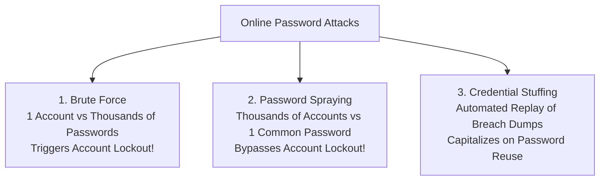

# Password Attacks, Offline Hash Cracking & NIST 800-63B Guidelines

> **Domain:** Cybersecurity Fundamentals  
> **Sub-Domain:** Credential Security & Password Cracking  
> **Interview Importance:** Very High / Common Technical Assessment & IAM Question  

---

## 1. Topic & Definitions

- **Online Password Attack:** An attack conducted directly against a live authentication interface (login page, SSH daemon, API endpoint) where the server verifies credentials and can enforce rate-limiting or lockouts.
- **Offline Password Attack:** An attack conducted after an adversary has already exfiltrated the database containing password hashes. The attacker cracks the hashes locally on high-performance GPU rigs without communicating with the target server (zero rate-limiting; zero lockouts).
- **Password Spraying:** An online attack that attempts **one or two common passwords** across **thousands of different user accounts**, staying below account lockout thresholds.
- **Credential Stuffing:** An automated online attack that tests billions of leaked username/password pairs stolen from third-party data breaches against an organization's login portal, exploiting cross-site password reuse.

---

## 2. Online Password Attack Vectors



### The Lockout Dilemma: Brute Force vs. Password Spraying
- **Standard Account Lockout Policy:** Lock an account for 30 minutes after 5 failed login attempts.
- **Why Brute Force Fails:** If an attacker attempts 10,000 passwords against `alice@company.com`, Alice's account locks after 5 attempts. The attack fails (and causes an operational Denial of Service for Alice).
- **How Password Spraying Bypasses Lockout:**
  - The attacker harvests 5,000 employee email addresses via LinkedIn.
  - The attacker tests **one single password** (e.g. `Welcome2026!` or `Winter2026!`) across all 5,000 accounts.
  - Each account receives exactly **1 failed attempt**—well below the 5-attempt lockout threshold!
  - In a company of 5,000 people, statistical probability guarantees dozens of employees have set that seasonal default password. The attacker gains valid access without triggering a single lockout alert!

---

## 3. Offline Password Cracking & GPU Tooling

Once an attacker compromises an Active Directory `ntds.dit` file or dumps a database table, they take the hashes offline.

```text
OFFLINE CRACKING PIPELINE:
[ Dictionary / Wordlist (e.g. rockyou.txt) ] ──► [ Rule Engine (Mangling Rules) ]
                                                            │
                                                            ▼ (Applies: + "123", Capitalize, leetspeak)
                                                  [ Candidate Plaintext: "Password123!" ]
                                                            │
                                                            ▼ Runs through GPU Hash Algorithm
                                                  [ Candidate Hash Digest ]
                                                            │
                                                            ▼ (Bitwise Match?)
[ Target Exfiltrated Hashes ] ────────────────────► [ MATCH FOUND! Hash Cracked! ]
```

### Cracking Modes (Hashcat / John the Ripper)
1. **Dictionary Attack:** Tests candidate words sequentially from a known wordlist (e.g. `rockyou.txt`).
2. **Rule-Based Attack (The Most Effective):** Takes words from a dictionary and applies programmatic mutation rules:
   - Capitalizing first/last letters (`password` $\to$ `Password`).
   - Leetspeak substitution (`e` $\to$ `3`, `a` $\to$ `@`, `o` $\to$ `0`).
   - Appending digits and years (`Password2026!`).
3. **Mask Attack:** A targeted hybrid brute force where known patterns are specified (e.g. `?u?l?l?l?l?d?d?s` matches an uppercase letter, 4 lowercase, 2 digits, 1 symbol).
4. **Pure Brute Force:** Mathematically tries every possible permutation of characters. Exceedingly slow for lengths $> 10$ characters on slow hashes.

---

## 4. Modern Password Guidelines: NIST SP 800-63B Revolution

For decades, IT organizations enforced arbitrary password policies that paradoxically made systems *less secure*. In **NIST SP 800-63B (Digital Identity Guidelines)**, NIST fundamentally updated password standards:

| Legacy Insecure Practice | NIST SP 800-63B Modern Standard | Technical / Psychological Rationale |
| :--- | :--- | :--- |
| **Mandatory 60 or 90-Day Password Expiry** | ❌ **FORBIDDEN:** Do NOT force periodic changes unless there is evidence of compromise. | Users forced to rotate passwords frequently choose predictable patterns (e.g. `Spring2025!` $\to$ `Summer2025!`), actually weakening security. |
| **Arbitrary Character Composition Rules** | ❌ **DISCOURAGED:** Do not mandate complex mixes of upper, lower, numbers, and symbols. | Leads to predictable substitutions (`P@ssw0rd1!`) rather than truly strong passwords. |
| **Short Passwords (8 characters)** | ✅ **MANDATE PASSPHRASES:** Enforce minimum length of **at least 8 (ideally 15+) characters**. | Length provides exponential entropy growth ($95^{16} \gg 95^8$). Passphrases (`correct-horse-battery-staple`) are easy to remember and hard to crack. |
| **No Compromised Password Checks** | ✅ **MANDATORY CHECK:** Verify user passwords against known breach lists (e.g. HaveIBeenPwned API). | Blocks common passwords, dictionary words, and previously breached credentials upon user registration. |
| **Truncating Long Passwords** | ❌ **FORBIDDEN:** System must support up to **at least 64 characters** and allow all ASCII/Unicode. | Allows spaces and long multi-word passphrases. |

---

## 5. Architectural Defenses Against Password Attacks

1. **Progressive Rate Limiting / Exponential Backoff:**
   Instead of hard account lockouts (which enable DoS), introduce exponential delays: 1st failed attempt = 0s delay, 2nd = 2s, 3rd = 4s, 4th = 16s, 5th = 60s. Completely stalls automated brute-force scripts while avoiding full account lockout.
2. **CAPTCHA / Turnstile Integration:**
   Trigger interactive challenges on suspicious login velocity or after 3 failed attempts to defeat automated bot scripts.
3. **Phishing-Resistant MFA (FIDO2 / WebAuthn):**
   Even if an attacker successfully sprays or cracks a user's password, the absence of the physical hardware authenticator renders the password completely useless for unauthorized access.

---

## 6. Interview Takeaway: What to Say Under Pressure

### 🎙️ 60-Second Elevator Pitch
> *"Password attacks are bifurcated into online and offline techniques. Online attacks include brute-forcing single accounts, credential stuffing using breached third-party dumps, and password spraying—where attackers attempt a single common password across thousands of accounts to bypass lockout thresholds. Offline attacks occur post-breach, running tools like Hashcat on GPU clusters using rule-based mutations against stolen hashes. Defense requires aligning with modern NIST SP 800-63B standards: abandoning periodic 90-day forced rotations, eliminating arbitrary character composition rules in favor of length and passphrases, screening against breached password databases, and adopting progressive rate-limiting alongside phishing-resistant FIDO2 multi-factor authentication."*

### ⚠️ Common Traps & Gotchas
- **Trap:** Advocating for mandatory 90-day password rotation in an interview.  
  *Correction:* Mentioning mandatory 90-day password expiration is outdated. Always cite **NIST SP 800-63B**: NIST explicitly advises against periodic password resets because it encourages predictable incremental substitutions. Passwords should be changed only upon evidence of compromise.
- **Trap:** Confusing Brute Force with Password Spraying.  
  *Correction:* **Brute force** is *many passwords against one user* (triggers lockouts). **Password spraying** is *one password across many users* (evades lockouts).
