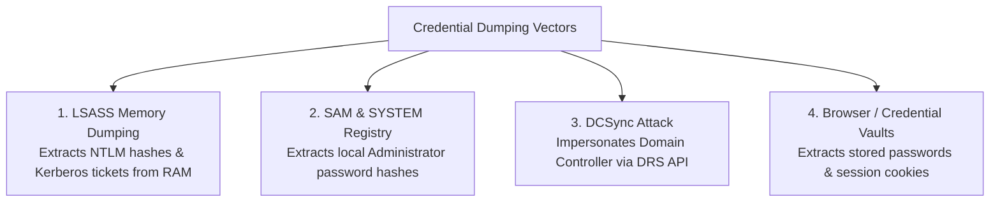

# Post-Exploitation, Credential Dumping & Lateral Movement

> **Domain:** Cybersecurity Fundamentals  
> **Sub-Domain:** Red Teaming & Advanced Threat Operations  
> **Interview Importance:** Very High / Distinguishes Senior Incident Responders & Pentesters  

---

## 1. Topic & Definitions

- **Post-Exploitation:** The phase of an adversary campaign following the successful establishment of an initial foothold on a target system. Focuses on maintaining access, gathering intelligence, escalating privileges, and expanding control across the enterprise.
- **Lateral Movement:** Techniques that cyber adversaries use to progressively extend their reach and pivot through a network from an initial compromised system toward high-value target assets (Domain Controllers, core databases, financial systems).
- **Credential Dumping:** The process of extracting account login secrets (cleartext passwords, NTLM password hashes, Kerberos tickets) from operating system memory or filesystem storage.

---

## 2. The Post-Exploitation Lifecycle

```text
[ INITIAL FOOTHOLD: Phished Workstation ]
                   │
                   ▼ 1. Local Host Reconnaissance (whoami /all, net user, ipconfig)
                   │
                   ▼ 2. Local Privilege Escalation (Standard User -> NT AUTHORITY\SYSTEM)
                   │
                   ▼ 3. Credential Harvesting (Dump LSASS memory / SAM registry)
                   │
                   ▼ 4. Establish Persistence (Scheduled Task / WMI Event Subscription)
                   │
                   ▼ 5. Internal Network Discovery (Port scan internal subnets, BloodHound AD mapping)
                   │
                   ▼ 6. Lateral Movement (Pass-the-Hash / PsExec / WinRM to Server B)
                   │
                   ▼ 7. Domain Dominance (DCSync attack against Domain Controller)
                   │
[ ACTIONS ON OBJECTIVES: Mass Ransomware Deployment / Data Exfiltration ]
```

---

## 3. Credential Harvesting Deep Dive

Once an attacker elevates privileges to `SYSTEM` or local `Administrator` on an endpoint, they harvest credentials to fuel lateral movement:



### 1. LSASS Memory Dumping
- **LSASS (Local Security Authority Subsystem Service - `lsass.exe`):** The core Windows process responsible for enforcing security policy, creating access tokens, and verifying user logins.
- **The Vulnerability:** LSASS caches active user credentials, Kerberos tickets, and NTLM hashes directly in its process memory so users don't have to re-type passwords when accessing network shares.
- **Tools:** Attackers use **Mimikatz** (`sekurlsa::logonpasswords`) or built-in Microsoft Sysinternals **Procdump** to create a mini-dump of the LSASS process and parse it offline.
- **Defenses:**
  - Enable **LSA Protection (RunAsPPL):** Restricts non-protected processes from reading LSASS memory.
  - Enable **Credential Guard:** Uses virtualization-based security (VBS) to isolate LSASS secrets in a protected Hyper-V micro-VM (`LsaIso.exe`) inaccessible even to the host kernel!

### 2. The SAM Database
- Stores local user account hashes (`C:\Windows\System32\config\SAM`).
- Locked by the OS while Windows is running, but attackers dump it by extracting the `SAM` and `SYSTEM` registry hives (`reg save hklm\sam sam.save; reg save hklm\system system.save`).

### 3. The DCSync Attack (Domain Compromise)
- **The Concept:** Instead of running tools on the Domain Controller directly, an attacker with high privileges (e.g. `Replicating Directory Changes` permission) uses Mimikatz on a standard workstation to **simulate the behavior of a Domain Controller**.
- **Mechanism:** Leverages Microsoft's Directory Replication Service (DRS) Remote Protocol (`GetNCChanges`), asking the real Domain Controller to replicate password hashes.
- **Result:** Dumps the NTLM hash of every single user in the entire enterprise domain, including the `krbtgt` account hash (enabling Golden Ticket creation).

---

## 4. Lateral Movement Techniques

### 1. Pass-the-Hash (PtH)
- In Windows NTLM authentication, the client proves its identity by performing a cryptographic challenge-response using the **NTLM hash** of the user's password. The client **never needs to know the plaintext password**!
- If an attacker dumps an administrator's NTLM hash from LSASS on Machine A, they can authenticate directly to Machine B using the hash without ever cracking it!
- **Mitigation:** Restrict NTLM; migrate to Kerberos; implement **LAPS (Local Administrator Password Solution)** so each endpoint has a unique random local administrator password.

### 2. Pass-the-Ticket (PtT)
- Attackers extract valid Kerberos Ticket Granting Tickets (TGT) from memory and inject them into their current logon session using `sekurlsa::tickets /export` and `kerberos::ptt`.
- Allows the attacker to impersonate the user across all network resources without knowing any password or hash.

### 3. Remote Execution Protocols

| Tool / Mechanism | Port | Protocol Used | Operational Indicator / Forensic Artifact |
| :--- | :---: | :--- | :--- |
| **PsExec** | **445** | SMB + Named Pipes | Creates temporary Windows Service `PSEXESVC.exe` on target (Event ID 7045). |
| **WinRM (PowerShell Remoting)**| **5985 / 5986**| HTTP / HTTPS | Spawns `wsmprovhost.exe`; leaves PowerShell Event IDs 4104 and 400. |
| **WMI (Windows Management Instrumentation)**| **135, Dynamic**| RPC / DCOM | Spawns processes via `WmiPrvSE.exe` (Event ID 4688: process creation). |
| **RDP Hijacking** | **3389** | RDP | Attacker hijacks existing disconnected user sessions via `tscon.exe` without entering passwords. |

---

## 5. Persistence Techniques

Adversaries ensure their access survives endpoint reboots and password changes:
- **Registry Run Keys:** Adding entries under `HKLM\Software\Microsoft\Windows\CurrentVersion\Run`.
- **Scheduled Tasks (`schtasks`):** Configured to execute malicious payloads periodically or upon user logon.
- **Windows Services:** Installing rogue background services running with `SYSTEM` privileges.
- **WMI Event Subscriptions:** Highly stealthy; registers a WMI event filter that triggers an event consumer (executing script/code) when specific OS triggers occur (e.g. uptime reaching 5 minutes).

---

## 6. Interview Takeaway: What to Say Under Pressure

### 🎙️ 60-Second Elevator Pitch
> *"Post-exploitation describes the adversary lifecycle following initial access, prioritizing privilege escalation, credential harvesting, persistence, and lateral movement. Attackers dump credentials from the LSASS memory process using tools like Mimikatz, enabling Pass-the-Hash (PtH) and Pass-the-Ticket (PtT) attacks to move laterally across SMB (PsExec) and WinRM without cracking plaintext passwords. At the domain level, DCSync attacks exploit replication protocols to harvest all domain hashes. Modern enterprise defenses counter this by deploying Windows Credential Guard to isolate LSASS secrets in virtualized memory, rolling out Microsoft LAPS to eliminate shared local administrator passwords, and enforcing network microsegmentation to block unauthorized workstation-to-workstation SMB traffic."*

### ⚠️ Common Traps & Gotchas
- **Trap:** Believing an attacker must crack an NTLM hash to log into other systems.  
  *Correction:* An attacker **does NOT need to crack the hash**! In a **Pass-the-Hash** attack, the raw NTLM hash is used directly as the authentication credential for network challenges.
- **Trap:** Forgetting LAPS when asked how to stop Pass-the-Hash.  
  *Correction:* Always recommend **LAPS (Local Administrator Password Solution)**. LAPS guarantees that if an attacker dumps the local Administrator hash on one workstation, that hash does not work on any other computer in the company.
