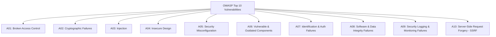

# OWASP Top 10 Web Application Security: The Comprehensive Guide

> **Domain:** Cybersecurity Fundamentals & Application Security (AppSec)  
> **Sub-Domain:** Web Vulnerabilities & Secure Engineering  
> **Interview Importance:** Critical / Mandatory Technical Round Assessment  

---

## 1. Topic & Definitions

- **OWASP (Open Web Application Security Project):** A globally recognized non-profit foundation dedicated to improving software security through community-driven open standards, methodologies, and tools.
- **OWASP Top 10:** The universally accepted consensus standard document representing the ten most critical security risks facing web applications, updated periodically by analyzing vulnerability data from thousands of organizations and millions of applications.

---

## 2. The Complete OWASP Top 10 Breakdown

---

### A01: Broken Access Control (Ranked #1 Most Critical Risk)
- **Root Cause:** Failure of the application to properly enforce access limitations, allowing users to access unauthorized data, perform actions outside their designated permissions, or elevate privileges.
- **Classic Vulnerabilities:**
  - **Insecure Direct Object References (IDOR):** Altering parameter identifiers: `GET /api/documents?id=450` $\to$ `/api/documents?id=451`.
  - **Missing Function-Level Access Control:** An ordinary user accessing administrative URLs directly: `https://site.com/admin/dashboard`.
  - **CORS Misconfiguration:** Overly permissive headers (`Access-Control-Allow-Origin: *; Access-Control-Allow-Credentials: true`) allowing untrusted websites to steal authenticated data.
- **Remediation:** Enforce server-side record ownership checks on *every single request*; adopt robust Role-Based (RBAC) or Attribute-Based Access Control (ABAC); disable directory listing on web servers.

---

### A02: Cryptographic Failures (Formerly Sensitive Data Exposure)
- **Root Cause:** Failure to properly encrypt sensitive data in transit or at rest, using weak or deprecated cryptographic algorithms, or mishandling cryptographic keys.
- **Classic Vulnerabilities:**
  - Transmitting sensitive data over unencrypted cleartext HTTP.
  - Storing passwords in plain text or using obsolete, fast hash functions (MD5, SHA-1).
  - Hardcoding encryption keys in source code repositories.
  - Insecure cipher suites in TLS configurations.
- **Remediation:** Enforce TLS 1.3 across all endpoints; mandate HSTS (`Strict-Transport-Security`); encrypt all sensitive data at rest using AES-256-GCM; hash credentials using Argon2id or bcrypt; store secrets in key vaults (AWS KMS, HashiCorp Vault).

---

### A03: Injection
- **Root Cause:** Untrusted user-supplied data is concatenated directly into an interpreter (SQL, OS Shell, LDAP, XML, XPath, NoSQL) and executed as command instructions.
- **Classic Vulnerabilities:** SQL Injection (SQLi), Command Injection, Cross-Site Scripting (XSS - included under injection in broader taxonomies).
- **Remediation:** Complete separation of code from data via **Parameterized Queries (Prepared Statements)**; using safe APIs that avoid spawning operating system subshells (`execv` instead of `system`); strict allowlist input validation.

---

### A04: Insecure Design
- **Root Cause:** Architectural design flaws resulting from a lack of threat modeling, secure design patterns, and reference architectures *before code is ever written*.
- **The Core Distinction:** Insecure implementation is a bug in the code; **Insecure Design is a flaw in the fundamental business logic**.
- **Classic Vulnerability:** A password reset workflow that asks predictable security questions (*"What was your high school mascot?"*), or an e-commerce checkout flow that lacks rate limits on coupon codes or discounts.
- **Remediation:** Perform formal **Threat Modeling (STRIDE)** during the design phase; adopt secure design patterns; establish automated security unit testing.

---

### A05: Security Misconfiguration
- **Root Cause:** Insecure default configurations, incomplete or ad-hoc cloud setup, verbose error messages exposing stack traces, unpatched services, or unnecessary enabled features.
- **Classic Vulnerabilities:**
  - Leaving default administrative passwords active (`admin:admin`).
  - Publicly accessible AWS S3 buckets containing confidential client records.
  - Enabling verbose debug mode in production (revealing database connection strings and environment variables upon error).
- **Remediation:** Automated Infrastructure as Code (IaC) configuration scanning; disabling unnecessary features, ports, and default accounts; hardening operating systems against CIS Benchmarks.

---

### A06: Vulnerable and Outdated Components
- **Root Cause:** Building applications on top of third-party open-source libraries, frameworks, or dependencies that contain known Common Vulnerabilities and Exposures (CVEs).
- **Classic Vulnerabilities:** Log4Shell (`CVE-2021-44228`), Apache Struts (`CVE-2017-5638` - Equifax breach), vulnerable npm or PyPI packages.
- **Remediation:** Integrate **Software Composition Analysis (SCA)** tools into CI/CD pipelines (Snyk, GitHub Dependabot); maintain an accurate Software Bill of Materials (SBOM); enforce patch management SLAs.

---

### A07: Identification and Authentication Failures
- **Root Cause:** Flaws in confirming the identity of the user, credential management, or session token security.
- **Classic Vulnerabilities:**
  - Permitting weak passwords or lacking protection against credential stuffing and brute force.
  - Exposing session tokens in URLs.
  - Failing to invalidate session tokens upon logout or password reset.
- **Remediation:** Enforce multi-factor authentication (MFA); implement progressive rate limiting; align with NIST SP 800-63B guidelines; issue cryptographically secure random session tokens with `HttpOnly` and `SameSite` flags.

---

### A08: Software and Data Integrity Failures
- **Root Cause:** Relying on software updates, dependencies, build pipelines, or CI/CD plugins without verifying their cryptographic authenticity and integrity.
- **Classic Vulnerabilities:**
  - **Insecure Deserialization:** Passing untrusted serialized objects (Java, Python pickle) to an application that deserializes them into executable memory.
  - **Supply-Chain Attacks:** The SolarWinds breach, where build pipeline runners were compromised to inject malicious code into signed software updates.
- **Remediation:** Cryptographically sign and verify software artifacts and updates (Sigstore/Cosign); avoid native deserialization formats (use JSON/Protocol Buffers); secure CI/CD runners and deployment pipelines.

---

### A09: Security Logging and Monitoring Failures
- **Root Cause:** Insufficient logging of security-relevant events (authentication failures, access denials), logs stored without central correlation, or failing to alert security analysts to ongoing breaches in real time.
- **Classic Vulnerabilities:** An adversary spends an average dwell time of 200+ days inside an enterprise network traversing systems undetected because failed logins and suspicious access anomalies are never audited or monitored.
- **Remediation:** Centralize all logs into a SIEM; ensure all authentication and authorization actions generate audit records; establish automated real-time alert rules for threshold breaches.

---

### A10: Server-Side Request Forgery (SSRF)
- **Root Cause:** A web application fetches a remote resource (e.g., an image, webhook, or URL preview) based on a user-supplied URL without properly validating the destination host or IP address.
- **Classic Vulnerabilities:** The server is tricked into sending requests to internal, non-routable network resources (RFC 1918) or cloud metadata endpoints (`http://169.254.169.254`).
- **Remediation:** Enforce strict allowlists of permissible target domains; block RFC 1918 private IPs and link-local addresses at the firewall/DNS resolver; disable HTTP redirects; enforce AWS IMDSv2.

---

## 3. Interview Takeaway: What to Say Under Pressure

### 🎙️ 60-Second Elevator Pitch
> *"The OWASP Top 10 represents the most critical web application vulnerabilities. Broken Access Control sits at #1, emphasizing that authorization failures like IDOR and privilege escalation are the most prevalent application flaws. Cryptographic Failures (#2) addresses unencrypted transit and poor key/password management. Injection (#3) covers flaws like SQLi where data and code planes are improperly mixed. Newer entries highlight architectural discipline: Insecure Design (#4) focuses on flaws missed during threat modeling, Software and Data Integrity Failures (#8) addresses supply chain poisoning and insecure deserialization, and SSRF (#10) counters cloud metadata and internal pivot vulnerabilities. Mature engineering organizations defend against these risks through automated security scanning in CI/CD, parameterized queries, and defense-in-depth."*

### ⚠️ Common Traps & Gotchas
- **Trap:** Thinking Injection is still #1 on OWASP.  
  *Correction:* Injection was dethroned! **Broken Access Control is currently #1**. Mentioning this shows you are up-to-date with current cybersecurity standards.
- **Trap:** Confusing Insecure Design with Security Misconfiguration.  
  *Correction:* **Insecure Design** is a failure in the *architecture* (e.g. failing to include rate limits in a business workflow). **Security Misconfiguration** is an error in *implementation or deployment* (e.g. leaving default passwords or verbose debug error messages enabled).
