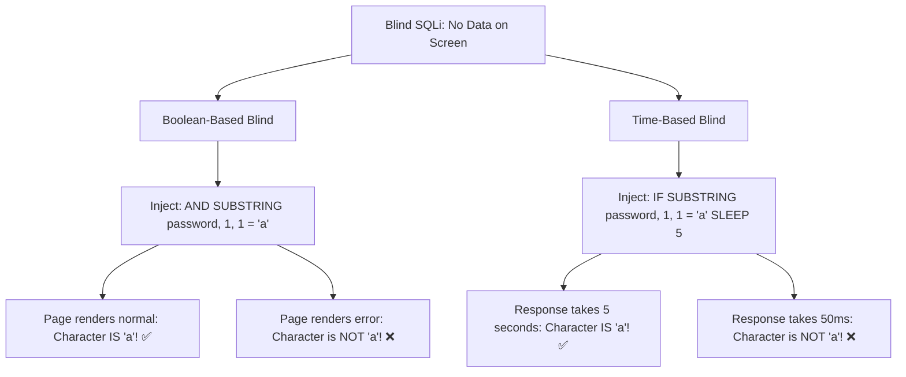

# SQL Injection (SQLi) Deep Dive: Vulnerability Mechanics & Parameterization

> **Domain:** Cybersecurity Fundamentals & Application Security (AppSec)  
> **Sub-Domain:** Injection Vulnerabilities & Database Defenses  
> **Interview Importance:** Critical / Mandatory Technical Round Assessment  

---

## 1. Topic & Definitions

- **SQL Injection (SQLi - CWE-89):** An application-layer vulnerability where untrusted user input is directly concatenated into a dynamic SQL query, enabling an attacker to manipulate the query's Abstract Syntax Tree (AST) and execute unauthorized database commands.
- **The Core Architectural Root Cause:** The failure to maintain a formal mathematical separation between the **Code Plane** (SQL commands and grammar) and the **Data Plane** (user parameters).
- **Impact of Successful SQLi:**
  1. Complete bypass of authentication (logging in as `admin`).
  2. Unauthorized data disclosure (dumping user tables, passwords, credit cards).
  3. Data tampering and destruction (`UPDATE` or `DROP TABLE`).
  4. Operating system compromise and Remote Code Execution (RCE via database functions like `xp_cmdshell` in MSSQL or `COPY TO/FROM PROGRAM` in PostgreSQL).

---

## 2. SQLi Attack Mechanics & Payload Evolution

```text
VULNERABLE BACKEND CODE (PHP / Python / Java):
query = "SELECT * FROM users WHERE username = '" + user_input + "' AND password = '" + pass_input + "'";
```

### 1. Classic Authentication Bypass (In-Band)
- **Attacker Input in username field:** `admin' OR '1'='1' --`
- **Resulting Query Executed by Database Engine:**
  ```sql
  SELECT * FROM users WHERE username = 'admin' OR '1'='1' --' AND password = '...';
  ```
- **How It Works:**
  1. The single quote (`'`) closes the username string literal.
  2. The boolean logic `OR '1'='1'` evaluates to **TRUE** for every single row in the table.
  3. The double hyphen (`-- `) comments out the rest of the original query, completely eliminating password verification!
  4. The engine returns the first row of the table (typically the `admin` account).

---

### 2. UNION-Based SQL Injection (Data Exfiltration)
When an application displays database results on the screen (e.g., search results or product catalog):
- **Step 1: Determine the number of columns in original query:**
  ```sql
  ' ORDER BY 1--   (Succeeds)
  ' ORDER BY 5--   (Succeeds)
  ' ORDER BY 6--   (Fails! "Column 6 out of range" -> Exactly 5 columns exist!)
  ```
- **Step 2: Determine which columns accept string data:**
  ```sql
  ' UNION SELECT 'a', NULL, NULL, NULL, NULL--
  ' UNION SELECT NULL, 'a', NULL, NULL, NULL--
  ```
- **Step 3: Extract sensitive data from other tables:**
  ```sql
  ' UNION SELECT null, username, password_hash, email, null FROM users--
  ```

---

### 3. Blind SQL Injection: Boolean vs. Time-Based



- In Blind SQLi, automated tools like **SQLMap** use **Binary Search** across ASCII values to reconstruct entire database tables character-by-character:
  $$O(\log_2 95) \approx 7 \text{ queries per character!}$$

---

## 4. The Definitive Defense: Parameterized Queries (Prepared Statements)

### Why Parameterized Queries Mathematically Guarantee Safety

```text
STEP 1: PRE-COMPILATION (Code Plane Fixed)
Database parses and compiles the query structure into an Abstract Syntax Tree (AST):
AST Structure: [SELECT] ──► Columns: [id, email]
               [FROM]   ──► Table:   [users]
               [WHERE]  ──► Condition: [username == ?] AND [password_hash == ?]
(The query logic and structure are FROZEN in database memory).

STEP 2: PARAMETER BINDING (Data Plane Handled Literally)
Application passes user input:
Parameter 1: "admin' OR 1=1 --"
Parameter 2: "irrelevant"

DATABASE EXECUTION:
The database compares the column 'username' against the LITERAL STRING "admin' OR 1=1 --".
Because the AST is already compiled, the quotes and SQL keywords are treated strictly as
PASSIVE DATA CHARACTERS. They CANNOT alter the AST grammar!
```

---

## 5. Do ORMs (Object-Relational Mappers) Automatically Prevent SQLi?

- **The Myth:** *"Using an ORM like Hibernate, SQLAlchemy, or Prisma guarantees 100% immunity to SQL injection."*
- **The Reality:** **FALSE!** While ORMs parameterize standard queries by default, developers frequently introduce SQLi when using **Raw SQL escape hatches**:
  ```python
  # VULNERABLE SQLAlchemy Code (Raw query concatenation!):
  session.execute(text(f"SELECT * FROM users WHERE name = '{user_input}'"))

  # SECURE SQLAlchemy Code (Proper parameter binding):
  session.execute(text("SELECT * FROM users WHERE name = :name"), {"name": user_input})
  ```

---

## 6. Database Defense-in-Depth

1. **Principle of Least Privilege for Database Accounts:**
   - The web application should never connect to the database as `sa`, `root`, or `postgres`.
   - Create a dedicated user (`app_user`) granted strictly `SELECT`, `INSERT`, `UPDATE`, and `DELETE` on specific tables.
   - Explicitly revoke `DROP TABLE`, `ALTER TABLE`, and access to stored system procedures (`xp_cmdshell`).
2. **Network Isolation:**
   - Bind database ports (`3306`, `5432`, `1433`) strictly to `127.0.0.1` or private subnets; never expose to public WAN.

---

## 7. Interview Takeaway: What to Say Under Pressure

### 🎙️ 60-Second Elevator Pitch
> *"SQL Injection occurs when untrusted user input alters the Abstract Syntax Tree (AST) of a backend SQL query due to dynamic string concatenation, collapsing the boundary between the code plane and data plane. Attacks range from In-Band Union-based extraction, to Error-based inference, to Blind Boolean and Time-based bit-by-bit recovery. The definitive, non-negotiable defense is Parameterized Queries (Prepared Statements). By pre-compiling the SQL statement before binding parameters, the database engine guarantees that user input is treated strictly as literal data. Secondary defenses include ORM parameterized APIs, least privilege database accounts that revoke administrative privileges, and strict input validation."*

### ⚠️ Common Traps & Gotchas
- **Trap:** Proposing input sanitization or regex filtering as the primary defense.  
  *Correction:* Rejecting quotes or blacklisting words like `UNION` or `SELECT` is inherently flawed and easily bypassed via case variation, URL encoding, or comments. Always state that **Parameterized Queries are the primary and definitive defense**.
- **Trap:** Assuming numeric inputs cannot be injected without quotes.  
  *Correction:* Queries like `SELECT * FROM items WHERE id = ` + user_input do not use quotes! An attacker simply inputs `1 OR 1=1` without typing a single quote, bypassing naive quote-filtering sanitizers.
