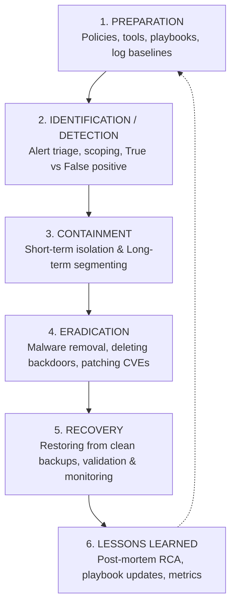

# Incident Response Lifecycle: NIST SP 800-61, SANS PICERL & Digital Forensics

> **Domain:** Cybersecurity Fundamentals & Security Operations (SecOps)  
> **Sub-Domain:** Incident Response & Digital Forensics  
> **Interview Importance:** Critical / High-Frequency Scenario Interview Question  

---

## 1. Topic & Definitions

- **Security Incident:** An occurrence that actually or potentially jeopardizes the confidentiality, integrity, or availability of an information system, or violates established organizational security policies or acceptable use rules.
- **Incident Response (IR):** The structured, systematic methodology that an organization follows to prepare for, detect, contain, investigate, eradicate, and recover from a cybersecurity breach.
- **The Two Standard Models:**
  - **NIST SP 800-61 Rev 2:** 4-stage cyclical model (Preparation $\to$ Detection & Analysis $\to$ Containment, Eradication & Recovery $\to$ Post-Incident Activity).
  - **SANS Institute Model (PICERL):** 6-step linear model (Preparation $\to$ Identification $\to$ Containment $\to$ Eradication $\to$ Recovery $\to$ Lessons Learned). Both frameworks share the exact same underlying operational milestones.

---

## 2. The 6 Phases of Incident Response (The PICERL Framework)



---

### Detailed Operational Walkthrough of Each Phase

| Phase Number & Name | Primary Objective & Actions | Key Tools & Artifacts | Critical Success Factor |
| :--- | :--- | :--- | :--- |
| **1. Preparation** | Establish security policies, incident response teams (CSIRT), playbooks, and ensure forensic tooling is pre-deployed before an incident occurs. | IR Playbooks, EDR agents, forensic jump bags, out-of-band communication channels (Signal/private cell). | Having verified, offline air-gapped backups and centralized SIEM logging enabled. |
| **2. Identification (Detection & Analysis)** | Triage alerts, validate whether an event is a **True Positive**, determine the root cause, and establish the complete **Scope** of the breach (which users, hosts, and data are compromised). | SIEM correlation alerts, EDR process trees, VirusTotal, sandboxes, firewall logs. | **Scoping accurately:** Never jump to fix one computer before understanding if 50 other machines are compromised! |
| **3. Containment** | Prevent the attack from spreading across the network and stop data exfiltration while preserving forensic evidence in memory. | EDR host network isolation, revoking active Kerberos/Azure AD tokens, blocking C2 IPs at perimeter firewall. | **Short-term vs Long-term containment:** Isolate host immediately; do not power off (preserves RAM)! |
| **4. Eradication** | Remove all malicious artifacts, close backdoors, reset all compromised account credentials, and patch the root vulnerability that allowed initial entry. | Malware removal scripts, reimaging infected OS disks, rotating domain administrator passwords. | Complete elimination of persistent access (scheduled tasks, rogue accounts, WMI persistence). |
| **5. Recovery** | Restore systems to normal production operations safely, verifying that systems are operating cleanly. | Restoring from validated golden master backups, staging reintroductions, gradual network reconnection. | **Heightened Monitoring:** Maintain intensive 24/7 EDR and SIEM scrutiny for 30+ days to ensure the attacker does not return. |
| **6. Lessons Learned (Post-Incident Review)** | Conduct a formal post-mortem debrief within 14 days to document timeline, quantify impact, identify procedural gaps, and update playbooks. | Final Incident Response Report, Root Cause Analysis (RCA) document, metric updates (MTTD / MTTR). | Executive accountability: Transforming failure lessons into automated detection engineering rules. |

---

## 3. Containment Deep Dive: Short-Term vs. Long-Term

```text
+─────────────────────────────────────────────────────────────────────────────+
|                         CONTAINMENT ARCHITECTURE                            |
+─────────────────────────────────────────────────────────────────────────────+
| SHORT-TERM CONTAINMENT (Immediate Emergency Action):                        |
|   • Objective: Stop immediate lateral movement and live data exfiltration. |
|   • Actions: Network isolate compromised endpoints via EDR;                 |
|     block malicious external C2 domain on DNS firewall / sinkhole;          |
|     revoke compromised user sessions and refresh tokens.                    |
|   • ⚠️ CRITICAL RULE: DO NOT PULL THE POWER PLUG! Pulling power destroys    |
|     all volatile memory (RAM), wiping out encryption keys and injected      |
|     malware shellcode needed for forensics.                                 |
|─────────────────────────────────────────────────────────────────────────────|
| LONG-TERM CONTAINMENT (Sustained Isolation while Business Operates):        |
|   • Objective: Allow non-compromised business functions to continue safely  |
|     while building clean recovery environments.                             |
|   • Actions: Route entire compromised network segments through isolated     |
|     monitored DMZ VLANs; enforce mandatory MFA on all external services;    |
|     deploy temporary WAF virtual patches against exploited CVEs.            |
+─────────────────────────────────────────────────────────────────────────────+
```

---

## 4. Digital Forensics Principles: Order of Volatility & Chain of Custody

When collecting evidence during an active incident, investigators must adhere strictly to legal and forensic standards:

### 1. Order of Volatility (RFC 3227)
Always capture evidence from the **most volatile** (disappears first upon power loss) to the **least volatile**:

```text
MOST VOLATILE (Capturing Priority 1)
▲
│  1. CPU Registers and CPU Cache
│  2. Routing Table, ARP Cache, Process Table, Kernel Memory (RAM)
│  3. Temporary File Systems / Swap Space / Pagefile
│  4. Non-volatile Disk Storage (HDD, SSD, Flash drives)
│  5. Remote Logging Data (SIEM, firewall logs, CloudTrail)
│  6. Physical Network Topology, Cabling, and Backup Tapes
▼
LEAST VOLATILE (Capturing Priority 6)
```

### 2. Chain of Custody
- The formal, legally binding chronological documentation tracking the custody, control, transfer, analysis, and disposition of physical and electronic evidence.
- **Requirements:** Every piece of evidence must record:
  - Exact Timestamp collected.
  - Collector's name and signature.
  - Hardware Write Blocker used during acquisition.
  - Cryptographic Hash (SHA-256) calculated immediately upon acquisition, and verified prior to analysis to prove evidence was never altered.

---

## 5. Key Metrics in Incident Response

- **MTTD (Mean Time to Detect):** The average time elapsed from when an adversary achieves initial compromise until the organization's security team detects the incident. (Target: minutes to hours).
- **MTTR (Mean Time to Respond / Remediate):** The average time elapsed from initial detection until the threat is contained and eradicated.
- **Dwell Time:** The total duration an adversary remains undetected inside the target environment.

---

## 6. Interview Takeaway: What to Say Under Pressure

### 🎙️ 60-Second Elevator Pitch
> *"Incident response follows a structured lifecycle codified by NIST SP 800-61 and SANS PICERL: Preparation, Identification, Containment, Eradication, Recovery, and Lessons Learned. When responding to a live breach, the first priority is accurate scoping and verification before executing containment. Containment must be balanced with forensic preservation—we isolate the host at the network layer via EDR rather than powering it off, strictly preserving volatile memory in accordance with RFC 3227's Order of Volatility. Following eradication and verified system restoration, the lifecycle concludes with a mandatory Lessons Learned review, documenting root cause analysis and implementing automated detection engineering rules to ensure that specific attack vector cannot succeed again."*

### ⚠️ Common Traps & Gotchas
- **Trap:** Answering "I would immediately reboot or pull the power plug on the infected server."  
  *Correction:* **NEVER pull the power plug!** Powering off destroys volatile RAM, obliterating injected in-memory malware, network connection sockets, and decrypted encryption keys. Always isolate the host via EDR network containment or disconnect the Ethernet cable while leaving the machine powered on to capture a live memory dump.
- **Trap:** Rushing to reimage a machine before completing scoping.  
  *Correction:* If an adversary compromised 10 machines and you immediately wipe the first one you find, you alert the adversary, who will immediately deploy ransomware across the remaining 9 systems. Always complete enterprise scoping before executing synchronized containment.
