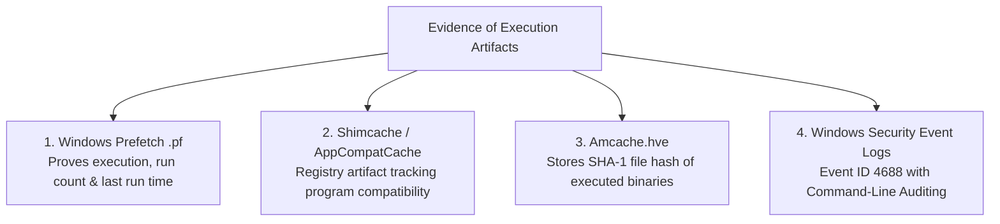

# Threat Hunting, The Pyramid of Pain & Windows Forensic Artifacts

> **Domain:** Cybersecurity Fundamentals & Security Operations (SecOps)  
> **Sub-Domain:** Proactive Threat Hunting & Host Forensics  
> **Interview Importance:** Very High / Distinguishes Senior Incident Responders & Threat Hunters  

---

## 1. Topic & Definitions

- **Threat Hunting:** The proactive, hypothesis-driven, iterative search through networks and endpoints to detect malicious activity, hidden persistence, or dormant threats that have successfully evaded automated security controls (firewalls, antivirus, SIEM).
- **Reactive vs. Proactive Security:**
  - **Reactive (Alert Triage):** Waiting for a SIEM or EDR alert to fire before opening a ticket.
  - **Proactive (Threat Hunting):** Assuming the network is *already compromised* (Assume Breach mindset) and actively interrogating telemetry to uncover stealthy adversaries.
- **Indicators of Compromise (IOCs):** Artifacts observed on a network or in an operating system that indicate a computer intrusion (e.g. malicious IP, file hash).
- **Tactics, Techniques, and Procedures (TTPs):** The behavioral patterns, methodologies, and tradecraft employed by an adversary group.

---

## 2. David Bianco's Pyramid of Pain

The **Pyramid of Pain** illustrates how difficult it is for an adversary to adapt when you deny them each category of indicator:

```text
                           ▲
                          / \
                         /   \
                        / TTPs\                <-- TOUGH! (Forces attacker to invent new techniques)
                       /───────\
                      /  Tools  \              <-- CHALLENGING (Forces attacker to rewrite software)
                     /───────────\
                    / Host/Net    \            <-- ANNOYING (Changing registry keys, C2 protocols)
                   /  Artifacts    \
                  /─────────────────\
                 /   Domain Names    \         <-- SIMPLE (Attacker buys new $5 domain name)
                /─────────────────────\
               /     IP Addresses      \       <-- EASY (Attacker changes cloud VPS IP)
              /─────────────────────────\
             /        Hash Values        \     <-- TRIVIAL (Flipping 1 byte changes MD5/SHA256)
            /─────────────────────────────\
```

| Indicator Level | Why It Is Painful / Trivial for the Attacker | Defensive Engineering Focus |
| :--- | :--- | :--- |
| **Hash Values (Trivial)** | An attacker recompiles code or changes 1 bit $\implies$ Hash changes completely. | Automated blocking only; zero long-term strategic defensive value. |
| **IP Addresses (Easy)** | Attackers use Fast-Flux DNS, VPNs, Tor, or spin up new AWS instances in seconds. | IP reputation blocking at firewalls. |
| **Domain Names (Simple)** | Purchasing a domain takes $2. Attackers automate domain generation (DGA). | DNS sinkholing, domain age filtering (< 30 days old). |
| **Host/Network Artifacts (Annoying)** | Modifying internal C2 communication protocols, user agents, or file naming conventions. | Developing custom Snort/YARA signatures and proxy inspection rules. |
| **Tools (Challenging)** | Developing a new exploit framework (e.g. replacing Cobalt Strike with custom C2). | Writing behavioral YARA rules, memory scanning for reflective loaders. |
| **TTPs (Tough!)** | Forces the adversary to learn entirely new methodologies (e.g. abandon Pass-the-Hash entirely). | **The Ultimate Goal of Threat Hunting:** Hunting behaviors mapped to MITRE ATT&CK! |

---

## 3. High-Value Windows Forensic Artifacts (Evidence of Execution)

When investigating a machine to answer: *"Did the attacker actually execute this malicious file?"*, forensic investigators inspect four primary Windows artifacts:



---

### 1. Windows Prefetch Files (`.pf`)
- **Location:** `C:\Windows\Prefetch\`
- **Purpose:** Created by Windows to speed up application startup.
- **Forensic Goldmine:** Proves **definitive execution**. Contains:
  - The exact executable name (e.g., `MIMIKATZ.EXE-B4E6F2A1.pf`).
  - Total number of times the executable was run (**Run Count**).
  - The exact timestamps of the **last 8 times the program was executed**.
  - List of DLLs, directories, and files referenced by the process during its first 10 seconds of execution.

### 2. Shimcache (Application Compatibility Cache)
- **Location:** `HKLM\SYSTEM\CurrentControlSet\Control\Session Manager\AppCompatCache`
- **Purpose:** Tracks application compatibility flags across Windows updates.
- **Forensic Value:** Records file paths, file sizes, and Last Modified timestamps of executables that existed on the system, even if the attacker deleted the file from disk!

### 3. Amcache (`Amcache.hve`)
- **Location:** `C:\Windows\appcompat\Programs\Amcache.hve`
- **Forensic Value:** A dedicated registry hive that records the **SHA-1 cryptographic hash** of executed binaries, execution path, compile time, and first execution timestamp. Allows investigators to look up the hash on VirusTotal even if the attacker deleted the malware!

### 4. Windows Logon Event IDs & Logon Types (Event 4624)
When analyzing compromised accounts, the **Logon Type** in Security Event ID 4624 identifies how the attacker authenticated:

| Logon Type | Meaning | Typical Adversary Activity |
| :---: | :--- | :--- |
| **Type 2** | **Interactive** (User physically logged in at the local keyboard/console). | Physical access or console VM logon. |
| **Type 3** | **Network** (Connection over the network; e.g. SMB share, PsExec, IIS). | **Lateral Movement:** Pass-the-Hash, accessing shared folders. |
| **Type 4** | **Batch** (Scheduled task execution). | Persistence via scheduled tasks. |
| **Type 5** | **Service** (Windows Service startup). | Persistence via malicious service. |
| **Type 9** | **NewCredentials** (`runas /netonly`). | Attackers running Mimikatz with alternate domain credentials. |
| **Type 10** | **RemoteInteractive** (Remote Desktop / RDP). | Direct graphical interactive access via Port 3389. |

---

## 4. Live Memory Forensics (Volatility Framework)

When volatile memory (RAM) is captured using FTK Imager or WinPmem, investigators analyze the raw memory image using **Volatility**:

```bash
# 1. Inspect Running Processes & Parent-Child Trees in Memory
vol.py -f memory.raw windows.pstree

# 2. Hunt for Injected Shellcode & Memory Hooking
vol.py -f memory.raw windows.malfind
# (Scans for memory regions marked PAGE_EXECUTE_READWRITE containing PE/shellcode headers)

# 3. Identify Active Network Sockets & Connections at Time of Capture
vol.py -f memory.raw windows.netscan

# 4. Extract In-Memory Passwords & LSA Secrets
vol.py -f memory.raw windows.lsadump
```

---

## 5. Interview Takeaway: What to Say Under Pressure

### 🎙️ 60-Second Elevator Pitch
> *"Proactive threat hunting assumes an adversary has already bypassed automated defenses, testing hypotheses mapped against the MITRE ATT&CK framework rather than waiting for SIEM alerts. We prioritize our detection engineering around David Bianco's Pyramid of Pain: while blocking hashes and IPs causes trivial inconvenience to attackers, targeting their TTPs forces them to re-engineer their entire tradecraft. In host forensics, investigators establish evidence of execution by interrogating Windows Prefetch files for run counts and execution timestamps, Shimcache for execution history, Amcache for historical SHA-1 hashes of deleted binaries, and Event ID 4624 logon types to distinguish between local console access (Type 2), lateral network movement (Type 3), and remote desktop sessions (Type 10)."*

### ⚠️ Common Traps & Gotchas
- **Trap:** Confusing an IOC with a TTP.  
  *Correction:* An **IOC** is a static digital trace left behind (e.g. SHA-256 hash or malicious IP). A **TTP** is the *underlying behavioral technique* used by the attacker (e.g. dumping credentials from LSASS memory using PowerShell API injection).
- **Trap:** Forgetting that Prefetch proves execution.  
  *Correction:* Finding an executable file on a hard drive only proves *presence* (it was downloaded). To prove the user or malware actually **ran** the program, you must produce evidence of execution from **Prefetch (`.pf`)**, Amcache, or Event ID 4688.
