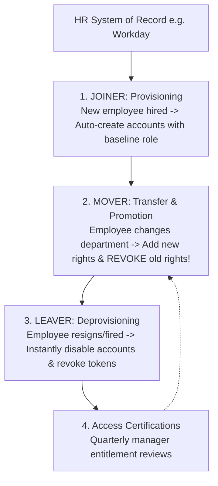

# Identity Terminology, Workload Identities & The JML Lifecycle

> **Domain:** Identity and Access Management (IAM)  
> **Sub-Domain:** Core IAM Foundations  
> **Interview Importance:** Very High / Foundational Enterprise Identity Concept  

---

## 1. Topic & Definitions

- **Identity:** The unique representation of an individual, system, or software entity within a digital computing environment.
- **Digital Identity vs. Account:**
  - **Identity:** The human or entity being modeled (e.g. *Alice Smith, Senior Software Engineer*).
  - **Account (User Account):** The specific record or digital credential created within a system to authenticate that identity (e.g. `asmith@corp.internal`, `alice-github-admin`). An identity can own multiple accounts across diverse systems.
- **Principal:** Any authenticated entity that can be granted permissions or make requests against resources (users, groups, service accounts, compute workloads).
- **Identity Provider (IdP):** A centralized system that creates, maintains, and manages identity information while offering authentication services to relying applications (e.g., Okta, Microsoft Entra ID / Azure AD, Ping Identity, Google Workspace).
- **Service Provider (SP) / Relying Party (RP):** The third-party application or website (e.g., Salesforce, Slack, AWS Console) that relies on the IdP to authenticate users and pass identity claims.

---

## 2. Human Identities vs. Workload & Machine Identities

In modern enterprise and cloud environments, **non-human machine identities outnumber human users by more than 10 to 1**:

```text
+─────────────────────────────────────────────────────────────────────────────+
|                     HUMAN IDENTITIES vs. WORKLOAD IDENTITIES                |
+─────────────────────────────────────────────────────────────────────────────+
| HUMAN IDENTITIES:                                                           |
|   • Employees, contractors, partners, customers.                            |
|   • Authenticate via: Passwords, MFA tokens, FIDO2 passkeys, Biometrics.    |
|   • Governed by: Human HR onboarding/offboarding cycles.                    |
|─────────────────────────────────────────────────────────────────────────────|
| WORKLOAD / MACHINE IDENTITIES:                                              |
|   • Applications, microservices, CI/CD runners, Kubernetes pods, VMs, APIs. |
|   • Authenticate via: API keys, X.509 mTLS certificates, OAuth client       |
|     credentials, IAM Roles (AWS Instance Profiles / Workload Identity).     |
|   • Challenge: High risk of hardcoded static API keys leaked in Git repos!  |
|   • Best Practice: Use Ephemeral, temporary credentials minted dynamically  |
|     (e.g., AWS STS AssumeRole, SPIFFE/SPIRE, HashiCorp Vault).              |
+─────────────────────────────────────────────────────────────────────────────+
```

---

## 3. The Identity Lifecycle: Joiner, Mover, Leaver (JML Framework)

The operational management of an employee's access throughout their organizational tenure follows the **JML Framework**:



### 1. Joiner (Onboarding & Birthright Access)
- HR enters a new hire into the HR Management System (HRIS - Workday/BambooHR).
- Automated provisioning tools (SCIM - System for Cross-domain Identity Management) create enterprise accounts, assigning "Birthright Permissions" (email, corporate Slack, basic intranet) using **Role-Based Access Control (RBAC)**.

### 2. Mover (The "Privilege Creep" Danger)
- An employee moves from Customer Support to Software Development.
- **The Fatal Security Flaw: Privilege Creep (Permission Bloat):** IT adds developer permissions to the user's account but **forgets to revoke their former customer support access**. Over 5 years, veteran employees accumulate excessive permissions across dozens of departments, violating Least Privilege.
- **The Correct Architecture:** Trigger an automated revocation of all role-specific permissions from the old department prior to provisioning new departmental roles.

### 3. Leaver (Offboarding & Orphaned Accounts)
- An employee resigns or is terminated.
- **Emergency Deprovisioning:** HR triggers an immediate termination event:
  - Account status flipped to `Disabled` in the centralized IdP (Active Directory / Okta).
  - Active refresh tokens and OAuth sessions **immediately revoked**.
  - Passwords randomized; MFA devices deregistered.
- **Orphaned Account:** An unmanaged, active user account remaining on a legacy system after an employee leaves the company. Prime targets for brute-force attacks and persistence by adversaries.

---

## 4. Access Reviews & Entitlement Certification

- **User Access Review (UAR):** A mandatory governance process (required by SOC 2, ISO 27001, and SOX) where department managers and asset owners periodically review and certify that every employee reporting to them still legitimately requires the permissions they hold.
- Any uncertified entitlement is automatically stripped (**Principle of Least Privilege**).

---

## 5. Cybersecurity Relevance & Threat Vectors

### 1. Insecure Offboarding (The Disgruntled Ex-Employee)
- Failure to automate the "Leaver" process allows terminated employees to retain access to corporate Google Drive, Slack, or AWS consoles using cached credentials, leading to intellectual property theft or intentional sabotage.

### 2. Machine Identity Compromise (The Capital One Breach)
- Machine credentials lack human oversight (no MFA). In the 2019 Capital One breach, an SSRF vulnerability was exploited to extract temporary AWS IAM role credentials assigned to an EC2 instance, allowing the attacker to download 100 million customer records.

---

## 6. Interview Takeaway: What to Say Under Pressure

### 🎙️ 60-Second Elevator Pitch
> *"Identity is the modern enterprise security perimeter. It encompasses human users authenticated via multi-factor credentials and workload machine identities—which outnumber humans and authenticate via API keys or ephemeral IAM roles. The identity lifecycle is governed by the JML framework: Joiner (automated onboarding), Mover (handling promotions where old privileges must be stripped to prevent privilege creep), and Leaver (immediate deprovisioning and session token revocation upon termination to prevent orphaned accounts). Regulatory frameworks mandate quarterly user access reviews to ensure continuous alignment with the Principle of Least Privilege."*

### ⚠️ Common Traps & Gotchas
- **Trap:** Confusing an Identity Provider (IdP) with a Service Provider (SP).  
  *Correction:* The **IdP** (e.g. Okta, Azure AD) *authenticates the user and holds identity credentials*. The **SP** (e.g. Salesforce, AWS) *provides the application service and trusts the IdP's authentication assertions*.
- **Trap:** Forgetting Privilege Creep during the "Mover" lifecycle phase.  
  *Correction:* Always highlight **Privilege Creep** when discussing employee promotions. Emphasize that transferring an employee requires *both* adding new entitlements and *actively revoking* previous role permissions.
