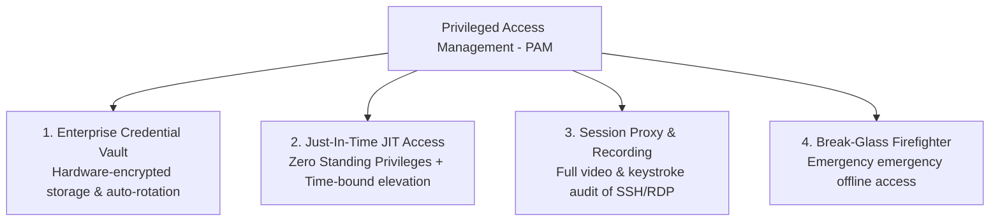

# The AAA Framework & Privileged Access Management (PAM)

> **Domain:** Identity and Access Management (IAM)  
> **Sub-Domain:** Core IAM Governance & Privileged Access  
> **Interview Importance:** Very High / Enterprise Security Architecture Standard  

---

## 1. Topic & Definitions

- **The AAA Framework:** The foundational architectural security framework governing access control:
  - **Authentication (AuthN):** The process of verifying the claimed identity of a user, device, or system.
  - **Authorization (AuthZ):** The process of granting or denying specific permissions and access rights to an authenticated principal.
  - **Accounting (Auditing):** The measurement and recording of the resources a principal accesses, actions taken, and active session durations.
- **Privileged Access Management (PAM):** A dedicated domain of cybersecurity technologies and strategies focused on securing, controlling, monitoring, and auditing elevated (administrative) access accounts that possess high-impact permissions across infrastructure (e.g. `root`, `Domain Admins`, AWS `OrganizationAccountAccessRole`).

---

## 2. Why Privileged Accounts are High-Risk

```text
STANDARD USER ACCOUNT:
• Access: Local email, office apps, basic department files.
• Blast Radius: Low to moderate.

PRIVILEGED ADMINISTRATIVE ACCOUNT:
• Access: Domain Controllers, core firewalls, database root, hypervisors.
• Blast Radius: CATASTROPHIC! Compromise results in complete enterprise takeover.
```

- **The Problem of "Standing Privileges":** In traditional IT, administrators hold 24/7 permanent root access. If an admin clicks a phishing email at 2:00 PM while logged into their workstation, their permanent standing privileges allow malware to execute immediately with full administrative rights.
- **The PAM Solution:** Eliminate permanent standing privileges entirely using **Zero Standing Privileges (ZSP)** and **Just-In-Time (JIT)** access.

---

## 3. Core Pillars of a PAM Architecture



---

### 1. Enterprise Credential Vaulting & Rotation
- Administrators **never know the actual root or domain administrator passwords**!
- Passwords are stored inside a hardened, hardware-backed vault (e.g., CyberArk, HashiCorp Vault, Delinea).
- **Automated Password Rotation:**
  1. Admin requests access to check out the password.
  2. PAM releases the password for 2 hours.
  3. Upon check-in (or lease expiration), the PAM vault **automatically contacts the server and rotates the password to a new 64-character random string**.

---

### 2. Just-In-Time (JIT) Access (Zero Standing Privileges)
- Instead of keeping administrators permanently in the `Domain Admins` group, their normal account holds **zero administrative permissions**.
- When an emergency maintenance task arises:
  1. The engineer submits a JIT request tied to a ServiceNow ticket: *"Upgrade production database from 2:00 PM to 3:00 PM."*
  2. Peer or manager approves the request.
  3. The PAM system dynamically injects the user into the administrative group for **exactly 60 minutes**.
  4. At 3:01 PM, the user is automatically removed from the group, and active sessions are terminated.

---

### 3. Privileged Session Proxy & Recording
- Administrators do not connect directly to sensitive servers over SSH or RDP.
- They connect to a **PAM Bastion / Session Proxy**:
  - The proxy injects credentials into the target session without displaying them to the human admin.
  - The proxy records a **full video recording and searchable keystroke log** of the entire session.
  - If the admin attempts to run a forbidden command (`rm -rf /` or `DROP DATABASE`), the PAM proxy immediately terminates the TCP session in real time.

---

### 4. "Break-Glass" (Firefighter) Emergency Accounts
- What happens if the centralized IdP, Okta, or PAM vault goes offline or suffers a major outage?
- Organizations maintain **Break-Glass Accounts**:
  - Highly privileged local emergency accounts (`emergency-admin-01`).
  - Passwords are split into halves using **Shamir's Secret Sharing** and stored in physical tamper-evident sealed envelopes in physical safes held by the CISO and General Counsel.
  - Using a break-glass account automatically triggers maximum-severity automated alerts across all security operations channels.

---

## 4. Key Differences: IAM vs. PAM

| Dimension | Standard IAM | Privileged Access Management (PAM) |
| :--- | :--- | :--- |
| **Target Users** | **All employees** (100% of workforce). | **Administrators only** (Top 1-5% of users). |
| **Primary Systems**| Email, HR portals, SaaS productivity apps. | Domain Controllers, Hypervisors, Cloud Root, Production DBs. |
| **Credential Handling**| User manages their own password + MFA. | **User never knows password**; checked out from vault. |
| **Monitoring Level** | Standard login event logging. | **Full live video & keystroke session recording**. |
| **Privilege Model** | Static role-based assignments. | Dynamic Just-In-Time (JIT) ephemeral elevation. |

---

## 5. Interview Takeaway: What to Say Under Pressure

### 🎙️ 60-Second Elevator Pitch
> *"The AAA framework defines the three pillars of access: Authentication validates identity, Authorization enforces permissions, and Accounting guarantees non-repudiation through immutable audit trails. Within IAM, Privileged Access Management (PAM) secures elevated administrative accounts—such as root, Domain Admins, and cloud infrastructure owners—which present the highest breach risk. PAM replaces permanent standing privileges with Zero Standing Privileges and Just-In-Time (JIT) access, where permissions are granted ephemerally for finite time windows upon ticket approval. Core PAM architectures mandate credential vaulting with automated post-use rotation, bastion session recording for SSH and RDP, and tightly audited offline break-glass accounts for disaster recovery."*

### ⚠️ Common Traps & Gotchas
- **Trap:** Believing PAM is just a password manager for admins.  
  *Correction:* A password manager merely remembers passwords. A **PAM system** acts as an active session proxy that injects credentials without human visibility, rotates passwords on target operating systems, enforces JIT approvals, and monitors/terminates live sessions.
- **Trap:** Forgetting Break-Glass procedures.  
  *Correction:* Mentioning **Break-Glass emergency accounts** demonstrates real-world architectural maturity, proving you understand how to prevent an organization from being locked out of its infrastructure during catastrophic PAM or IdP outages.
