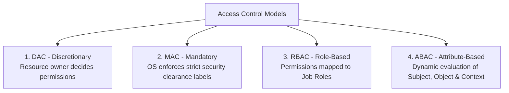

# Access Control Models: RBAC, ABAC, MAC, DAC & Military Security Models

> **Domain:** Identity and Access Management (IAM)  
> **Sub-Domain:** Authorization Architectures & Security Models  
> **Interview Importance:** Very High / Fundamental Computer Science & Security Concept  

---

## 1. Topic & Definitions

- **Access Control Model:** A formal architectural framework that defines the rules, mechanisms, and relationships governing how subjects (users, processes) are granted or denied access to objects (files, databases, APIs, network sockets).
- **Subject:** The active entity requesting access to an object (e.g., User Alice, Service Account).
- **Object:** The passive resource to which access is requested (e.g., File, Database Table, Network Port).
- **Operation / Action:** The specific task the subject wishes to perform on the object (Read, Write, Execute, Delete).

---

## 2. The Four Primary Access Control Models Compared



---

### 1. Discretionary Access Control (DAC)
- **Core Principle:** The **owner of an object** has complete discretion to grant or revoke access permissions to other users.
- **Mechanism:** Implemented via Access Control Lists (ACLs) tied to files and folders (e.g. standard Linux `chmod/chown` and Windows NTFS permissions).
- **Strengths:** Maximum flexibility; decentralized management.
- **Weaknesses:** **Inherently insecure against malware.** If Alice owns a secret document, a trojan executing under Alice's account inherits her full discretion and can change the document's permissions to world-readable (`chmod 777`).

---

### 2. Mandatory Access Control (MAC)
- **Core Principle:** Access decisions are enforced strictly by the operating system kernel based on **fixed security labels (Classification & Clearance)**. Users **cannot** override, modify, or share permissions.
- **Mechanism:**
  - **Subject Clearance:** Top Secret, Secret, Confidential, Unclassified.
  - **Object Classification Label:** Top Secret, Secret, Confidential, Unclassified.
- **Strengths:** Maximum security; mathematically provable containment; immune to trojans and DAC privilege leaks.
- **Implementations:** **SELinux (Security-Enhanced Linux)**, AppArmor, military/defense intelligence systems.

---

### 3. Role-Based Access Control (RBAC)
- **Core Principle:** Permissions are assigned to **Job Roles**, and users are assigned to roles based on their organizational responsibilities.
- **Mechanism:**
  ```text
  [ Users: Alice, Bob ] ──► Assigned to ──► [ Role: Financial Analyst ] ──► Granted ──► [ Permissions: Read /ledger ]
  ```
- **Strengths:** Highly scalable; intuitive for HR organizations; trivial to audit and revoke (removing a user from a role revokes all associated permissions instantly).
- **The Core Flaw: Role Explosion:**
  As organizational complexity grows, static roles struggle to handle exceptions. To grant Alice access to *only UK accounts on weekends*, administrators create micro-roles: `Financial_Analyst_UK_Weekend`. In large enterprises, this results in **thousands of overlapping roles**, creating administrative paralysis.

---

### 4. Attribute-Based Access Control (ABAC) - The Modern Standard
- **Core Principle:** Access is evaluated dynamically at runtime based on **Attributes** evaluated across four dimensions using boolean logic policies:

```text
+─────────────────────────────────────────────────────────────────────────────+
|                            THE 4 ABAC DIMENSIONS                            |
+─────────────────────────────────────────────────────────────────────────────+
| 1. SUBJECT ATTRIBUTES:     Role, Department, Clearance, Seniority, Title.  |
| 2. OBJECT ATTRIBUTES:      Classification, File Type, Owner, Sensitivity.   |
| 3. ACTION ATTRIBUTES:      Read, Write, Edit, Approve, Transfer.           |
| 4. ENVIRONMENT ATTRIBUTES: Time of Day, Geolocation IP, Device Health,      |
|                            Threat Level, Network Type (Corporate vs Home).  |
+─────────────────────────────────────────────────────────────────────────────+
```

- **Policy Example:**  
  *“Permit [Action: Read] if [Subject.Department == 'Medical'] AND [Object.Type == 'PatientRecord'] AND [Environment.Time == '08:00-18:00'] AND [Environment.Device_Compliant == TRUE].”*
- **Technologies:** **XACML** (eXtensible Access Control Markup Language), **Open Policy Agent (OPA / Rego)**, AWS IAM Policy Engine.

---

## 3. Formal Military Security Models: Bell-LaPadula vs. Biba

In technical rounds, interviewers frequently test understanding of the classic mathematical confidentiality and integrity models:

```text
+─────────────────────────────────────────────────────────────────────────────+
|                      BELL-LAPADULA vs. BIBA COMPARISON                      |
+─────────────────────────────────────────────────────────────────────────────+
| BELL-LAPADULA MODEL (Preserves CONFIDENTIALITY):                            |
|   • "No Read Up" (Simple Security Property):                                |
|     A subject at Secret clearance CANNOT read Top Secret documents.         |
|   • "No Write Down" (*-Property / Star Property):                           |
|     A subject at Top Secret clearance CANNOT write to a Secret document.    |
|     (Prevents high-clearance users from leaking secrets to lower tiers!).   |
|─────────────────────────────────────────────────────────────────────────────|
| BIBA INTEGRITY MODEL (Preserves INTEGRITY):                                 |
|   • "No Read Down" (Simple Integrity Property):                             |
|     A subject at High Integrity CANNOT read low-integrity, untrusted data.  |
|     (Prevents corrupted data from contaminating high-integrity processes).  |
|   • "No Write Up" (*-Integrity Property):                                   |
|     A subject at Low Integrity CANNOT write or modify high-integrity objects.|
+─────────────────────────────────────────────────────────────────────────────+
```

---

## 4. Master Comparison Matrix

| Model | Decision Maker | Flexibility | Complexity | Primary Use Case |
| :--- | :--- | :---: | :---: | :--- |
| **DAC** | Resource Owner | Highest | Low | Desktop OS, Linux file permissions, NTFS. |
| **MAC** | Central Policy (Kernel) | Lowest | Extreme | Military, SELinux, High-assurance defense. |
| **RBAC** | Enterprise Role Mapping | Moderate | Moderate | Enterprise SaaS, Active Directory groups, K8s RBAC.|
| **ABAC** | Dynamic Policy Engine | Highest | High | Cloud IAM (AWS/Azure), Zero Trust architectures, Healthcare.|

---

## 5. Interview Takeaway: What to Say Under Pressure

### 🎙️ 60-Second Elevator Pitch
> *"Access control models govern how authorization decisions are enforced. In DAC, resource owners have full discretion over file permissions, making it flexible but vulnerable to malware. In MAC, the kernel strictly enforces access labels using mathematical models like Bell-LaPadula for confidentiality (No Read Up, No Write Down) and Biba for integrity (No Read Down, No Write Up), implemented in SELinux. In enterprise environments, RBAC maps permissions to job roles, providing simple governance but suffering from role explosion in complex organizations. Modern architectures increasingly deploy Attribute-Based Access Control (ABAC), which dynamically evaluates subject, object, action, and contextual environment attributes (like device posture and location) to enforce fine-grained, context-aware Zero Trust policies."*

### ⚠️ Common Traps & Gotchas
- **Trap:** Confusing Bell-LaPadula with Biba.  
  *Correction:* Remember the core objectives: **Bell-LaPadula is about Confidentiality** (*No Read Up, No Write Down* to prevent information leaks). **Biba is about Integrity** (*No Read Down, No Write Up* to prevent data corruption).
- **Trap:** Assuming RBAC and ABAC are mutually exclusive.  
  *Correction:* Modern cloud IAM systems combine them (**Hybrid RBAC-ABAC**): RBAC provides baseline broad permissions by role, while ABAC layers dynamic contextual constraints (e.g. requiring MFA or corporate IP ranges) on top.
