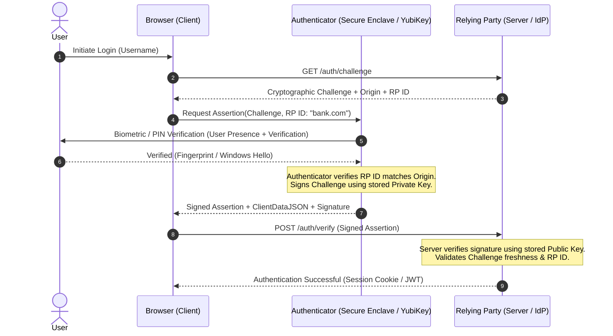

# Multi-Factor Authentication (MFA), TOTP, and Passkeys / FIDO2

## 1. Topic & Definition
Multi-Factor Authentication (MFA) is an identity verification mechanism requiring a user to present two or more independent credentials across different authentication categories before access is granted.

### Core Authentication Factors
1. **Knowledge (Something you know):** Password, PIN, passphrase, security questions.
2. **Possession (Something you have):** Hardware token (YubiKey), smartphone authenticator app, smart card, cryptographic private key.
3. **Inherence (Something you are):** Biometrics (fingerprint scan, facial recognition, retina scan, voiceprint).
4. **Context / Inherent Attribute (Something you do / Where you are):** Geolocation, typing cadence, IP reputation, behavioral velocity.

> **Crucial Rule:** Presenting two items from the *same* factor (e.g., password + security question PIN) is **Multi-Step Authentication (2-Step)**, NOT true Multi-Factor Authentication. True MFA requires crossing distinct factor categories.

---

## 2. How It Works: Protocols and Cryptographic Flows

### A. Time-Based One-Time Password (TOTP — RFC 6238)
TOTP extends HMAC-based One-Time Passwords (HOTP — RFC 4226) by replacing an incrementing counter with Unix epoch time steps (typically 30 seconds).

```
[Enrollment / Registration]
1. Server generates random shared secret key K (Base32 encoded, e.g., 160-bit).
2. Server presents K to User via QR Code (otpauth://totp/App:user@domain?secret=JBSWY3DPEHPK3PXP&issuer=App).
3. Authenticator app scans QR code and stores K securely in protected storage.

[Authentication Verification Cycle]
1. Current Unix Epoch Time T = CurrentTimestamp() (seconds since Jan 1, 1970).
2. Time Step Window: C = floor((T - T0) / X), where X = 30 seconds (default).
3. Compute HMAC: H = HMAC-SHA1(K, C) (or SHA256 / SHA512).
4. Dynamic Truncation:
   - Extract offset from last nibble of H: offset = H[19] & 0x0F.
   - Extract 4 bytes: P = (H[offset] & 0x7F) << 24 | (H[offset+1] & 0xFF) << 16 | (H[offset+2] & 0xFF) << 8 | (H[offset+3] & 0xFF).
5. Generate 6-digit code: OTP = P mod 10^6.
6. Server performs identical calculation for C, C-1, and C+1 (to account for minor clock drift). If match -> Authenticated.
```

```
+-----------------------------------------------------------------------------------+
|                            TOTP Protocol Flow                                     |
+-----------------------------------------------------------------------------------+
  Authenticator App (Possession)                      Identity Provider (IdP)
       |                                                         |
       |  Shared Secret 'K' synchronized during QR enrollment   |
       |                                                         |
  Calculates C = floor(Time / 30)                                |
  Computes HMAC-SHA1(K, C)                                       |
  Derives 6-digit OTP (e.g., 492813)                             |
       |                                                         |
       |--------- POST /login (Username, Pass, OTP: 492813) ---->|
       |                                                         | Validates Password
       |                                                         | Computes HMAC(K, C)
       |                                                         | Checks C, C-1, C+1
       |                                                         | Match = True
       |<-------- 200 OK (Session / Bearer Token) --------------|
```

### B. FIDO2 / WebAuthn & Passkeys (Phishing-Resistant MFA)
FIDO2 comprises **WebAuthn** (W3C browser API) and **CTAP2** (Client to Authenticator Protocol). Passkeys replace passwords with public-key cryptography bound directly to the web origin (domain).



**Why FIDO2 / Passkeys are Phishing-Proof:**
- The browser enforces origin binding. If an attacker directs a user to `evil-phish-bank.com`, the browser transmits `evil-phish-bank.com` as the RP ID to the authenticator.
- The authenticator looks up credentials tied only to `evil-phish-bank.com`. It will **never** release credentials or sign challenges for `bank.com`.
- Reverse-proxy phishing kits (e.g., Evilginx) cannot capture or replay passkey credentials.

---

## 3. Practical Configurations, Commands, and Implementations

### TOTP URI Structure
```
otpauth://totp/EnterpriseIdP:alice@corp.com?secret=HXDMVJECJJWSRB3HWIZR4IFUGFTMXBOZ&issuer=EnterpriseIdP&algorithm=SHA1&digits=6&period=30
```

### Linux PAM Configuration for Google Authenticator (`/etc/pam.d/sshd`)
```bash
# Require public key + TOTP MFA for SSH access
auth required pam_google_authenticator.so nullok echo_verification_code forward_pass
auth required pam_permit.so
```
In `/etc/ssh/sshd_config`:
```bash
ChallengeResponseAuthentication yes
AuthenticationMethods publickey,keyboard-interactive
UsePAM yes
```

### FIDO2 / Hardware Token Verification via OpenSSH
```bash
# Generate hardware-backed ECDSA-SK SSH key (FIDO2 / YubiKey)
ssh-keygen -t ecdsa-sk -O resident -O verify-required -f ~/.ssh/id_yubikey

# The private key stub requires touch presence on physical key whenever used
ssh -i ~/.ssh/id_yubikey user@hardened-bastion.corp.local
```

---

## 4. Key Differences Matrix: MFA Technologies

| Dimension | SMS / Voice OTP | Email Magic Link | Authenticator App (TOTP) | Push Notification (Duo/Okta) | FIDO2 / WebAuthn / Passkeys |
| :--- | :--- | :--- | :--- | :--- | :--- |
| **Factor Category** | Possession (Simulated) | Possession | Possession (App) | Possession (App) | Possession + Inherence/Knowledge |
| **Phishing Resistance** | ❌ Vulnerable (Proxies) | ❌ Vulnerable | ❌ Vulnerable (Evilginx captures OTP) | ⚠️ Vulnerable to MFA Fatigue / Proxies | ✅ **100% Cryptographically Phishing-Proof** |
| **Offline Operation** | ❌ Requires cellular | ❌ Requires internet | ✅ Fully offline (Clock-based) | ❌ Requires cellular / internet | ✅ Fully offline (Local hardware) |
| **Key Threat Vector** | SIM-swapping, SS7 interception | Account takeover on email | Adversary-in-the-Middle (AiTM) | MFA Prompt Bombing (Fatigue) | Physical device theft (requires PIN/Bio) |
| **NIST 800-63B Level** | Restricted / Discouraged | AAL2 (Conditional) | AAL2 | AAL2 (with Number Matching) | **AAL3 (Highest Assurance)** |

---

## 5. Cybersecurity Relevance, Threats & Attack Vectors

### 1. Adversary-in-the-Middle (AiTM) Reverse Proxy Phishing (Evilginx3 / Modlishka)
- **Mechanism:** Attackers set up a transparent reverse proxy between the victim and legitimate identity provider (e.g., login.microsoftonline.com).
- **Execution:** When the user enters their password and TOTP code, Evilginx relays them in real time to Microsoft. Upon successful authentication, Microsoft returns the authenticated `ESTSAUTH` and `ESTSAUTHPERSISTENT` session cookies. Evilginx steals these session cookies, bypassing MFA completely without breaking the encryption.
- **Defense:** Deploy FIDO2 / Passkeys / Conditional Access requiring Compliant Managed Devices.

### 2. MFA Fatigue Attack (Prompt Bombing)
- **Mechanism:** Attackers obtain credentials through credential stuffing or breaches. They trigger dozens of MFA push notifications to the victim's smartphone at odd hours (e.g., 3:00 AM) while contacting them via WhatsApp or Teams pretending to be IT support ("Please accept to stop the notifications").
- **Real-World Incident:** Uber (2022 breach) was compromised via MFA fatigue directed at an external contractor.
- **Defense:**
  1. **Number Matching:** The login screen presents a 2-digit number that the user must manually type into the authenticator push screen.
  2. **Rate Limiting:** Lock push notifications after 3 consecutive rejections.
  3. **Contextual Alerts:** Show IP address, geographic location, and application name on the authorization screen.

### 3. SIM Swapping & SS7 Interception
- **Mechanism:** Social engineering cellular carrier support to port the victim's phone number to an attacker-controlled SIM card, intercepting SMS OTPs.

---

## 6. Interview Takeaways & Rapid-Fire Q&A

### 60-Second Elevator Pitch
> *"Multi-Factor Authentication verifies identity across two or more distinct categories: knowledge, possession, and inherence. Traditional MFA like SMS and TOTP codes are vulnerable to modern Adversary-in-the-Middle (AiTM) reverse proxies like Evilginx that capture session tokens post-authentication. Modern enterprise standard mandates FIDO2/WebAuthn Passkeys, which utilize asymmetric cryptography mathematically bound to the specific browser domain (RP ID), rendering phishing and credential theft technically impossible even if the user is deceived into visiting a malicious site."*

### Candidate Traps & Common Mistakes
- **Trap 1:** Calling Password + Security Question "MFA". *Correction:* Both are knowledge factors; that is 2-step verification, not 2-factor authentication.
- **Trap 2:** Believing TOTP requires an internet connection on the mobile device. *Correction:* TOTP relies purely on a shared secret and synchronized Unix time steps (`epoch / 30`). It functions completely offline.
- **Trap 3:** Assuming MFA makes a system unhackable. *Correction:* MFA protects authentication, not session tokens. Once an attacker steals the session cookie (via Infostealer malware or AiTM), MFA is completely bypassed.

### Expected Follow-Up Questions
1. *How do you mitigate MFA fatigue without transitioning all users to hardware tokens overnight?*
   - Enable Number Matching in Microsoft Entra / Duo, suppress high-risk push prompts via risk-based conditional access, and rate limit MFA pushes.
2. *What happens if the internal clock on a client device drifts by 45 seconds during TOTP generation?*
   - Robust IdP verifiers evaluate a verification window typically spanning `[C - 1, C, C + 1]`. A 45-second drift falls into `C - 1` or `C + 1`, allowing successful validation while tracking drift adjustments.
