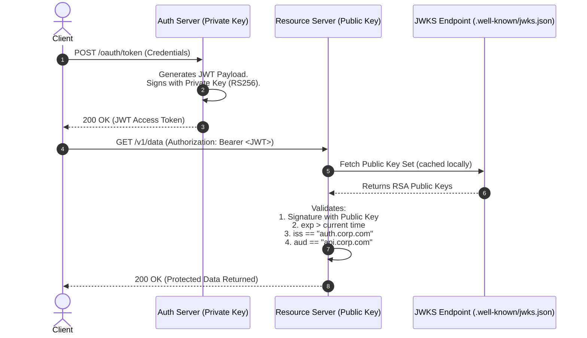

# JSON Web Tokens (JWT) Architecture, Claims, and Cryptographic Security

## 1. Topic & Definition
A **JSON Web Token (JWT — RFC 7519)** is a compact, URL-safe, self-contained means for cryptographically transferring claims between two parties. It is widely adopted in modern stateless authentication, microservices architecture, and OAuth 2.0 / OpenID Connect authorization ecosystems.

### Core Architecture: The Three Components
A JWT is represented as three Base64URL-encoded strings separated by dots (`.`):
```
header.payload.signature
```

```
+--------------------------------------------------------------------------------------------------+
|                                    JWT Token Structure                                           |
+--------------------------------------------------------------------------------------------------+
  eyJhbGciOiJIUzI1NiIsInR5cCI6IkpXVCJ9.eyJzdWIiOiIxMjM0NTYiLCJuYW1lIjoiQWxpY2UiLCJyb2xlIjoiYWRtaW4ifQ.sV_xY72...
  \__________________________________/ \_____________________________________________________________/ \___________/
             Part 1: Header                                    Part 2: Payload                         Part 3: Signature
        Base64URL(JSON Metadata)                           Base64URL(JSON Claims)                   Cryptographic Hash/Sig
```

1. **Header:** Contains metadata specifying the token type (`typ: "JWT"`) and the cryptographic signing algorithm (`alg: "HS256"` or `"RS256"`, plus optional key identifier `kid`).
2. **Payload:** Contains the claims (statements about an entity and additional data).
3. **Signature:** Calculated by hashing/signing the concatenated encoded header and payload using a secret key (symmetric) or private key (asymmetric).

> **Vital Architectural Truth:** A JWT is **signed**, NOT **encrypted** (unless using JWE — JSON Web Encryption). Anyone who intercepts a JWT can decode the Base64URL payload and read all sensitive claims in plaintext. Never store raw passwords, SSNs, or API credentials inside JWT claims.

---

## 2. How It Works: Claims, Signatures, and Verification Flow

### A. JWT Claims Hierarchy
1. **Registered Claims (Standardized RFC 7519):**
   - `iss` (Issuer): Identity of the authority that created the token (e.g., `https://auth.enterprise.com`).
   - `sub` (Subject): Principal identity (unique user ID, e.g., `usr_98a72f01`).
   - `aud` (Audience): Intended recipient/resource server (e.g., `https://api.enterprise.com/billing`).
   - `exp` (Expiration Time): Unix epoch timestamp after which the token is strictly invalid.
   - `nbf` (Not Before): Unix timestamp before which token must not be accepted.
   - `iat` (Issued At): Timestamp when token was created.
   - `jti` (JWT ID): Unique identifier for one-time use / replay attack mitigation.
2. **Public Claims:** Defined in IANA JSON Web Token Registry or given URI collision-resistant names.
3. **Private Claims:** Custom application-specific attributes (e.g., `roles: ["secops", "admin"]`, `tenant_id: "org_451"`).

### B. Cryptographic Signing Mechanisms

#### Symmetric Signing (HMAC — HS256 / HS384 / HS512)
- **Concept:** Both the Authorization Server and Resource Server share the **exact same symmetric secret key**.
- **Signature Calculation:**
  $$\text{Signature} = \text{HMAC-SHA256}(\text{Base64URL}(Header) + "." + \text{Base64URL}(Payload), Secret)$$
- **Limitation:** Any microservice or resource server that validates the signature possesses the secret key and could forge arbitrary tokens.

#### Asymmetric Signing (RSA / ECDSA — RS256 / ES256 / Ed25519)
- **Concept:** Auth Server signs the token with a **Private Key**. Any resource server validates the token using the corresponding **Public Key** fetched via JWKS.
- **Security Advantage:** Microservices only possess the public key; compromise of a downstream API does not allow forging tokens.



---

## 3. Practical Token Dissection and Verification Logic

### Raw Decoded Header & Payload Example
**Header (JSON):**
```json
{
  "alg": "RS256",
  "typ": "JWT",
  "kid": "k-2026-prod-01"
}
```

**Payload (JSON):**
```json
{
  "iss": "https://auth.corp.com",
  "sub": "user_491823",
  "aud": "https://api.corp.com/v1",
  "iat": 1775836800,
  "exp": 1775837700,
  "roles": ["read:logs", "write:alerts"],
  "jti": "d6f43e11-9a72-4b21-8845-a764d89a0b12"
}
```

### JSON Web Key Set (JWKS) Structure (`/.well-known/jwks.json`)
```json
{
  "keys": [
    {
      "kty": "RSA",
      "use": "sig",
      "kid": "k-2026-prod-01",
      "alg": "RS256",
      "n": "u1W...[Base64URL Modulus]...",
      "e": "AQAB"
    }
  ]
}
```

### Strict Backend Validation Pseudocode
```python
# Theoretical Server-Side Validation Checklist
def validate_jwt(token, expected_issuer, expected_audience, trusted_public_key):
    # 1. Parse without trusting header blindly
    header, payload, signature = parse_jwt_parts(token)
    
    # 2. Enforce strict whitelist of allowed algorithms (Reject "none" or algorithm switching)
    if header['alg'] != 'RS256':
        raise SecurityException("Algorithm not allowed: " + header['alg'])
    
    # 3. Cryptographically verify signature using trusted public key
    if not verify_rsa_signature(header, payload, signature, trusted_public_key):
        raise SecurityException("Invalid Cryptographic Signature")
        
    # 4. Enforce temporal claims
    current_time = get_epoch_timestamp()
    if payload['exp'] <= current_time:
        raise TokenExpiredException("Token expired")
    if payload.get('nbf', 0) > current_time:
        raise SecurityException("Token not yet active")
        
    # 5. Validate Identity Boundaries
    if payload['iss'] != expected_issuer:
        raise SecurityException("Untrusted Issuer")
    if payload['aud'] != expected_audience:
        raise SecurityException("Audience mismatch")
        
    return payload
```

---

## 4. Key Differences Matrix: HS256 vs RS256 vs ES256

| Feature | HS256 (HMAC-SHA256) | RS256 (RSA Signature) | ES256 (ECDSA P-256) |
| :--- | :--- | :--- | :--- |
| **Cryptography Type** | Symmetric | Asymmetric | Asymmetric (Elliptic Curve) |
| **Key Architecture** | Single Shared Secret | Private Key (Sign) + Public Key (Verify) | Private Key (Sign) + Public Key (Verify) |
| **Key Size** | 256 bits minimum recommended | 2048 - 4096 bits | 256 bits |
| **Token Size Overhead** | Minimal (~43 byte signature) | Large (~256–512 byte signature) | Compact (~64 byte signature) |
| **Microservice Isolation** | Poor (All services need secret) | High (Only IdP has private key) | High (Only IdP has private key) |
| **CPU Performance** | Extremely fast signing/verification | Fast verification, slow signing | Fast signing and verification |
| **Industry Preference** | Internal monolithic systems | Legacy enterprise / OAuth IdPs | Modern cloud-native APIs |

---

## 5. Cybersecurity Relevance, Threats & Attack Vectors

### 1. The Algorithm Switching Attack (`alg: "none"`)
- **Mechanism:** The JWT specification permits `"alg": "none"` for unsecured tokens. If a backend library naively extracts the algorithm from the untrusted token header, an attacker modifies the payload (setting `admin: true`), changes `alg` to `"none"`, removes the signature, and sends `header.payload.`.
- **Impact:** Complete authentication bypass and arbitrary privilege escalation.
- **Defense:** Hardcode the verification algorithm in the backend framework. Never allow user-supplied headers to define the algorithm parameter.

### 2. HMAC vs RSA Key Confusion Vulnerability (Algorithm Confusion)
- **Mechanism:** The API server is designed to verify tokens signed with RSA (RS256) using a public key file (`public.pem`).
- **Exploitation:**
  1. Attacker obtains the server's public key (which is publicly accessible via JWKS or web page).
  2. Attacker modifies the JWT payload.
  3. Attacker changes the header `"alg"` to `"HS256"` (symmetric HMAC).
  4. Attacker signs the token using the server's **RSA Public Key as the HMAC secret string**.
  5. The server checks `alg`, sees `HS256`, calls `HMAC(token, server_public_key)`, and because both attacker and server used the exact same public key bytes, the signature validates as authentic!
- **Defense:** Explicitly enforce `algorithm=["RS256"]` in the validator and ensure public keys cannot be fed into HMAC verification routines.

### 3. Weak Symmetric Secrets & Offline Brute-Forcing
- **Mechanism:** If HS256 uses a weak dictionary secret (e.g., `secret123`, `jwt_secret`), attackers capture a legitimate token and crack it offline using tools like `hashcat` (`hashcat -m 16500 jwt.txt rockyou.txt`). Once cracked, attackers forge valid tokens at will.
- **Defense:** Use minimum 256-bit cryptographically secure pseudorandom keys, or enforce asymmetric RS256/ES256.

### 4. Header Parameter Injection (`jku`, `jwk`, `kid` SQLi/Directory Traversal)
- **`jku` Injection:** Attacker changes `jku` (JWK Set URL) in header to point to attacker server (`https://attacker.com/jwks.json`), signing with their own private key. Mitigated by strict domain whitelisting.
- **`kid` Path Traversal:** Setting `"kid": "../../../dev/null"` causes HMAC validator to use an empty string as secret key. Mitigated by sanitizing key IDs against a strictly controlled key registry.

---

## 6. Interview Takeaways & Rapid-Fire Q&A

### 60-Second Elevator Pitch
> *"A JSON Web Token (JWT) is a compact, URL-safe container for cryptographically signed claims consisting of a Header, Payload, and Signature. Unlike stateful session IDs, JWTs allow stateless authorization in distributed microservices where resource servers verify claims using the issuer's public key without querying a central database. However, JWT security depends entirely on strict verification: servers must enforce expected algorithms to prevent 'alg: none' and Key Confusion attacks, validate expiration (exp), audience (aud), and issuer (iss) boundaries, and keep expiration short since stateless tokens cannot be revoked natively without token blocklists or refresh token rotation."*

### Candidate Traps & Common Mistakes
- **Trap 1:** Believing JWT payloads are confidential. *Correction:* Standard JWTs are signed, not encrypted. Base64URL is encoding, not encryption; anyone can read the claims.
- **Trap 2:** Storing long-lived JWT access tokens in browser `localStorage`. *Correction:* `localStorage` is accessible to JavaScript, making tokens vulnerable to Cross-Site Scripting (XSS). Access tokens belong in memory or HttpOnly Secure cookies.
- **Trap 3:** Trusting the `alg` header parameter. *Correction:* Never allow the client's token header to dictate which cryptographic algorithm the backend executes.

### Expected Follow-Up Questions
1. *How do you invalidate a stateless JWT before its expiration time if a user logs out or is compromised?*
   - Three standard patterns: (a) Maintain a short TTL (5–15 mins) and revoke the stateful Refresh Token in Redis; (b) Maintain a distributed Redis revocation list (Token Blacklist) storing revoked `jti` IDs until their natural expiration; (c) Track a `token_version` or `password_changed_at` integer in the user record and reject tokens with mismatched version numbers.
2. *What is the difference between JWS and JWE?*
   - JWS (JSON Web Signature) provides integrity and authenticity (claims are readable). JWE (JSON Web Encryption) encrypts the payload, ensuring confidentiality in transit even to intermediate relays.
