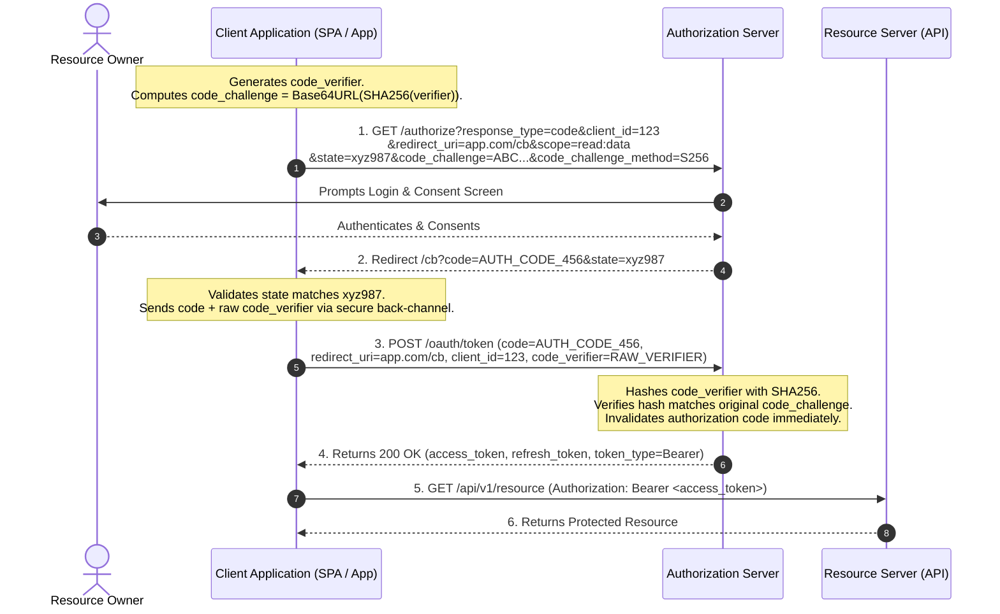

# OAuth 2.0 Authorization Framework and Grant Types (RFC 6749 & RFC 7636)

## 1. Topic & Definition
**OAuth 2.0 (RFC 6749)** is an open industry-standard **authorization framework** that enables a third-party application to obtain delegated, scoped, and time-limited access to protected HTTP resources on behalf of a resource owner without exposing the owner's credentials to the application.

### The Four Fundamental Roles
1. **Resource Owner:** The entity capable of granting access to a protected resource (typically the human end-user).
2. **Client:** The application requesting access to protected resources (can be web, native mobile, Single Page Application, or daemon service).
3. **Authorization Server:** The server that authenticates the Resource Owner, gathers consent, and issues Access Tokens (and optionally Refresh Tokens).
4. **Resource Server:** The server hosting the protected data/APIs, capable of accepting and responding to protected resource requests using Access Tokens.

---

## 2. How It Works: Grant Types & Detailed Protocol Flows

### A. Authorization Code Flow with PKCE (Proof Key for Code Exchange — RFC 7636)
**Mandatory gold standard** for all public clients (SPAs, mobile apps) and modern web applications to prevent authorization code interception attacks.

#### PKCE Mathematical Foundations
1. Client generates a cryptographically random string: **Code Verifier** ($43 \le \text{length} \le 128$).
2. Client computes the **Code Challenge**:
   $$\text{Code Challenge} = \text{Base64URL}(\text{SHA256}(\text{Code Verifier}))$$
3. Client specifies `code_challenge_method = "S256"`.



### B. Client Credentials Flow (Machine-to-Machine / Daemons)
Used when the client itself is the resource owner (background cron jobs, microservice-to-microservice communication, daemon integrations). There is no human user interaction.

```
+-----------------------------------------------------------------------------------+
|                        Client Credentials Flow (M2M)                              |
+-----------------------------------------------------------------------------------+

     Confidential Client (Backend Service)               Authorization Server
                 |                                                 |
                 |-- POST /oauth/token --------------------------->|
                 |   grant_type=client_credentials                 |
                 |   client_id=backend_srv_01                      | Validates Client ID
                 |   client_secret=K89#xP...                       | & Secret against DB
                 |   scope=billing:write                           |
                 |                                                 | Generates Scoped
                 |                                                 | Access Token
                 |<-- 200 OK (access_token, expires_in=3600) ------|
                 |
     Client now accesses API directly using Access Token.
```

### C. Device Authorization Flow (RFC 8628)
Designed for browser-less or input-constrained devices (Smart TVs, CLI tools, IoT devices).
1. Device calls `/device/code` and receives a `device_code` and a human-friendly `user_code` (e.g., `WDJB-HGZX`) with a verification URL (`https://auth.tv.com/activate`).
2. Device displays the code on screen and instructs user to open a browser on phone/PC.
3. Device polls the authorization server in the background (`/token`).
4. Once user enters the code on their phone and authenticates, the server grants the token to the polling device.

---

## 3. Deprecated Grant Types & Security Flaws

### 1. Implicit Grant (`response_type=token`) — **STRICTLY DEPRECATED**
- **Original Intent:** Developed for SPAs before CORS was widespread; returned the access token directly in the URI hash fragment (`#access_token=...`).
- **Fatal Flaws:**
  - Tokens exposed directly in browser history, HTTP `Referer` headers, and web server access logs.
  - No client authentication possible.
  - Replaced universally by **Authorization Code Flow with PKCE**.

### 2. Resource Owner Password Credentials (ROPC) (`grant_type=password`) — **STRICTLY DEPRECATED**
- **Mechanism:** User types raw username and password directly into the third-party client application, which forwards them to `/token`.
- **Fatal Flaws:**
  - Destroys the fundamental premise of OAuth: the third-party client gets visibility of plaintext user credentials.
  - Breaks MFA and federated identity integration.
  - Highly susceptible to credential stuffing and credential harvesting.

---

## 4. Key Differences Matrix: OAuth 2.0 Grant Types

| Grant Type | Target Client | User Present? | Client Secret Required? | Primary Security Risk / Defense |
| :--- | :--- | :--- | :--- | :--- |
| **Auth Code + PKCE** | SPAs, Mobile Apps, Web Apps | Yes | No (Public clients) / Yes (Confidential) | Code interception / Mitigated by PKCE and exact redirect URIs |
| **Client Credentials** | Backend Services, Daemons | **No** | **Yes** (Strictly confidential) | Secret leakage / Mitigated by Secret Managers & Key Rotation |
| **Device Code** | Smart TVs, CLI tools, IoT | Yes (Out of band) | No | Phishing via fake activation URLs / Mitigated by polling rate limits |
| **Implicit (Deprecated)**| Legacy SPAs | Yes | No | Token leakage via URL hash fragment & Referer header |
| **ROPC (Deprecated)** | Legacy apps | Yes | No / Yes | Plaintext credential harvesting by client |

---

## 5. Cybersecurity Relevance, Threats & Attack Vectors

### 1. CSRF on Authorization Endpoint (Mitigated by `state`)
- **Mechanism:** An attacker initiates an authorization flow, obtains an authorization code linked to the *attacker's* account, and tricks a victim into clicking the callback link: `https://client.com/callback?code=ATTACKER_CODE`.
- **Impact:** The victim's client account becomes linked to the attacker's resources (or vice versa).
- **Defense:** Enforce a cryptographically random, unguessable, session-bound `state` parameter in step 1. The client must verify that the returned `state` matches the value saved in the victim's session before exchanging the code.

### 2. Open Redirector & Authorization Code Theft
- **Mechanism:** If the Authorization Server uses loose wildcard matching on the `redirect_uri` (e.g., `https://client.com/*`), an attacker crafts an authorization URL directing the callback to an open redirector:
  `https://auth.com/authorize?...&redirect_uri=https://client.com/redirect?url=https://attacker.com`
- **Impact:** The authorization server passes the sensitive authorization code directly to the attacker's infrastructure.
- **Defense:** RFC 6749 Section 3.1.2 mandates **exact string matching** of pre-registered redirect URIs without wildcards or regexes.

### 3. Scope Creep and Over-Privileged Tokens
- **Mechanism:** Client requests expansive scopes (`scope=read,write,admin,delete`) when it only needs `read`.
- **Defense:** Enforce Principle of Least Privilege: request minimal viable scopes dynamically per action.

---

## 6. Interview Takeaways & Rapid-Fire Q&A

### 60-Second Elevator Pitch
> *"OAuth 2.0 is an authorization framework designed for delegated resource access without credential sharing. It operates across four core roles: Resource Owner, Client, Authorization Server, and Resource Server. The industry gold standard for all user-facing applications—both web and mobile—is Authorization Code with PKCE (Proof Key for Code Exchange), which binds the code exchange cryptographically using a one-time SHA-256 code challenge to prevent interception. Legacy flows like Implicit and Password (ROPC) are formally deprecated due to token leakage in URL fragments and plaintext credential exposure. Security depends entirely on exact redirect URI matching, dynamic CSRF state verification, and least-privilege scoping."*

### Candidate Traps & Common Mistakes
- **Trap 1:** Saying "OAuth 2.0 logs the user in". *Correction:* OAuth is an authorization framework, not an authentication protocol. It authorizes access to APIs; it does not authenticate who the user is without OpenID Connect.
- **Trap 2:** Confusing `state` with `PKCE`. *Correction:* `state` prevents CSRF on the client callback; `PKCE` prevents an attacker from intercepting and redeeming the authorization code on public clients.
- **Trap 3:** Using Client Credentials for Single Page Applications (SPAs). *Correction:* SPAs are public clients running in browser environments; they cannot keep a `client_secret` confidential.

### Expected Follow-Up Questions
1. *Why can't a Single Page App (SPA) safely use a client secret?*
   - Because all code and network traffic in an SPA execute on the user's browser where anyone can inspect dev tools, decompile JavaScript, or dump memory to extract the secret.
2. *What is the difference between `code_challenge_method=plain` and `S256`?*
   - `plain` sends the raw verifier string without hashing, which provides zero cryptographic protection if network traffic is inspected. `S256` hashes the verifier with SHA-256; only the party possessing the pre-image can redeem the code.
