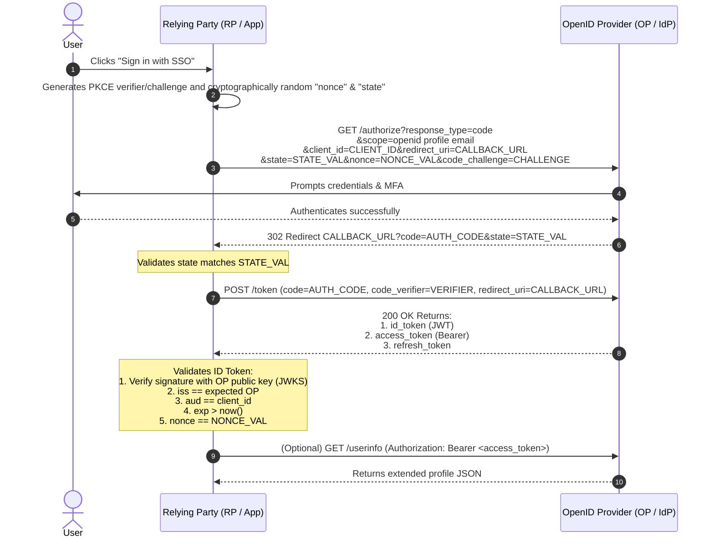

# OpenID Connect (OIDC) Identity Layer Architecture

## 1. Topic & Definition
**OpenID Connect 1.0 (OIDC)** is an interoperable **authentication protocol** built as an identity layer directly on top of the OAuth 2.0 authorization framework. 

While OAuth 2.0 authorizes access to APIs via an opaque or structured Access Token, OIDC introduces standardized mechanisms for verifying user identity, providing clients with a cryptographically signed **ID Token** and a standardized **UserInfo Endpoint**.

```
+---------------------------------------------------------------------------------+
|                       The Identity & Auth Layer Cake                            |
+---------------------------------------------------------------------------------+
|   OpenID Connect (OIDC)   --> Authentication (Identity, "Who are you?", ID Token)
+---------------------------------------------------------------------------------+
|   OAuth 2.0 Framework     --> Authorization (Delegated Access, "What can you do?", Access Token)
+---------------------------------------------------------------------------------+
|   HTTPS / TLS 1.3         --> Secure Transport Layer
+---------------------------------------------------------------------------------+
```

---

## 2. How It Works: ID Token Architecture & Protocol Flows

### A. The OIDC ID Token Anatomy
An ID Token is strictly formatted as a signed **JSON Web Token (JWT)** that certifies the authentication event:

```json
{
  "iss": "https://accounts.google.com",
  "sub": "1098234810293810293",
  "aud": "my-client-app-id.apps.googleusercontent.com",
  "exp": 1775840400,
  "iat": 1775836800,
  "auth_time": 1775836790,
  "nonce": "n-0S6_WzA2Mj",
  "acr": "urn:mace:incommon:iap:silver",
  "amr": ["pwd", "mfa", "otp"],
  "email": "alice@enterprise.com",
  "email_verified": true
}
```

#### Critical OIDC Claims Explained
- `sub` (Subject): The stable, unique identifier for the authenticated user within the issuer's namespace.
- `auth_time`: Time when the actual human authentication event occurred (used to enforce re-auth for sensitive operations).
- `nonce`: String value passed in the authorization request that is reflected verbatim in the ID Token to prevent replay attacks.
- `acr` (Authentication Context Class Reference): Indicates the assurance level of the auth event.
- `amr` (Authentication Methods References): Array of identifiers describing how the user authenticated (e.g., password + OTP).

### B. OIDC Core Protocol Flow (Authorization Code Flow)



### C. Standard OIDC Endpoints & The Discovery Document
All conformant OpenID Providers publish an automated discovery document located at the well-known URI:
`https://<issuer-domain>/.well-known/openid-configuration`

Key parameters exposed in the discovery document:
- `issuer`: The exact string the OP asserts as its issuer identifier.
- `authorization_endpoint`: URL where client redirects users for login.
- `token_endpoint`: URL where client exchanges authorization codes for tokens.
- `userinfo_endpoint`: URL where access tokens can be exchanged for detailed claims.
- `jwks_uri`: URL where the OP's public keys are hosted to verify signatures.
- `scopes_supported`: List of supported scopes (`openid`, `profile`, `email`, etc.).
- `claims_supported`: List of claims that can be asserted.

---

## 3. Practical Token Dissection and Scope Mappings

### Standard OIDC Scopes and Associated Claims
The presence of `scope=openid` is the **mandatory flag** that transforms an OAuth 2.0 transaction into an OpenID Connect authentication flow.

| Scope | Resulting Claims Returned in ID Token / UserInfo |
| :--- | :--- |
| `openid` | **Mandatory.** Signals OIDC flow; yields `sub`, `iss`, `aud`, `exp`, `iat`. |
| `profile` | `name`, `family_name`, `given_name`, `middle_name`, `nickname`, `picture`, `updated_at`. |
| `email` | `email`, `email_verified`. |
| `address` | `formatted`, `street_address`, `locality`, `region`, `postal_code`, `country`. |
| `phone` | `phone_number`, `phone_number_verified`. |

---

## 4. Key Differences Matrix: ID Token vs Access Token

| Dimension | ID Token | Access Token |
| :--- | :--- | :--- |
| **Intended Consumer** | **The Client Application (Relying Party)** | **The Resource Server (API)** |
| **Format** | Strictly a signed JSON Web Token (JWT) | Opaque string OR JWT |
| **Purpose** | Identity verification and user profile data | Authorization to access APIs and resources |
| **Audience (`aud`)** | The Client's `client_id` | The Resource Server's identifier / API URI |
| **Usage** | Inspected and validated by client app logic | Sent in HTTP `Authorization: Bearer` header |
| **Security Handling** | Never pass as API credentials to external APIs | Sent to APIs; must never be leaked to untrusted parties |

---

## 5. Cybersecurity Relevance, Threats & Attack Vectors

### 1. ID Token Replay Attack (Mitigated by `nonce`)
- **Mechanism:** An attacker intercepts a legitimate ID Token issued to a user and replays it to the client application to forge an active session.
- **Defense:** The client generates a unique, cryptographically random `nonce` stored in the user's browser session before initiating the flow. The OP embeds this exact `nonce` inside the signed ID Token payload. When the client receives the token, it verifies that `claims.nonce === session.nonce`. Once validated, the nonce is immediately destroyed.

### 2. ID Token Confusion Attack (Audience Mismatch)
- **Mechanism:** An attacker creates an account on their own rogue application registered with the same OpenID Provider (e.g., Google). They extract their valid ID Token (where `aud: attacker_app_id`) and submit it to a target application (`victim_app`).
- **Exploitation:** If `victim_app` verifies the signature but fails to check the `aud` claim, it logs the attacker into the account corresponding to the `sub` claim.
- **Defense:** Strict validation: `assert token.aud == MY_REGISTERED_CLIENT_ID`.

### 3. Identity Provider Impersonation (Issuer Mismatch)
- **Mechanism:** Attacker tricks the client into accepting an ID token signed by an attacker-controlled issuer.
- **Defense:** Always validate that `token.iss` matches the configured issuer URL byte-for-byte.

---

## 6. Interview Takeaways & Rapid-Fire Q&A

### 60-Second Elevator Pitch
> *"OpenID Connect (OIDC) is an identity layer built on OAuth 2.0 that standardizes authentication. While OAuth 2.0 returns an Access Token intended solely for APIs, OIDC introduces the ID Token—a signed JWT containing verified identity claims like `sub`, `email`, and `auth_time` intended specifically for the client application. The flow is triggered by requesting the `openid` scope. Robust OIDC client security demands strict verification of the ID token: validating the cryptographic signature via the issuer's JWKS, ensuring the `aud` claim matches the client ID to prevent cross-app impersonation, and verifying the `nonce` claim to eliminate replay attacks."*

### Candidate Traps & Common Mistakes
- **Trap 1:** Passing an ID Token to a backend API as an authorization credential. *Correction:* ID Tokens are meant for the client to know who is logged in; APIs expect Access Tokens. Passing ID tokens breaks audience boundaries.
- **Trap 2:** Forgetting the `openid` scope. *Correction:* If `scope=openid` is omitted from the authorization request, the authorization server executes pure OAuth 2.0 and will not issue an ID Token.
- **Trap 3:** Trusting claims without validating `iss` and `aud`. *Correction:* Verifying the signature is only step one. Failing to check `iss` and `aud` opens the door to cross-tenant impersonation attacks.

### Expected Follow-Up Questions
1. *Why does OIDC provide both an ID Token and a UserInfo endpoint?*
   - To optimize performance and bandwidth. The ID Token provides minimal cryptographic proof of authentication immediately; the UserInfo endpoint allows fetching larger, optional profile attributes on demand.
2. *What is the difference between `acr` and `amr` claims?*
   - `acr` (Authentication Context Class Reference) indicates the level of assurance achieved (e.g., NIST AAL2). `amr` (Authentication Methods References) lists the specific mechanisms used (e.g., `["pwd", "otp"]`).
