# SAML 2.0 Enterprise Identity Federation Architecture

## 1. Topic & Definition
**Security Assertion Markup Language 2.0 (SAML 2.0)** is an open OASIS XML-based standard for exchanging authentication and authorization data between an **Identity Provider (IdP)** and a **Service Provider (SP)** across distinct security domains.

SAML 2.0 remains the foundational standard for legacy enterprise Single Sign-On (SSO), powering integrations across enterprise SaaS ecosystems (e.g., Okta/Entra ID authenticating Salesforce, Workday, Zoom, ServiceNow).

### Core Components
1. **Assertions:** XML tokens containing cryptographically verified identity statements:
   - *Authentication Statements:* Proves the subject authenticated at a specific time via a specific method.
   - *Attribute Statements:* Carries user profile attributes (e.g., email, department, groups).
   - *Authorization Decision Statements:* Specifies whether the user is permitted to perform actions.
2. **Protocols:** XML-defined request and response messages (e.g., `AuthnRequest`, `Response`, `LogoutRequest`).
3. **Bindings:** Mappings of SAML protocol messages onto standard transport layers (HTTP Redirect Binding, HTTP POST Binding, HTTP Artifact Binding).
4. **Profiles:** End-to-end specifications combining assertions, protocols, and bindings for concrete use cases (e.g., *Web Browser SSO Profile*).

---

## 2. How It Works: SAML 2.0 Protocol Flows & XML Anatomy

### A. SP-Initiated Web Browser SSO Profile (HTTP Redirect / POST Binding)
This is the most secure and prevalent enterprise workflow.

```mermaid
sequenceDiagram
    autonumber
    actor User as User Agent (Browser)
    participant SP as Service Provider (e.g., Salesforce)
    participant IdP as Identity Provider (e.g., Okta / Entra ID)

    User->>SP: 1. Attempts to access https://salesforce.com/dashboard
    SP->>SP: Unauthenticated. Generates AuthnRequest XML.<br/>Defines ID, IssueInstant, ACS URL.
    SP-->>User: 2. 302 Redirect to IdP SingleSignOnService URL<br/>(SAMLRequest=Deflated+Base64URL(AuthnRequest)&RelayState=URL)
    User->>IdP: 3. Browser navigates to IdP Login Page
    IdP->>User: Prompts for Enterprise Credentials + MFA
    User-->>IdP: Authenticates successfully
    IdP->>IdP: Generates SAML Response containing signed Assertion.<br/>Embeds NameID, Attributes, Conditions.<br/>Signs with IdP Private Key (XML-DSig).
    IdP-->>User: 4. Returns HTML form with auto-submit script:<br/><form action="ACS_URL" method="POST"><br/><input name="SAMLResponse" value="Base64(XML)"/><br/><input name="RelayState" value="URL"/>
    User->>SP: 5. Browser automatically submits POST to SP ACS URL
    SP->>SP: Validates:<br/>1. XML Digital Signature against IdP Public Certificate<br/>2. Current time between NotBefore and NotOnOrAfter<br/>3. InResponseTo matches sent AuthnRequest ID<br/>4. AudienceRestriction matches SP Entity ID
    SP-->>User: 6. Sets SP Session Cookie & redirects to RelayState (Dashboard)
```



### B. IdP-Initiated SSO
In an IdP-initiated flow, the user begins on the enterprise IdP dashboard (e.g., `https://mycompany.okta.com`) and clicks an application icon.
- The IdP generates an unsolicited `SAMLResponse` and sends an HTTP POST form to the SP's Assertion Consumer Service (ACS).
- **Security Vulnerability:** Because no `AuthnRequest` was sent, the SP has no prior request context, no `InResponseTo` matching, and cannot prevent CSRF / Assertion Injection attacks.

---

## 3. Practical SAML Assertion XML Dissection

### Raw Decoded SAML Assertion Structure
```xml
<saml2:Assertion xmlns:saml2="urn:oasis:names:tc:SAML:2.0:assertion" 
                 ID="_9f4a8b71-3c22-48df-9b21" 
                 IssueInstant="2026-10-09T18:00:00Z" 
                 Version="2.0">
    <saml2:Issuer>https://idp.enterprise.com/saml</saml2:Issuer>
    <ds:Signature xmlns:ds="http://www.w3.org/2000/09/xmldsig#">
        <!-- XML Digital Signature securing the assertion -->
        <ds:SignedInfo>...</ds:SignedInfo>
        <ds:SignatureValue>Base64SignatureData==</ds:SignatureValue>
    </ds:Signature>
    <saml2:Subject>
        <saml2:NameID Format="urn:oasis:names:tc:SAML:1.1:nameid-format:emailAddress">
            alice.smith@enterprise.com
        </saml2:NameID>
        <saml2:SubjectConfirmation Method="urn:oasis:names:tc:SAML:2.0:cm:bearer">
            <saml2:SubjectConfirmationData InResponseTo="_sp_req_992" 
                                           NotOnOrAfter="2026-10-09T18:05:00Z" 
                                           Recipient="https://sp.app.com/saml/acs"/>
        </saml2:SubjectConfirmation>
    </saml2:Subject>
    <saml2:Conditions NotBefore="2026-10-09T17:59:00Z" NotOnOrAfter="2026-10-09T18:05:00Z">
        <saml2:AudienceRestriction>
            <saml2:Audience>https://sp.app.com/saml/metadata</saml2:Audience>
        </saml2:AudienceRestriction>
    </saml2:Conditions>
    <saml2:AuthnStatement AuthnInstant="2026-10-09T18:00:00Z">
        <saml2:AuthnContext>
            <saml2:AuthnContextClassRef>urn:oasis:names:tc:SAML:2.0:ac:classes:PasswordProtectedTransport</saml2:AuthnContextClassRef>
        </saml2:AuthnContext>
    </saml2:AuthnStatement>
    <saml2:AttributeStatement>
        <saml2:Attribute Name="Role">
            <saml2:AttributeValue>Enterprise-Admin</saml2:AttributeValue>
        </saml2:Attribute>
    </saml2:AttributeStatement>
</saml2:Assertion>
```

---

## 4. Key Differences Matrix: SAML 2.0 vs OpenID Connect (OIDC)

| Dimension | SAML 2.0 | OpenID Connect (OIDC) |
| :--- | :--- | :--- |
| **Payload Syntax** | XML (Extensible Markup Language) | JSON (JavaScript Object Notation) |
| **Signature Standard** | XML-DSig (XML Digital Signature) | JWS (JSON Web Signature) |
| **Encryption Standard**| XML-Enc (XML Encryption) | JWE (JSON Web Encryption) |
| **Complexity & Overhead**| High (Verbose parsing, canonicalization) | Low (Lightweight, native JavaScript parsing) |
| **Mobile App Support** | Cumbersome (Requires embedded browser) | Native (Deep link / ASWebAuthenticationSession) |
| **API Authorization** | No (AuthN only, lacks scoped access) | Yes (OAuth 2.0 native pairing) |
| **Ecosystem Dominance** | Traditional Enterprise B2B SaaS | Cloud-Native, Consumer & Modern Mobile |

---

## 5. Cybersecurity Relevance, Threats & Attack Vectors

### 1. XML Signature Wrapping (XSW) Attacks (XSW1 to XSW8)
- **Mechanism:** In XML-DSig, signatures reference target elements via an `ID` attribute (`URI="#assertion_id"`). If the XML parser used for signature verification evaluates one element, but the application logic extracts user identity from a different element, an attacker exploits this desynchronization.
- **Exploitation:**
  1. Attacker copies a legitimate, signed SAML assertion.
  2. Attacker inserts a forged, unsigned assertion element containing `NameID: admin@enterprise.com`.
  3. Attacker relocates the legitimate, signed assertion inside a wrapper (e.g., `<saml2p:Extensions>`).
  4. The SP validator checks the signature: it verifies the original assertion successfully.
  5. The SP application logic queries the first `<Assertion>` found in the DOM: it reads the attacker's forged admin assertion!
- **Defense:** Strict XML schema validation, hardened XML parsers, and validating that the signed XML node and the consumed business logic node are identical memory references.

### 2. XML External Entity (XXE) Injection
- **Mechanism:** If the SP's XML parser resolves external entities (`<!ENTITY xxe SYSTEM "file:///etc/passwd">`), an attacker injects local file inclusion or SSRF payloads into the SAML XML document.
- **Defense:** Disable `DOCTYPE` declarations and external DTD processing entirely in the XML parser (`disallow-doctype-decl = true`).

### 3. Certificate Expiration Outages & Key Rollover
- **Risk:** SAML trust relies on explicit X.509 certificate validation. When an IdP's certificate expires, all federated SP logins fail simultaneously across the entire company.
- **Defense:** Automated metadata refresh polling (`MetadataProvider`), overlapping dual-signing certificate configurations during rollover windows.

---

## 6. Interview Takeaways & Rapid-Fire Q&A

### 60-Second Elevator Pitch
> *"SAML 2.0 is an enterprise-grade XML federation standard that enables cross-domain Single Sign-On between Identity Providers (IdPs) and Service Providers (SPs). The standard workflow is SP-Initiated SSO: an unauthenticated user triggers an AuthnRequest redirect to the IdP, which returns a cryptographically signed XML SAMLResponse containing the user's NameID and attributes via an HTTP POST form binding to the SP's Assertion Consumer Service (ACS). SAML security requires meticulous XML validation to prevent XML Signature Wrapping (XSW) and XXE attacks, as well as strict verification of `NotOnOrAfter`, `AudienceRestriction`, and `InResponseTo` parameters."*

### Candidate Traps & Common Mistakes
- **Trap 1:** Preferring IdP-Initiated SSO over SP-Initiated. *Correction:* IdP-Initiated SSO lacks cryptographic request correlation (`InResponseTo`), making it vulnerable to assertion injection and CSRF. SP-Initiated is far more secure.
- **Trap 2:** Confusing XML signing with encryption. *Correction:* Signed assertions are readable in Base64 plaintext; encryption (`saml:EncryptedAssertion`) must be specifically configured if data confidentiality across browser relays is required.
- **Trap 3:** Not checking `AudienceRestriction`. *Correction:* Failing to validate `Audience` allows a malicious SP to take a valid assertion issued to it and replay it to compromise the user's account on an entirely different SP.

### Expected Follow-Up Questions
1. *What is XML Signature Wrapping (XSW)?*
   - An attack where an adversary alters the structure of the XML document so that the signature verification logic validates the authentic node, while the application logic processes a malicious cloned node injected into another part of the tree.
2. *What is RelayState in SAML?*
   - An opaque state token passed from the SP to the IdP and returned unmodified, telling the SP where to redirect the user (e.g., `/reports/q3`) after successful authentication.
