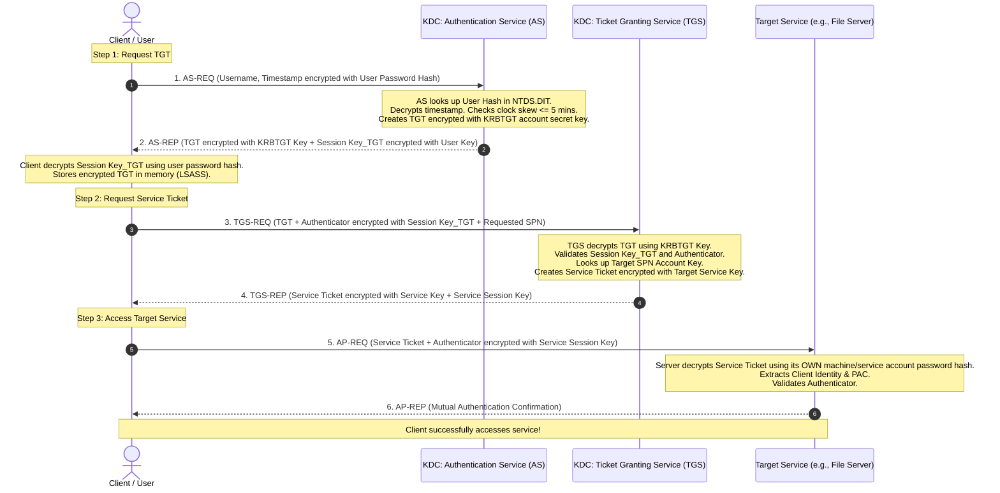

# Kerberos Authentication Protocol (RFC 4120)

## 1. Topic & Definition
**Kerberos v5 (RFC 4120)** is a trusted third-party, ticket-based cryptographic authentication protocol designed to verify the identities of clients and servers over insecure networks without ever transmitting passwords across the wire.

Operating primarily over **Port 88 (TCP/UDP)**, Kerberos is the default and fundamental authentication mechanism for Windows Active Directory domains and enterprise Unix/Linux environments (FreeIPA, MIT Kerberos).

### The Three Entities (The "Three-Headed Dog")
1. **Client (Principal):** The workstation or user requesting access.
2. **Key Distribution Center (KDC):** The trusted central authority (residing on Domain Controllers in AD), divided into two sub-services:
   - **Authentication Service (AS):** Verifies the client's initial identity and issues the **Ticket Granting Ticket (TGT)**.
   - **Ticket Granting Service (TGS):** Evaluates valid TGTs and issues application **Service Tickets (ST / TGS)**.
3. **Application Server (Target Service):** The server hosting the requested network resource (e.g., File Share, SQL Server, Exchange, Web Server).

---

## 2. How It Works: The 6-Message Kerberos Handshake

### Detailed Message Breakdown
1. **AS-REQ (Client $\to$ AS):** Sends plaintext username and pre-authentication data (a current timestamp encrypted with the user's password hash).
2. **AS-REP (AS $\to$ Client):** AS verifies pre-auth. Returns:
   - **TGT (Ticket Granting Ticket):** Contains client ID, expiration, PAC, and a new `Session_Key(Client, TGS)`. The entire TGT is encrypted using the KDC's master key (`krbtgt` account hash). The client *cannot* read or modify the TGT.
   - **Encrypted Session Key:** A copy of `Session_Key(Client, TGS)` encrypted using the client's password hash so the client can decrypt and use it.
3. **TGS-REQ (Client $\to$ TGS):** Client presents the opaque TGT, an **Authenticator** (timestamp encrypted with `Session_Key(Client, TGS)`), and the **Service Principal Name (SPN)** (e.g., `cifs/fs01.corp.local`).
4. **TGS-REP (TGS $\to$ Client):** KDC decrypts the TGT using `krbtgt` key. Returns:
   - **Service Ticket (ST):** Contains user identity, PAC, and `Session_Key(Client, Service)`. Encrypted using the **Target Service Account's password hash**.
   - **Encrypted Service Session Key:** A copy of `Session_Key(Client, Service)` encrypted with `Session_Key(Client, TGS)`.
5. **AP-REQ (Client $\to$ Target Server):** Client connects to target server on port 445/1433/etc. Sends the Service Ticket and an Authenticator encrypted with the Service Session Key.
6. **AP-REP (Target Server $\to$ Client):** Server decrypts ticket using its local secret key, validates authenticator, optionally replies to prove its own identity (mutual authentication).

---

## 3. Critical Kerberos Data Structures & Mechanics

### The PAC (Privilege Attribute Certificate)
- In standard MIT Kerberos, tickets only identify *who* the user is.
- In Microsoft Active Directory, the KDC injects a **PAC (Privilege Attribute Certificate)** into the TGT and Service Ticket.
- The PAC contains:
  - User's Security Identifier (SID)
  - All Group SIDs (e.g., `Domain Admins`, `Schema Admins`)
  - User Account Control flags
- When a target server decrypts the Service Ticket, it inspects the PAC to enforce authorization decisions locally without making an LDAP query to the DC!

### Clock Skew Tolerance (5-Minute Window)
- Kerberos relies on timestamps inside Authenticators to prevent replay attacks.
- If an adversary captures an `AP-REQ`, they cannot replay it 10 minutes later because the server rejects timestamps outside the acceptable **Clock Skew** window (default: **5 minutes**, configured via Group Policy).
- Accurate **NTP (Network Time Protocol)** synchronization across all domain controllers, servers, and clients is mandatory for Kerberos to function.

---

## 4. Key Differences Matrix: Kerberos vs NTLM

| Feature | Kerberos v5 (Port 88) | NTLMv2 (Port 445 / 139) |
| :--- | :--- | :--- |
| **Authentication Model** | Ticket-based (Trusted KDC) | Challenge-Response (Direct / Pass-Through) |
| **Domain Controller Load** | Low (DC only contacted during ticket requests) | High (Target server must contact DC on every auth) |
| **Mutual Authentication** | Native (Both client and server prove identity) | One-way only (Client proves identity to server) |
| **Delegation Support** | Supported (Constrained & Unconstrained Delegation) | Not supported natively |
| **Cryptographic Strength** | AES-128 / AES-256 (Robust) | MD4 / HMAC-MD5 (Vulnerable to relaying & cracking) |
| **Relay Attacks** | Immune to simple relaying via Session Keys & PAC | Highly vulnerable to **NTLM Relay** attacks |
| **Industry Status** | Enterprise Standard | Deprecated by Microsoft; phased out |

---

## 5. Cybersecurity Relevance, Threats & Attack Vectors

### 1. Kerberoasting (Targeting Service Accounts)
- **Mechanism:** Any authenticated domain user can request a Service Ticket (TGS) for any Service Principal Name (SPN) registered in Active Directory.
- **Exploitation:** Because the Service Ticket is encrypted with the password hash of the service account, the attacker extracts the ticket from memory and cracks it offline with `hashcat` (`hashcat -m 13100 kerberoast.txt rockyou.txt`).
- **Impact:** Compromise of service accounts (often members of Domain Admins or Local Admins).
- **Defense:** Group Managed Service Accounts (gMSA) with 128-char rotating passwords; switch encryption to AES256; monitor Event ID 4769.

### 2. AS-REP Roasting (Accounts with "Do not require Kerberos preauthentication")
- **Mechanism:** If a user account has `DONT_REQ_PREAUTH` enabled in its `userAccountControl` attribute, an attacker sends an `AS-REQ` without providing a password hash.
- **Exploitation:** The KDC returns an `AS-REP` containing a message component encrypted with the user's password hash. The attacker cracks the hash offline (`hashcat -m 18200 asrep.txt rockyou.txt`).
- **Defense:** Enforce Kerberos pre-authentication across all domain accounts.

### 3. Golden Ticket vs Silver Ticket
- **Golden Ticket:** Created by forging a TGT using the decrypted **`krbtgt` account NTLM hash**. Grants total, unrevocable Domain Admin access for up to 10 years across the entire forest.
- **Silver Ticket:** Created by forging a Service Ticket using a compromised **target service account password hash**. Grants full admin access to that specific service without ever contacting the KDC.

---

## 6. Interview Takeaways & Rapid-Fire Q&A

### 60-Second Elevator Pitch
> *"Kerberos v5 is a ticket-based authentication protocol built around a trusted Key Distribution Center (KDC). Authentication begins with an AS-REQ/AS-REP exchange where the client verifies its identity using pre-authentication and receives a Ticket Granting Ticket (TGT) encrypted with the KDC's `krbtgt` key. To access specific network services, the client exchanges the TGT for a Service Ticket via TGS-REQ/TGS-REP. The target service validates the ticket using its own password hash and reads the Privilege Attribute Certificate (PAC) to enforce permissions. Kerberos eliminates cleartext passwords on the wire and mitigates replay attacks via strict 5-minute clock skew synchronization, but requires strict defenses against Kerberoasting and Golden Ticket attacks."*

### Candidate Traps & Common Mistakes
- **Trap 1:** Believing the client decrypts the TGT. *Correction:* The TGT is encrypted with the `krbtgt` secret key. The client cannot read or modify the TGT; it merely acts as a bearer.
- **Trap 2:** Confusing AS-REP Roasting with Kerberoasting. *Correction:* AS-REP Roasting targets user accounts with pre-auth disabled; Kerberoasting targets service accounts with registered SPNs by extracting TGS service tickets.
- **Trap 3:** Thinking the target server contacts the KDC during AP-REQ. *Correction:* The target server decrypts the Service Ticket locally using its own stored secret key. The KDC is never involved in step 5/6!

### Expected Follow-Up Questions
1. *What is the role of the `krbtgt` account in Active Directory?*
   - The `krbtgt` account is the master service account whose password hash encrypts and signs all Ticket Granting Tickets (TGTs) issued by the KDC. Compromise of this hash enables Golden Ticket creation.
2. *Why is clock synchronization (NTP) critical in Kerberos?*
   - Kerberos Authenticators contain timestamps valid for only $\pm 5$ minutes to stop replay attacks. If clocks desynchronize beyond this threshold, all authentication fails.
