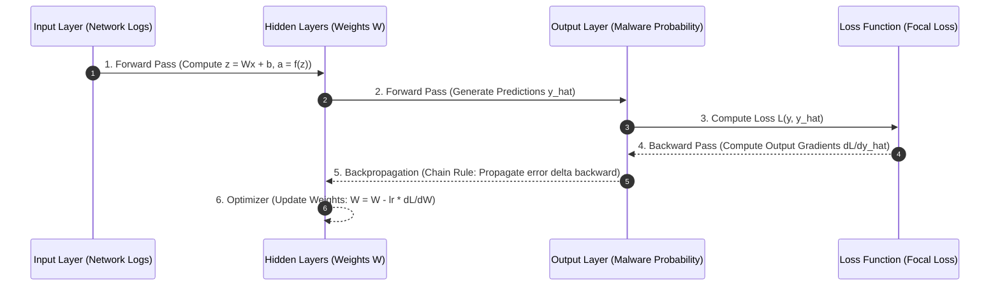

# Neural Networks, Backpropagation, and Optimizers in Security

## 1. Topic & Definition
**Artificial Neural Networks (ANNs)** are computational models inspired by biological neural structures, composed of interconnected layers of artificial neurons (perceptrons) that learn continuous non-linear representations of input data through iterative parameter adjustments.

A **Multi-Layer Perceptron (MLP)** serves as the baseline deep learning architecture, consisting of an input layer, one or more hidden layers, and an output layer. In cybersecurity, MLPs process high-dimensional vector representations of system calls, network flows, and credential authentication bursts.

---

## 2. How It Works: Forward Propagation, Loss Optimization, and Backpropagation

### A. Neuron Mechanics & Activation Functions
A single neuron computes a weighted sum of inputs plus a bias, passing the result through a non-linear activation function $f(z)$:

$$z = \sum_{j=1}^{n} w_j x_j + b = \mathbf{w}^T \mathbf{x} + b \quad \Longrightarrow \quad a = f(z)$$

```
Input Vector x       Weights w           Sum & Bias          Activation f(z)       Output a
    x1 ------------( w1 )---------\
    x2 ------------( w2 )-----------> [ Sum: z = w^T x + b ] ---> [ f(z) ] ---------> a
    x3 ------------( w3 )---------/
```

#### Core Activation Functions in Security Models
1. **Sigmoid:** $\sigma(z) = \frac{1}{1 + e^{-z}}$. Bounds output to $(0, 1)$, ideal for binary threat probabilities. Vulnerable to **vanishing gradient** problem when $|z| \gg 0$.
2. **ReLU (Rectified Linear Unit):** $f(z) = \max(0, z)$. Solves vanishing gradient for positive values; computationally cheap. Risk: "Dying ReLU" where neurons become permanently inactive.
3. **Leaky ReLU:** $f(z) = \max(\alpha z, z)$ (with $\alpha = 0.01$). Retains a slight gradient for negative values, preventing dead neurons.
4. **GELU (Gaussian Error Linear Unit):** Smooth non-linearity used in modern Transformer architectures (SecBERT, GPT-4).

### B. Loss Functions: Tackling the Security Class Imbalance

#### 1. Binary Cross-Entropy (BCE) Loss
$$\mathcal{L}_{\text{BCE}} = -\frac{1}{N} \sum_{i=1}^{N} \left[ y_i \log(\hat{y}_i) + (1 - y_i) \log(1 - \hat{y}_i) \right]$$
Standard loss for binary classification. Under massive class imbalance, the vast majority of benign samples dominate the gradient, causing the network to ignore attacks.

#### 2. Focal Loss (The Security Gold Standard)
Introduced to address extreme class imbalance by dynamically down-weighting easy, well-classified examples:
$$\mathcal{L}_{\text{Focal}} = -\alpha_t (1 - p_t)^\gamma \log(p_t)$$
- When a sample is easy (e.g., standard benign HTTP packet, $p_t = 0.99$), the modulating factor $(1 - p_t)^\gamma \to 0$, suppressing its contribution to the loss.
- Focuses gradient updates almost exclusively on hard, ambiguous, and rare attack vectors.

### C. The Mathematics of Backpropagation (Chain Rule)
Backpropagation calculates the gradient of the loss function $\mathcal{L}$ with respect to every weight $w_{ij}$ in the network via the multivariate calculus **Chain Rule**:

$$\frac{\partial \mathcal{L}}{\partial w_{ij}^{(l)}} = \frac{\partial \mathcal{L}}{\partial z_j^{(l)}} \cdot \frac{\partial z_j^{(l)}}{\partial w_{ij}^{(l)}} = \delta_j^{(l)} \cdot a_i^{(l-1)}$$

Where the error term $\delta_j^{(l)}$ is propagated backward from output to input:
$$\delta_j^{(l)} = \left( \sum_{k} \delta_k^{(l+1)} w_{jk}^{(l+1)} \right) \cdot f'(z_j^{(l)})$$



---

## 3. Optimizers: SGD, Momentum, Adam, and AdamW

### 1. Stochastic Gradient Descent (SGD) with Momentum
Updates weights using a moving average of past gradients to navigate noisy, ravine-like loss landscapes:
$$v_t = \beta v_{t-1} + \eta \nabla_\theta \mathcal{L}(\theta) \quad \Longrightarrow \quad \theta = \theta - v_t$$

### 2. Adam (Adaptive Moment Estimation)
Maintains exponentially decaying averages of past gradients ($m_t$, first moment) and past squared gradients ($v_t$, second moment), providing adaptive per-parameter learning rates:
$$\theta_{t+1} = \theta_t - \frac{\eta}{\sqrt{\hat{v}_t} + \epsilon} \hat{m}_t$$

### 3. AdamW (Decoupled Weight Decay)
Standard Adam applies L2 regularization to gradients, which couples weight decay to the second moment scale. **AdamW decouples weight decay directly into the parameter update step**, substantially improving generalization in deep security models and Transformers.

---

## 4. Key Differences Matrix: Activation Functions & Optimizers

| Component | Mechanism | Key Advantage | Primary Failure Mode |
| :--- | :--- | :--- | :--- |
| **Sigmoid** | $1 / (1 + e^{-z})$ | Interpretable probability $(0, 1)$ | Vanishing gradients on deep layers |
| **ReLU** | $\max(0, z)$ | Computationally fast, no vanishing gradient for $z > 0$ | Dying neurons on large negative gradients |
| **GELU** | $x \cdot \Phi(x)$ | Smooth non-linearity, state of the art in NLP | Higher computational overhead |
| **SGD** | $\theta - \eta \nabla \mathcal{L}$ | High asymptotic convergence | Slow, gets trapped in local saddles |
| **AdamW** | Decoupled Weight Decay + Moments | Fast convergence, stable generalization | Higher GPU memory overhead (stores 2 moments) |

---

## 5. Cybersecurity Relevance, Threats & Attack Vectors

### 1. Vanishing and Exploding Gradients in Long Security Sequences
- **Vulnerability:** When processing deep sequences (e.g., chains of 10,000 process creation events), repeated multiplication of gradients through Sigmoid/Tanh activations drives the gradient to zero.
- **Impact:** The network cannot learn long-range temporal dependencies, missing multi-day APT reconnaissance-to-exfiltration sequences.
- **Defense:** Utilize Residual Connections (Skip Connections), Layer Normalization, and ReLU/GELU activations.

### 2. The Dying ReLU Attack (Input Manipulation)
- **Mechanism:** An adversary craftily feeds large out-of-distribution numerical inputs (e.g., massive byte counts) that force large negative activations across neurons, driving weights into a state where they output zero for all subsequent inputs.
- **Impact:** Causes widespread neural death, effectively blinding the ML classifier.
- **Defense:** Implement Leaky ReLU or ELU, paired with Robust Scaler log transformations on input data.

---

## 6. Interview Takeaways & Rapid-Fire Q&A

### 60-Second Elevator Pitch
> *"Neural networks in cybersecurity learn complex, non-linear mappings directly from high-dimensional telemetry. The forward pass calculates linear combinations of weights and inputs passed through non-linear activations like ReLU or GELU. Backpropagation computes the exact partial derivatives of the loss with respect to all network weights using the calculus Chain Rule, propagating error deltas backward to update weights via optimizers like AdamW. Because cybersecurity telemetry suffers from severe class imbalance, standard Binary Cross-Entropy often fails; state-of-the-art security neural networks rely on Focal Loss to down-weight ubiquitous easy benign logs and force optimization on rare, subtle attack patterns."*

### Candidate Traps & Common Mistakes
- **Trap 1:** Using Sigmoid activations in deep hidden layers. *Correction:* Sigmoid causes severe vanishing gradient issues; use ReLU, Leaky ReLU, or GELU in hidden layers, reserving Sigmoid strictly for the final binary output neuron.
- **Trap 2:** Confusing L2 regularization in Adam with weight decay. *Correction:* Standard Adam couples L2 penalty to historical gradient variance, distorting regularization; AdamW decouples weight decay, leading to far superior generalization.
- **Trap 3:** Training an intrusion detection neural network with standard BCE on 99.9% benign data without weighting. *Correction:* The network will collapse into predicting the majority class; you must use Focal Loss, class weights, or positive-class loss multipliers.

### Expected Follow-Up Questions
1. *Why does Backpropagation use the Chain Rule instead of direct numerical differentiation?*
   - Numerical differentiation requires evaluating the network twice per parameter ($2 \times N$ forward passes), which is computationally intractable for millions of weights. Backpropagation computes all gradients analytically in a single backward pass ($O(N)$ complexity).
2. *How does Focal Loss mathematically address class imbalance?*
   - By multiplying standard cross-entropy by $(1 - p_t)^\gamma$. As confidence on easy samples approaches 1, the multiplier approaches zero, reducing their gradient contribution to negligible levels while preserving gradients on ambiguous attack samples.
