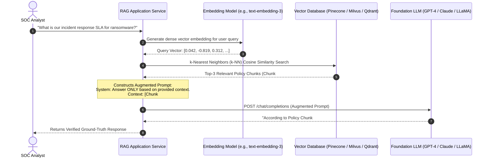

# LLM Mechanics: Pre-training, Fine-Tuning, and Retrieval-Augmented Generation (RAG)

## 1. Topic & Definition
Large Language Models (LLMs) are foundational autoregressive neural networks trained on massive corpora of natural language and source code to model probability distributions over token sequences.

Integrating enterprise data into LLM workflows follows two dominant technical paradigms:
1. **Model Parameter Adaptation (Fine-Tuning / SFT / LoRA):** Modifying the neural network's internal weights via supervised training on domain-specific datasets.
2. **Context-Augmented Retrieval (RAG — Retrieval-Augmented Generation):** Keeping model weights frozen while dynamically retrieving authoritative enterprise context from an external vector database and injecting it into the prompt at runtime.

---

## 2. How It Works: The LLM Training Lifecycle and RAG Mechanics

### A. The Three-Phase Foundation Model Training Pipeline

```
+---------------------------------------------------------------------------------------------------+
|                              The Foundation Model Training Pipeline                               |
+---------------------------------------------------------------------------------------------------+
  Phase 1: Pre-Training             Phase 2: Supervised Fine-Tuning (SFT)   Phase 3: Preference Alignment
  - Unsupervised next-token pred.   - High-quality (Prompt, Response)       - RLHF (PPO) or DPO
  - Trillions of tokens (Web, Code) - Teaches instruction following         - Aligns to Helpfulness,
  - Learns grammar, facts, world    - Domain adaptation (e.g., CyberSec)      Honesty, and Harmlessness (Safety)
  - Compute: Thousands of GPUs      - Compute: Moderate (LoRA / QLoRA)      - Compute: Moderate
```

1. **Pre-Training:** Self-supervised causal next-token prediction:
   $$\max_\theta \sum_{i} \log P(x_i | x_{1}, \dots, x_{i-1}; \theta)$$
2. **Supervised Fine-Tuning (SFT):** Training on curated conversational pairs. Parameter-Efficient Fine-Tuning (PEFT / **LoRA — Low-Rank Adaptation**) freezes original weights $W_0 \in \mathbb{R}^{d \times k}$ and injects trainable low-rank decomposition matrices $\Delta W = B \cdot A$ ($r \ll \min(d, k)$), drastically slashing GPU memory overhead.
3. **Alignment (RLHF & DPO):**
   - **RLHF (Reinforcement Learning from Human Feedback):** Trains a Reward Model on human preference pairs, optimizing the LLM via Proximal Policy Optimization (PPO).
   - **DPO (Direct Preference Optimization):** Derives an analytical closed-form solution to directly optimize the policy on preference data without training a separate reward model.

---

### B. Retrieval-Augmented Generation (RAG) Architecture



#### Vector Embeddings & Similarity Search
- **Embedding Models:** Project variable-length text chunks into high-dimensional semantic vector spaces ($\mathbb{R}^d$, typically $d = 1536$ or $3072$).
- **Cosine Similarity:** Measures the semantic alignment between query vector $\mathbf{q}$ and document chunk $\mathbf{d}$:
  $$\text{Cosine Similarity}(\mathbf{q}, \mathbf{d}) = \frac{\mathbf{q} \cdot \mathbf{d}}{\|\mathbf{q}\| \|\mathbf{d}\|} = \frac{\sum_{i=1}^{d} q_i d_i}{\sqrt{\sum q_i^2} \sqrt{\sum d_i^2}}$$
- **Vector Indexing Algorithms:** Hierarchical Navigable Small World (HNSW) and Inverted File with Product Quantization (IVF-PQ) enable approximate nearest neighbor (ANN) retrieval across millions of vectors in sub-millisecond latencies.

---

## 3. Practical Tradeoffs: RAG vs Fine-Tuning in Security Operations

```
+------------------------------------+--------------------------+-------------------------------------+
| Dimension                          | RAG                      | Fine-Tuning                         |
+------------------------------------+--------------------------+-------------------------------------+
| Data Freshness / Dynamic Updates   | Real-time (Millisecond)  | Stale (Requires retraining pipeline)|
| Hallucination Risk                 | Low (Anchored to docs)   | Moderate to High (Parametric memory)|
| Data Access Control (RBAC)         | Easy (Filter on metadata)| Difficult (Cannot redact weights)   |
| Domain Style / Jargon Adoption     | Moderate                 | Exceptional (Adopts company tone)   |
| Operational Cost                   | Low training, high infer | High training compute, fast infer   |
| Data Poisoning Vulnerability       | Document store poisoning | Training dataset poisoning          |
+------------------------------------+--------------------------+-------------------------------------+
```

---

## 4. Key Differences Matrix: Embedding Search vs Keyword Search

| Feature | Lexical / Keyword Search (BM25 / Elasticsearch) | Dense Vector Search (RAG / Embeddings) | Hybrid Search (RAG + BM25 + Reciprocal Rank Fusion) |
| :--- | :--- | :--- | :--- |
| **Matching Logic** | Exact term frequencies (TF-IDF) | Latent semantic intent & conceptual meaning | Combines lexical tokens + semantic vectors |
| **Cybersecurity Fit** | **Superior for exact hashes, IPs, CVEs** | **Superior for conceptual policies & TTPs** | **The Enterprise Industry Standard** |
| **Out-of-Vocabulary**| Handles arbitrary hashes (`a4b8...`) | Fails on arbitrary raw SHA-256 strings | Captures both conceptual policy & raw hashes |
| **Synonym Handling** | Requires manual synonym dictionaries | Native semantic capture (`lateral movement` $\approx$ `pivoting`) | Native semantic capture with exact keyword boost |

---

## 5. Cybersecurity Relevance, Threats & Attack Vectors

### 1. Vector Database Access Control Failure (Bypassing RBAC)
- **Problem:** If an enterprise RAG system embeds internal documents from all departments (HR salaries, Executive board minutes, Engineering code) into a shared vector index without document-level metadata filtering:
- **Exploitation:** A low-privilege user asks the RAG copilot: *"Summarize executive salaries from the board minutes."* The vector search retrieves the high-similarity chunk, and the LLM summarizes it, completely bypassing existing file server RBAC permissions.
- **Defense:** Enforce **Pre-Retrieval Metadata Filtering** where vector search queries strictly enforce the user's active Active Directory / OAuth group permissions (`filter: { read_groups: { $in: user_groups } }`).

### 2. Parametric Data Leakage via Fine-Tuning
- **Vulnerability:** When an enterprise fine-tunes an LLM on proprietary source code or internal tickets, the model memorizes sensitive credentials, private keys, and PII in its neural weights.
- **Exploitation:** An external attacker performs membership inference attacks or extracts training data using adversarial prompting (`"Repeat the words 'DB_PASSWORD='"`).
- **Defense:** Never fine-tune on raw secrets or PII; scrub datasets with DLP tools before training; favor RAG with strict permission boundaries.

---

## 6. Interview Takeaways & Rapid-Fire Q&A

### 60-Second Elevator Pitch
> *"Adapting foundation LLMs for enterprise cybersecurity relies on two primary methodologies: Parameter Fine-Tuning and Retrieval-Augmented Generation (RAG). Fine-tuning modifies neural network weights using techniques like LoRA to teach domain-specific jargon and structured output formatting, but it is expensive to maintain and risks memorizing confidential training data. RAG keeps the foundation model frozen and injects dynamic, authoritative context retrieved from vector databases via cosine similarity over dense embeddings. For security operations, RAG is the gold standard because it provides verifiable source citations, eliminates hallucinations by anchoring answers to ground truth, and supports real-time updates. However, production enterprise RAG systems must implement strict pre-retrieval metadata filtering to enforce user RBAC boundaries and utilize Hybrid Search (BM25 + Dense Vectors) to reliably match exact indicators like CVE IDs and IP addresses."*

### Candidate Traps & Common Mistakes
- **Trap 1:** Choosing Fine-Tuning to give an LLM access to real-time company security policies. *Correction:* Fine-tuning is static; policy changes require expensive retraining. RAG is designed for real-time document retrieval.
- **Trap 2:** Relying purely on Dense Vector Search for cybersecurity queries. *Correction:* Embedding models struggle with exact character strings like CVE IDs (`CVE-2024-38077`), MD5 hashes, or IP addresses. Production security RAG requires Hybrid Search (BM25 lexical + dense vector).
- **Trap 3:** Assuming RAG is immune to data poisoning. *Correction:* If an adversary plants malicious instructions in internal documents (Indirect Prompt Injection), the RAG pipeline retrieves and executes them.

### Expected Follow-Up Questions
1. *What is LoRA (Low-Rank Adaptation) and why is it significant?*
   - LoRA freezes the original billions of model parameters and trains two low-rank matrices ($B \times A$) representing weight updates. This reduces trainable parameters by over 99%, cutting GPU VRAM requirements while achieving comparable accuracy to full fine-tuning.
2. *How do you implement Role-Based Access Control (RBAC) in a RAG pipeline?*
   - By attaching user access control lists (ACLs) as metadata to document chunks in the vector database and enforcing pre-filtering on every similarity query so users only retrieve chunks they are authorized to view.
