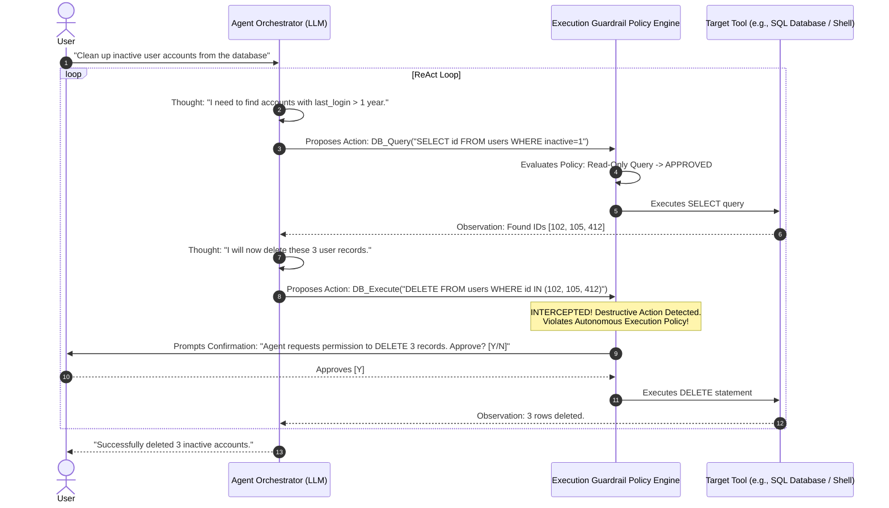

# AI Guardrails and Secure Autonomous Agent Architecture

## 1. Topic & Definition
An **Autonomous AI Agent** is an LLM-powered cognitive orchestration system that operates within a continuous loop of reasoning, planning, and tool execution (e.g., calling APIs, querying databases, executing shell commands) to accomplish multi-step objectives with minimal human intervention.

**Excessive Agency (OWASP LLM06)** represents the primary vulnerability of agentic workflows: granting an AI agent broader permissions, access to more destructive tools, or higher autonomy than strictly required, allowing unintended or malicious actions to compromise real-world infrastructure.

---

## 2. How It Works: Agentic Cognitive Loops and the ReAct Framework

### The ReAct (Reasoning + Acting) Execution Loop
In modern agent architectures (e.g., LangChain, AutoGen, CrewAI, OpenAI Assistants), the LLM executes iterative cycles:

$$\text{Thought} \longrightarrow \text{Action (Tool Call)} \longrightarrow \text{Observation (Tool Output)} \longrightarrow \text{Thought}$$



---

## 3. Four-Tier AI Guardrail Architecture

```
[ Inbound User / External Data ]
               |
               v
  +-------------------------------------------------------------------------+
  | TIER 1: INPUT GUARDRAILS                                                |
  | - Jailbreak Classifier (Llama Guard / Prompt-Armor)                     |
  | - Shannon Entropy & Unicode Normalization (Blocks ASCII smuggling)      |
  | - PII & Secret Redaction (Masks SSNs, API keys before LLM ingestion)    |
  +-------------------------------------------------------------------------+
               |
               v
  +-------------------------------------------------------------------------+
  | TIER 2: DIALOG & TOPIC RAILS (NeMo Guardrails / Colang)                 |
  | - State Machine Policy: Enforces bounded conversation topics            |
  | - Rejects off-topic prompts (e.g., coding requests to billing bot)      |
  +-------------------------------------------------------------------------+
               |
               v
  +-------------------------------------------------------------------------+
  | TIER 3: EXECUTION / TOOL RAILS                                          |
  | - Strict Parameter Type Validation (Pydantic / JSON Schema)             |
  | - Read-Only Enforcement (Prevents writes without human approval)         |
  | - Ephemeral Sandboxing (gVisor, microVMs for code execution)            |
  +-------------------------------------------------------------------------+
               |
               v
  +-------------------------------------------------------------------------+
  | TIER 4: OUTPUT GUARDRAILS                                               |
  | - Regex / Secret Scanners (Scans output for AWS keys, passwords, hashes)|
  | - Content Safety & Toxicity Classifiers                                 |
  | - RAG Grounding Verification (Prevents confabulations & hallucinations) |
  +-------------------------------------------------------------------------+
               |
               v
[ Verified, Safe Operational Result ]
```

---

## 4. Key Differences Matrix: Agent Security Paradigms

| Feature | Unrestricted Autonomous Agent | Secure Guardrailed Agent (Enterprise Standard) |
| :--- | :--- | :--- |
| **Tool Execution** | Executes arbitrary API calls immediately | Evaluated against deterministic permission policies |
| **Destructive Actions**| Permitted autonomously | **Mandatory Human-in-the-Loop (HITL) Approval** |
| **Runtime Environment**| Runs directly on host OS / Shared container | Ephemeral isolated microVM / gVisor sandbox |
| **Database Access** | Raw read/write database user | Scoped read-only views; parameterized queries |
| **Context Boundaries** | Unlimited token loops (Denial of Wallet) | Hard execution limits ($N \le 10$ iterations, token caps) |

---

## 5. Architectural Principles for Secure Agent Design

### 1. Principle of Least Privilege (PoLP) for Tools
- **Granular Scoping:** Never provide an agent with a generic `execute_sql()` or `run_bash_command()` tool.
- **Micro-Tools:** Provide purpose-built, parameter-restricted functions:
  - *Bad:* `tool_sql_query(raw_query: string)`
  - *Good:* `get_customer_order_status(order_id: int)`
- The LLM can only pass typed parameters into pre-approved, parameterized backend code.

### 2. Human-in-the-Loop (HITL) Authorization Gates
- Operations categorized by impact level:
  - **Tier 1 (Benign / Read-Only):** Autonomous execution (e.g., reading documentation, calculating statistics).
  - **Tier 2 (Sensitive / Reversible):** Autonomous with asynchronous logging and alerting (e.g., archiving an alert).
  - **Tier 3 (Destructive / Irreversible):** **Hard Execution Freeze**. The agent emits a structured approval payload and pauses state until an authorized human provides a cryptographic signature or session confirmation.

### 3. Ephemeral Sandboxed Code Execution
- When an AI agent must write and execute code (e.g., analyzing security logs or rendering charts), code must never execute on the host machine.
- Execute within **ephemeral, non-networked sandboxes** (e.g., AWS Firecracker microVMs, Docker with gVisor `runsc` runtime, WebAssembly):
  - No internet access (prevents exfiltration).
  - Read-only root filesystem.
  - 10-second CPU time limits.
  - Memory capped at 512 MB.

---

## 6. Interview Takeaways & Rapid-Fire Q&A

### 60-Second Elevator Pitch
> *"Autonomous AI agents execute iterative cognitive ReAct loops (Reasoning, Action, Observation) by invoking external tools and APIs. Their most critical vulnerability is Excessive Agency (OWASP LLM06), where an injected prompt or hallucination triggers destructive operations like deleting databases or changing infrastructure configurations. Designing secure agents requires a 4-tier guardrail architecture: input filtering, dialog policy enforcement, tool execution controls, and output secret scanning. Core architectural principles demand replacing generic bash/SQL tools with strictly typed, least-privilege micro-functions, executing all generated code within isolated ephemeral sandboxes (gVisor/microVMs), and enforcing mandatory Human-in-the-Loop approval gates before any state-changing or destructive action can execute."*

### Candidate Traps & Common Mistakes
- **Trap 1:** Giving an agent a raw Bash terminal tool and asking it to "be careful". *Correction:* Any indirect prompt injection will gain full host command execution; tools must be narrowly scoped, parameterized functions.
- **Trap 2:** Placing guardrails only on the model input. *Correction:* Input guardrails can be bypassed; defense-in-depth requires output verification and strict execution-time policy checks.
- **Trap 3:** Allowing unconstrained recursive loops. *Correction:* Without loop breakers and execution limits, a confused agent will burn through API budgets in infinite tool retry loops (Unbounded Consumption).

### Expected Follow-Up Questions
1. *What is the difference between Deterministic Guardrails and Model-Based Guardrails?*
   - Deterministic guardrails use programmatic rules, regex, JSON schemas, and AST parsers—they are 100% reliable, fast, and un-hackable by prompt engineering. Model-based guardrails (like Llama Guard) use smaller neural networks to judge intent and toxicity, which can still theoretically be deceived. Production systems always combine both.
2. *Why is gVisor or Firecracker preferred over standard Docker containers for agent code sandboxes?*
   - Standard Docker containers share the host Linux kernel; a kernel privilege escalation exploit allows container breakout. gVisor intercepts system calls in user space, and Firecracker runs a distinct KVM microVM, ensuring hardware-level isolation.
