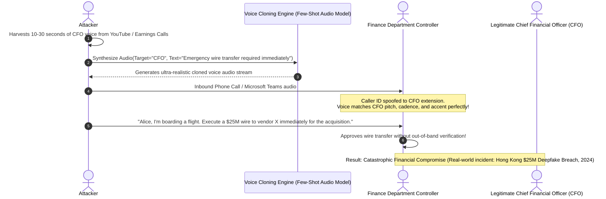

# Offensive AI Threats, Deepfakes, and Enterprise Countermeasures

## 1. Topic & Definition
**Offensive AI** refers to the weaponization of artificial intelligence, machine learning, and generative foundation models by cyber adversaries to scale, accelerate, and automate the cyber kill chain.

By lowering the technical threshold for sophisticated attacks, offensive AI shifts the threat landscape from manual, high-cost Advanced Persistent Threat (APT) campaigns to **automated, hyper-personalized, and autonomous attacks at machine speed**.

```
+---------------------------------------------------------------------------------------------------+
|                              The Offensive AI Weaponization Spectrum                              |
+---------------------------------------------------------------------------------------------------+
  Social Engineering (GenAI)      Deepfakes & Biometric Fraud       Autonomous Malware & Exploits
  - Automated Spear-Phishing      - Real-Time Voice Cloning (Vishing) - Polymorphic Shellcode Synthesis
  - Context-Aware Reconnaissance  - Video Deepfake Executive Fraud   - AI-Driven Exploit Generation
  - Multi-Lingual Fluency         - Virtual Meeting Impersonation    - Dynamic Evasion of Static EDR
```

---

## 2. How Offensive AI Operates: Mechanics & Kill Chain Integration

### A. AI-Driven Hyper-Personalized Spear-Phishing
Traditional phishing relies on static templates with telltale grammatical flaws, awkward phrasing, and generic lures.
- **Offensive AI Workflow:**
  1. **Automated OSINT Scraping:** AI scrapers ingest targets' public LinkedIn posts, corporate blog articles, conference presentations, and recent GitHub commits.
  2. **Persona & Tone Synthesis:** An LLM analyzes the writing style, jargon, and organizational hierarchy of the victim's colleagues or executives.
  3. **Contextual Lure Generation:** The AI crafts tailored emails referencing authentic current internal initiatives with flawless grammar in any language.
  4. **Dynamic Pretexting:** The AI conversational bot engages in realistic multi-turn email dialogues, patiently building rapport before delivering malicious links or attachments.

---

### B. Audio Voice Cloning & Video Deepfake Fraud (Executive Impersonation)



#### The Technology Behind Real-Time Voice Cloning
- Modern neural audio codecs and zero-shot voice cloning models (e.g., VALL-E, XTTS) require as little as **3 to 10 seconds of clean reference audio** to extract an acoustic speaker embedding, generating speech with accurate timbre, emotion, and background acoustic characteristics.

---

### C. Polymorphic and Autonomous Malware (e.g., BlackMamba, HYAS Alpha)
- Traditional polymorphic malware uses hardcoded mutation engines or packers with static stub routines that eventually get fingerprinted by EDRs.
- **LLM-Driven Dynamic Malware:**
  1. The malware dropper lands on the victim endpoint containing zero malicious payloads on disk.
  2. At runtime, the dropper queries a public or compromised LLM API endpoint over HTTPS, passing a prompt request (e.g., *"Write a Python keylogger that hooks `GetAsyncKeyState` and sends data to an IP"*).
  3. The LLM generates fresh, syntactically unique code variants on the fly.
  4. The dropper executes the synthesized code entirely in-memory using dynamic reflection (`exec()` or `VirtualAlloc`).
  5. Because the code syntax, variable names, and API call order change on every single execution, **static file hashes and traditional signature scanners are completely blind**.

---

## 3. Practical Defensive Engineering: Countermeasure Architecture

```
+------------------------------------+---------------------------------------------------------------+
| Offensive AI Threat Vector         | Non-Negotiable Enterprise Defensive Countermeasure            |
+------------------------------------+---------------------------------------------------------------+
| AI Spear-Phishing Credential Theft | **FIDO2 / WebAuthn Passkeys** (Phishing-proof origin binding) |
| Deepfake Voice Cloning (Vishing)   | **Cryptographic Out-of-Band Verification Protocols**          |
| Video Deepfake Board Impersonation | **Liveness Detection & Dynamic Visual Challenge-Response**     |
| Polymorphic Dynamic Malware        | **Behavioral EDR / AMSI In-Memory Memory Inspection**         |
| AI Automated Exploit Scanning      | **Attack Surface Management & Rapid Patch Automation**        |
+------------------------------------+---------------------------------------------------------------+
```

---

## 4. Key Differences Matrix: Deepfake Detection Technologies

| Method | Physical / Physiological Artifacts | Spectral / Acoustic Artifacts | Cryptographic Watermarking (C2PA) |
| :--- | :--- | :--- | :--- |
| **Detection Target** | Irregular blinking, lack of pupil light reflex | High-frequency phase mismatch in audio spectrograms | Digital signature embedded at camera/microphone sensor |
| **Mechanics** | Models biological heart-rate skin color variations (rPPG) | Detects vocoder artifact peaks and phase discontinuities | Public key certificate chain verification |
| **Robustness** | Decreases as generative video models improve | Susceptible to lossy audio compression (Zoom/Teams) | **100% Mathematically Tamper-Proof** |
| **Adoption Barrier** | High computational overhead | High false positive rate on noisy connections | Requires hardware vendor support (Coalition C2PA) |

---

## 5. Enterprise Protocols for Combating Deepfake Executive Fraud

### The Cryptographic Out-of-Band Dual-Authorization Protocol
To neutralize deepfake audio/video executive impersonation, organizations must ban verbal authorizations for consequential transactions:

1. **Dual-Key Authorization:** No individual employee possesses unilateral authority to transfer funds exceeding established thresholds (e.g., >$50,000).
2. **Out-of-Band Challenge-Response:** 
   - When a verbal request is received (phone or Teams), the recipient must initiate an independent secondary contact over an encrypted, pre-established channel (e.g., hardware-authenticated Signal message or enterprise authenticator push prompt).
3. **Shared Secret Duress Words:** Executive teams maintain rotating physical duress passphrases never transmitted over digital networks, immediately flagging coercion or synthetic clones.

---

## 6. Interview Takeaways & Rapid-Fire Q&A

### 60-Second Elevator Pitch
> *"Offensive AI represents the weaponization of machine learning and generative foundation models to execute automated, hyper-personalized attacks at machine scale. Adversaries utilize LLMs to automate spear-phishing campaigns personalized to victims' public social profiles with native fluency, deploy zero-shot voice cloning models to impersonate C-level executives in financial wire fraud, and explore polymorphic malware that generates novel, unique exploit code in memory via LLM APIs. Defending against offensive AI cannot rely on training humans to spot subtle video glitches or email typos. Instead, enterprises must deploy cryptographically resilient defenses: FIDO2 Passkeys render AI credential harvesting useless via origin binding, behavioral EDR detects malicious execution intent regardless of polymorphic file hashes, and dual-authorization protocols eliminate single-point verbal fraud."*

### Candidate Traps & Common Mistakes
- **Trap 1:** Relying on human awareness training to identify AI phishing or voice deepfakes. *Correction:* Modern voice cloning and GenAI phishing are indistinguishable from human reality; defenses must be cryptographically enforced (FIDO2 MFA, out-of-band verification protocols).
- **Trap 2:** Assuming deepfakes can always be detected by automated AI tools. *Correction:* Deepfake detection is an arms race; attackers continuously train discriminator models to eliminate visual and acoustic artifacts. Cryptographic provenance (C2PA) is the only long-term deterministic solution.
- **Trap 3:** Thinking polymorphic AI malware can be stopped by file hashes. *Correction:* Since the LLM synthesizes fresh syntax for every target, file hashes are unique on every execution; detection must focus on runtime behavioral heuristics (AMSI, ETW, API call sequences).

### Expected Follow-Up Questions
1. *Why does FIDO2 / WebAuthn completely neutralize AI-generated spear-phishing?*
   - Because FIDO2 binds the cryptographic authentication key mathematically to the exact browser domain origin. Even if an AI creates a persuasive phishing website that tricks the human into clicking, the browser authenticator refuses to release or sign credentials for the fake domain.
2. *What is C2PA (Coalition for Content Provenance and Authenticity)?*
   - An open technical standard that cryptographically signs media files at the point of capture (camera or microphone) using public key cryptography, proving content authenticity and detecting whether audio or video has been synthesized or altered.
