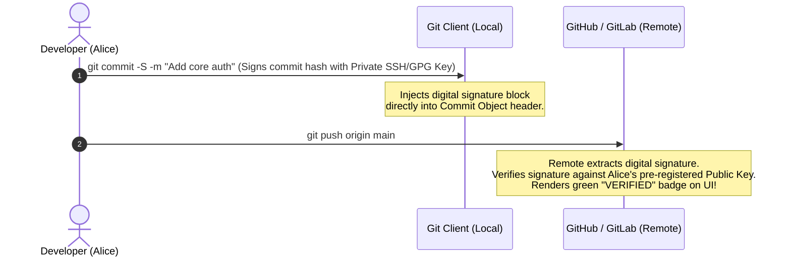

# Git Security, Secret Leakage Prevention, and Cryptographic Commit Signing

## 1. Topic & Definition
Hardcoded secrets (AWS access keys, database passwords, OAuth tokens, private SSH keys) committed to Git repositories represent one of the most common and disastrous root causes of enterprise cloud breaches.

Because Git is an immutable Directed Acyclic Graph, **simply deleting a secret file and making a subsequent commit (`git rm secrets.env && git commit`) DOES NOT REMOVE THE SECRET**. The credential remains permanently preserved inside historical commit blobs throughout the repository's `.git/` history, trivial for automated adversary scrapers to extract.

---

## 2. The Credential Leakage Lifecycle and Adversary Scraping

```
+---------------------------------------------------------------------------------------------------+
|                            The Leaked Secret Exploitation Timeline                                |
+---------------------------------------------------------------------------------------------------+
  [ Developer commits aws_key ] ---> [ git push to Public Repo ] ---> [ Adversary Scraper (TruffleHog)]
                                                                               |  (Within 60 SECONDS!)
                                                                               v
  [ Breach Contained: $50k Cloud Bill ] <--- [ Spins up 500 EC2 Crypto Miners ] <--- [ AWS Root Key Used ]
```

- Public code-hosting platforms (GitHub, GitLab) are monitored in real time by automated botnets that ingest the public commit event firehose.
- Historical studies demonstrate that exposed AWS access keys pushed to public repositories are weaponized to provision unauthorized cryptocurrency-mining EC2 instances in **under 60 seconds**.

---

## 3. Defense-in-Depth Secret Prevention Architecture

```
+---------------------------------------------------------------------------------------------------+
|                         Multi-Stage Secret Prevention Defense-in-Depth                            |
+---------------------------------------------------------------------------------------------------+
  Stage 1: Local Developer Machine   --> Pre-Commit Hooks (Gitleaks / TruffleHog pre-commit framework)
  Stage 2: Code Hosting Server       --> Push Protection (GitHub/GitLab rejects push containing secrets)
  Stage 3: CI/CD Pipeline Scanning   --> Automated Pipeline Gate (TruffleHog / Gitleaks in PR checks)
  Stage 4: Post-Commit / Out-of-Band --> Repository-Wide Secret Scanning & CloudTrail Anomaly Alerts
```

### A. Stage 1: Pre-Commit Hook Configuration (`.pre-commit-config.yaml`)
Prevents secrets from ever being committed to the local Git DAG:
```yaml
repos:
  - repo: https://github.com/gitleaks/gitleaks
    rev: v8.18.2
    hooks:
      - id: gitleaks
```

### B. Stage 2: Secret Scanning with Push Protection
- **Mechanism:** When a developer runs `git push`, the remote server inspects incoming blob objects before updating branch refs.
- **Enforcement:** If a regex match or high-entropy token matches a verified vendor format (e.g., `AKIA[0-9A-Z]{16}` for AWS or `ghp_[A-Za-z0-9_]{36}` for GitHub), the server **aborts the push immediately**, requiring the engineer to remove the secret before pushing.

---

## 4. Emergency Incident Response: Remediating a Leaked Secret

When a secret is inadvertently committed or pushed, teams must execute a strict 3-step incident response protocol:

```
[ CRITICAL RULE: NEVER JUST "DELETE AND RE-COMMIT"! ]
Step 1: REVOKE & ROTATE THE SECRET IMMEDIATELY!
        Assume the credential was already intercepted. Invalidate it in AWS IAM / Database.
        
Step 2: PURGE FROM GIT OBJECT HISTORY USING git-filter-repo:
        git filter-repo --invert-paths --path credentials.env
        (Completely rewrites all commits, expunging the blob from the DAG)
        
Step 3: FORCE-PUSH & PURGE CACHED VIEWS:
        git push origin --force --all
        Contact GitHub/GitLab support to purge orphan pull request cached views / reflogs.
```

### Why `git-filter-repo` Over `git filter-branch`?
- `git filter-branch` is deprecated by Git core: it is notoriously slow, error-prone, and often leaves lingering references in the reflog.
- **`git-filter-repo`** is the officially recommended, high-speed Python-based utility that comprehensively rewrites history, purges references, and sanitizes object trees safely.

---

## 5. Cryptographic Commit Signing (GPG / SSH / S/MIME)

### The Author Spoofing Threat
Anyone can forge commit authorship in Git. Setting:
```bash
git config user.name "Linus Torvalds"
git config user.email "torvalds@linux-foundation.org"
```
results in a commit that appears in `git log` and GitHub UI as authored by Linus Torvalds!

### Cryptographic Signatures to the Rescue
To verify commit authenticity, developers sign commits using private cryptographic keys:



### Modern SSH Commit Signing Setup
Developers can now use standard SSH keys instead of complex GPG setups:
```bash
# Configure Git to use SSH for signing
git config --global gpg.format ssh
git config --global user.signingkey ~/.ssh/id_ed25519.pub
git config --global commit.gpgsign true

# Verify signature on commit
git log --show-signature -1
```

---

## 6. Key Differences Matrix: Commit Signing Methods

| Feature | GPG (GNU Privacy Guard) | SSH Commit Signing | S/MIME Signatures |
| :--- | :--- | :--- | :--- |
| **Key Type** | OpenPGP Keypairs | Standard OpenSSH (`ed25519`, `rsa`) | X.509 Corporate PKI Certificates |
| **Complexity** | High (Keyrings, subkeys, trust web) | **Low (Reuses existing SSH keys)** | High (Requires corporate PKI CA) |
| **Key Expiration** | Supported natively | Managed externally via Git allowed_signers | Bound to X.509 validity dates |
| **Enterprise Fit** | Open Source Developers | Modern Engineering Teams | Regulated Banking / Enterprise PKI |

---

## 7. Interview Takeaways & Rapid-Fire Q&A

### 60-Second Elevator Pitch
> *"Hardcoded secrets committed to Git represent severe enterprise risks because Git's immutable DAG preserves deleted files across historical commit objects indefinitely. Defense-in-depth requires multi-layered controls: client-side pre-commit hooks running Gitleaks, server-side push protection blocking pushes containing verified API tokens, and automated CI/CD pipeline scans. When an incident occurs, the first and most critical action is immediate secret revocation and rotation, followed by purging Git history using `git-filter-repo` and force-pushing sanitized trees. To prevent identity spoofing—since `user.email` can be forged by anyone—enterprises enforce commit signing using GPG or Ed25519 SSH keys, granting verifiable cryptographic provenance across every production commit."*

### Candidate Traps & Common Mistakes
- **Trap 1:** Assuming `git rm` removes a secret from Git. *Correction:* The secret remains fully accessible in the historical commit object; you must rewrite history using `git-filter-repo` or BFG.
- **Trap 2:** Scrubbing Git history *before* rotating the leaked secret. *Correction:* The moment a secret is pushed, it must be presumed compromised. Always rotate/revoke the key in the target cloud provider *first*.
- **Trap 3:** Trusting commit author names in audit logs. *Correction:* Unsigned commit author metadata is trivial to forge; only cryptographically signed commits (`git commit -S`) provide non-repudiation.

### Expected Follow-Up Questions
1. *What is the difference between Gitleaks and TruffleHog?*
   - Gitleaks uses fast, regex-based and Shannon entropy scanning optimized for local pre-commit hooks; TruffleHog specializes in deep Git history scanning and actively verifies secrets against live cloud vendor APIs to confirm if a credential is valid.
2. *How do you configure GitHub to enforce commit signing across all developers?*
   - By navigating to repository Branch Protection Rules and enabling the "Require signed commits" toggle on protected branches like `main`.
