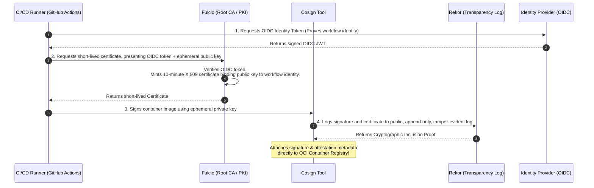

# Software Supply Chain Security, SBOMs, SLSA, and Cryptographic Attestations

## 1. Topic & Definition
**Software Supply Chain Security** encompasses the protection of every component, dependency, toolchain stage, and deployment pipeline involved in producing and releasing software.

Unlike classical application security that focuses on bugs inside internal code, supply chain attacks exploit **the trust placed in third-party libraries, build infrastructure, and release mechanisms**. An adversary compromises a single upstream dependency (e.g., Log4j) or build pipeline (e.g., SolarWinds), allowing them to automatically compromise thousands of downstream enterprise consumers.

---

## 2. Anatomy of Historic Supply Chain Catastrophes

```
+---------------------------------------------------------------------------------------------------+
|                            Historic Supply Chain Compromise Archetypes                            |
+---------------------------------------------------------------------------------------------------+
  SOLARWINDS (Build Pipeline Tampering):
  Source Repo (Clean) ---> Build Server COMPROMISED (SUNSPOT) ---> Signed Binary Infected (SUNBURST)
                           (Injects backdoor during compilation)   (Legitimate cert trusted by 18k orgs!)

  CODECOV (Tooling & Runner Tampering):
  CI Pipeline ---> Fetches `bash uploader` from Codecov CDN ---> Script modified by attacker
                   (Extracts CI runner environment secrets and exfiltrates to attacker server)

  LOG4SHELL (Transitive Dependency Exploitation):
  Enterprise App ---> Imports Framework A ---> Imports Logging Lib (Log4j 2.14.0) ---> JNDI RCE!
                      (Nobody knew Log4j was embedded 5 levels deep in enterprise software stacks!)
```

---

## 3. The Software Bill of Materials (SBOM)

An **SBOM (Software Bill of Materials)** is a formal, machine-readable inventory of software components, dependencies, metadata, and hierarchical relationships utilized in building a software artifact.

Mandated for government and enterprise vendors under US Executive Order 14028, an SBOM transforms software from an opaque "black box" into an auditable manifest.

### The Two Standard SBOM Formats: SPDX vs CycloneDX

```
+------------------------------------+--------------------------+-------------------------------------+
| Dimension                          | SPDX (ISO/IEC 5962:2021) | CycloneDX (OWASP Standard)          |
+------------------------------------+--------------------------+-------------------------------------+
| **Governing Body**                 | Linux Foundation / ISO   | OWASP Foundation                    |
| **Primary Historical Focus**       | Open Source License Legal| **Cybersecurity, Vulnerabilities &**|
|                                    | Compliance & IP Auditing | **Supply Chain Risk Analysis**      |
| **Formats Supported**              | JSON, YAML, Tag:Value    | JSON, XML                           |
| **Modern Cyber Features**          | Added security fields    | Native VEX (Vulnerability Exploit), |
|                                    | in SPDX 2.3 / 3.0        | Cryptographic Hashes, Services, ML  |
+------------------------------------+--------------------------+-------------------------------------+
```

### Key SBOM Attributes (The Minimum Elements)
- **Supplier Name:** Entity that produced the component.
- **Component Name & Version:** e.g., `log4j-core` version `2.14.1`.
- **Package URL (PURL):** Universal, unambiguous identifier across package ecosystems:
  `pkg:maven/org.apache.logging.log4j/log4j-core@2.14.1`
- **Cryptographic Hashes:** SHA-256 checksums verifying integrity.
- **Dependency Relationships:** Defines whether component B is a direct or transitive child of component A.

### Vulnerability Exploitability eXchange (VEX)
An SBOM indicates a component is present; **VEX** communicates whether a known CVE in that component is actually exploitable in the final product:
- Statuses: `Not Affected`, `Affected`, `Fixed`, `Under Investigation`.
- Example: If a vulnerable library is bundled, but the vulnerable function is never invoked or blocked by an internal sanitizer, the vendor issues a VEX statement: `Status: Not Affected (Vulnerable code not reachable)`.

---

## 4. Supply-Chain Levels for Software Artifacts (SLSA Framework)

Developed by Google and the OpenSSF, **SLSA (Supply-chain Levels for Software Artifacts)** provides a 4-level maturity framework to prevent tampering and ensure software integrity:

```
+---------------------------------------------------------------------------------------------------+
|                                      The SLSA Maturity Spectrum                                   |
+---------------------------------------------------------------------------------------------------+
  SLSA 1: Build as Code         --> Scripted automated build process + Generated Provenance metadata
  SLSA 2: Hosted Build Service  --> Hosted build platform (GitHub Actions) + Signed, Authentic Provenance
  SLSA 3: Isolated & Hermetic   --> Ephemeral build environments + Non-falsifiable provenance + Hardened
  SLSA 4: Two-Party Review      --> Two-person code review + Hermetic reproducible builds + Air-gapped
```

- **Hermetic Build:** A build process executed in a container or VM with **zero internet access**, relying strictly on pre-declared, cryptographically hashed inputs. Prevents dynamic pulling of unverified code during compilation.
- **Reproducible Build:** Independent parties building from the exact same source code, toolchain, and flags produce a **byte-for-byte identical compiled binary**.

---

## 5. Artifact Signing and Attestation with Sigstore (Cosign, Fulcio, Rekor)

Modern software supply chain security relies on the **Sigstore** open-source ecosystem to provide keyless cryptographic signing for container images and software binaries:



- **Cosign:** Command-line tool to sign and verify OCI container images.
- **Fulcio:** A free Root Certificate Authority that issues **short-lived (10-minute) X.509 certificates** bound to developer or CI/CD OIDC identities. **Completely eliminates the nightmare of managing and rotating private PGP/GPG keys!**
- **Rekor:** An immutable, append-only cryptographic transparency ledger (Merkle Tree) that records all signatures, preventing hidden or rogue signing events.

---

## 6. Key Differences Matrix: Supply Chain Attacks

| Attack Type | Mechanism | Classic Real-World Example | Primary Countermeasure |
| :--- | :--- | :--- | :--- |
| **Build Tampering** | Infecting build server/compiler | SolarWinds (SUNBURST, 2020) | Hermetic builds & SLSA 3/4 provenance |
| **Tooling Poisoning**| Tampering with CI utility scripts | Codecov (2021) | SHA-256 pinned script hashes |
| **Dependency Confusion**| Registering internal package names on public PyPI/npm registries | Alex Birsan Research (Apple/MS, 2021)| Scoped enterprise package namespaces |
| **Typosquatting** | Registering `cross-env` vs `crossenv` | Malicious npm crypto-stealers | Package lockfiles & private artifact proxies |
| **Account Takeover** | Phishing/stealing npm maintainer token | Event-Stream compromise | FIDO2 MFA for package maintainers |

---

## 7. Interview Takeaways & Rapid-Fire Q&A

### 60-Second Elevator Pitch
> *"Software Supply Chain Security shifts focus from internal application code to the entire ecosystem of third-party dependencies, build systems, and delivery pipelines. High-profile incidents like SolarWinds and Log4j demonstrated that adversaries target upstream build servers and deep transitive dependencies to bypass enterprise perimeter defenses. Countermeasures center on generating machine-readable Software Bills of Materials (SBOMs) using standards like CycloneDX or SPDX to maintain complete inventory visibility, paired with VEX for exploitability filtering. To guarantee build integrity, organizations adopt the SLSA framework for isolated, hermetic builds and leverage the Sigstore ecosystem—Cosign, Fulcio, and Rekor—to generate keyless cryptographic signatures and non-falsifiable in-toto attestations for all container images."*

### Candidate Traps & Common Mistakes
- **Trap 1:** Assuming signing code with a private PGP key is secure. *Correction:* Static private signing keys get stolen or leaked from CI build servers; keyless signing via Sigstore (Fulcio short-lived OIDC certs) eliminates long-lived keys.
- **Trap 2:** Confusing CycloneDX with SPDX. *Correction:* SPDX originated from Linux Foundation licensing compliance; CycloneDX was built specifically by OWASP for application security, vulnerability tracking, and VEX.
- **Trap 3:** Believing an SBOM alone prevents supply chain attacks. *Correction:* An SBOM is merely an inventory; without continuous automated vulnerability ingestion and cryptographic artifact verification (Cosign), it is just passive documentation.

### Expected Follow-Up Questions
1. *What is a Dependency Confusion attack?*
   - An attack where an adversary registers an internally named private package (e.g., `corp-auth-utils`) on a public registry (like npm or PyPI) with a higher version number (e.g., `99.0.0`). Insecure package managers configure-wise prioritize the public registry, pulling and executing the attacker's package.
2. *How does the Sigstore Rekor transparency log stop supply chain compromise?*
   - Rekor maintains an immutable, append-only Merkle tree of all signing events. If a rogue certificate authority or insider signs a malicious image, the transaction is publicly recorded, enabling instant detection and attribution by security monitors.
