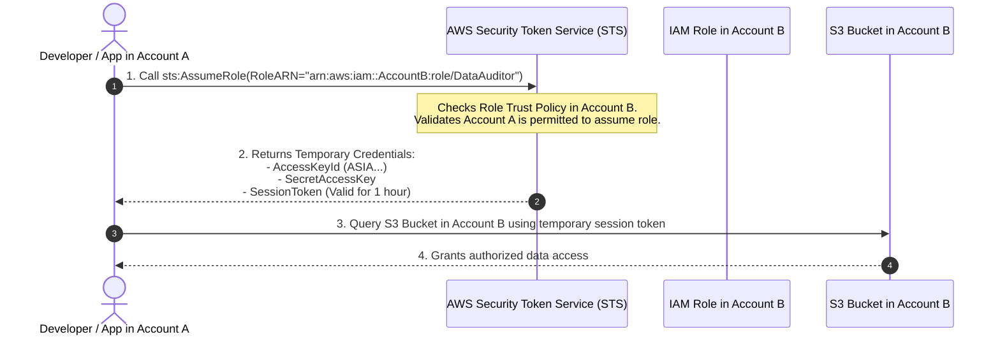

# Cloud Identity, IAM Architecture, and Least Privilege Enforcement

## 1. Topic & Definition
**Identity and Access Management (IAM)** is the primary security perimeter of modern cloud computing. In traditional on-premises environments, security centered around physical network boundaries and firewalls. In the cloud, **Identity is the New Perimeter**.

Cloud IAM regulates:
- **Authentication (AuthN):** Verifying the identity of **Principals** (human users, automated CI/CD pipelines, or cloud workloads like EC2/Lambda).
- **Authorization (AuthZ):** Determining what actions a principal can execute on which specific cloud resources under which environmental conditions, using declarative JSON policy documents.

---

## 2. How It Works: Policy Evaluation Logic and Architecture

```
+---------------------------------------------------------------------------------------------------+
|                            AWS IAM Policy Evaluation Logic Flowchart                              |
+---------------------------------------------------------------------------------------------------+
  Incoming API Request (e.g., "s3:GetObject" on "arn:aws:s3:::finance-bucket/*")
           |
           v
  [ Decision Start: Default Deny ]
           |
           v
  [ Is there an EXPLICIT DENY statement? ] ------------ YES -------------> [ FINAL DECISION: DENY ]
           |                                                                     ^
           NO                                                                    |
           v                                                                     |
  [ Does Organization Service Control Policy (SCP) allow it? ] --- NO -----------+
           |                                                                     |
           YES                                                                   |
           v                                                                     |
  [ Is within Permission Boundary ceiling? ] --------------------- NO -----------+
           |                                                                     |
           YES                                                                   |
           v                                                                     |
  [ Is there an EXPLICIT ALLOW statement? ] ---------------------- NO -----------+
  (In Identity-Based OR Resource-Based Policy)
           |
          YES
           v
  [ FINAL DECISION: ALLOW ]
```

### The Golden Rule of Evaluation:
$$\text{Explicit Deny} \quad > \quad \text{Explicit Allow} \quad > \quad \text{Default Deny (Implicit Deny)}$$
If an explicit `Deny` exists anywhere in any policy attached to the principal or resource, the request is **immediately denied**, overriding all allow statements.

---

## 3. Policy Types & JSON Policy Dissection

### A. Anatomical Structure of a Cloud IAM Policy
```json
{
  "Version": "2012-10-17",
  "Statement": [
    {
      "Sid": "AllowEncryptedS3UploadsOnly",
      "Effect": "Allow",
      "Action": [
        "s3:PutObject"
      ],
      "Resource": "arn:aws:s3:::enterprise-data-lake/*",
      "Condition": {
        "StringEquals": {
          "s3:x-amz-server-side-encryption": "aws:kms"
        },
        "Bool": {
          "aws:SecureTransport": "true"
        }
      }
    }
  ]
}
```

### B. Core Policy Categories
1. **Identity-Based Policies:** Attached directly to IAM Users, Groups, or Roles. Governs what the identity can do.
2. **Resource-Based Policies:** Attached directly to target resources (e.g., S3 Bucket Policies, AWS KMS Key Policies, SQS Queue Policies). Specifies *who* is allowed to access the resource.
3. **Permissions Boundaries:** An advanced management control that sets the **maximum allowable permissions ceiling** that an identity-based policy can grant. Even if an administrator gives a developer `AdministratorAccess`, a permissions boundary ensures they cannot perform actions beyond the boundary ceiling.
4. **Service Control Policies (SCPs):** Organizational guardrails applied at the AWS Organizations root or OU level. SCPs apply across entire AWS accounts, restricting even the root account!

---

## 4. Key Differences Matrix: IAM Roles vs IAM Users

| Dimension | IAM Users | IAM Roles |
| :--- | :--- | :--- |
| **Credentials Type** | Static, permanent Access Key ID + Secret Key | **Temporary, short-lived STS tokens (15m – 12h)** |
| **Credential Rotation** | Manual or custom script rotation required | **Automated rotation by AWS infrastructure** |
| **Primary Target** | Legacy human developers / direct console access | **Applications, EC2 instances, Lambda, CI/CD, cross-account**|
| **Security Risk** | High (frequently leaked to public GitHub repos)| **Near Zero leak exposure (tokens self-expire)** |
| **Enterprise Standard**| **Deprecated for machine workloads** | **Mandatory Cloud Standard** |

---

## 5. STS & Cross-Account AssumeRole Workflow



---

## 6. Cybersecurity Relevance, Threats & IAM Privilege Escalation

Adversaries who compromise low-privileged IAM credentials exploit specific permission combinations to escalate privileges to full cloud administration without authorization.

### Top IAM Privilege Escalation Vectors (Rhino Security Labs Taxonomy)

#### 1. `iam:CreatePolicyVersion`
- **Vulnerability:** User has permission to create a new version of an IAM policy attached to their own user account.
- **Exploitation:** The user creates a new version containing `Action: "*", Resource: "*"` and sets `--set-as-default`, instantly escalating themselves to full Administrator!
- **Defense:** Never grant `CreatePolicyVersion` without restricting resource targets or enforcing a Permission Boundary.

#### 2. `iam:PassRole` + `ec2:RunInstances`
- **Vulnerability:** User has permission to launch an EC2 instance and pass an existing high-privileged IAM role (e.g., `AdminRole`) to it.
- **Exploitation:** Attacker launches an EC2 instance passing `AdminRole`, inserts a shell script in EC2 user data that curls the Instance Metadata Service (IMDS) for credentials, and exfiltrates the administrator STS token.
- **Defense:** Constrain `iam:PassRole` resource ARNs strictly to specific non-admin service roles.

#### 3. `iam:AttachUserPolicy`
- **Vulnerability:** User has permission to attach managed policies to their own identity.
- **Exploitation:** Attacker runs `aws iam attach-user-policy --user-name my-user --policy-arn arn:aws:iam::aws:policy/AdministratorAccess`.
- **Defense:** Enforce Permission Boundaries that cap maximum permissions even if policies are attached.

---

## 7. Interview Takeaways & Rapid-Fire Q&A

### 60-Second Elevator Pitch
> *"In cloud security, Identity is the new perimeter. Cloud IAM governs authentication and authorization using declarative JSON policies evaluated under a strict logic hierarchy: an Explicit Deny always overrides everything, an Explicit Allow is required to grant access, and the baseline default is an Implicit Deny. Modern cloud architectures mandate eliminating static IAM users and long-lived access keys in favor of IAM Roles that issue short-lived, automatically rotating cryptographic tokens via AWS STS. Enterprise least-privilege governance requires defense-in-depth: applying Service Control Policies (SCPs) at the multi-account organizational root, bounding developer blast radius using Permission Boundaries, and auditing for dangerous privilege escalation permissions like `CreatePolicyVersion` and `PassRole`."*

### Candidate Traps & Common Mistakes
- **Trap 1:** Assuming an Allow in an identity policy guarantees access. *Correction:* An explicit Deny in an SCP, Permission Boundary, or Resource-based policy will override that Allow immediately.
- **Trap 2:** Creating static IAM users with access keys for EC2 applications. *Correction:* EC2 instances should use IAM Instance Profiles; static keys risk being leaked and committed to code.
- **Trap 3:** Confusing Trust Policies with Permission Policies. *Correction:* Trust Policies govern *who can assume* the IAM Role; Permission Policies govern *what actions* the role can perform once assumed.

### Expected Follow-Up Questions
1. *What is the difference between an Identity-Based Policy and a Resource-Based Policy in AWS?*
   - Identity-based policies attach to the principal (User, Group, Role) and define what that entity can do; Resource-based policies attach directly to the resource (S3 bucket, KMS key) and specify which external principals are granted access to that specific asset.
2. *What is the security significance of the `aws:SecureTransport` condition key?*
   - It evaluates whether the incoming API request was transmitted over encrypted HTTPS (TLS). Setting `"aws:SecureTransport": "true"` in a Deny statement on an S3 bucket policy blocks all unencrypted cleartext HTTP access.
