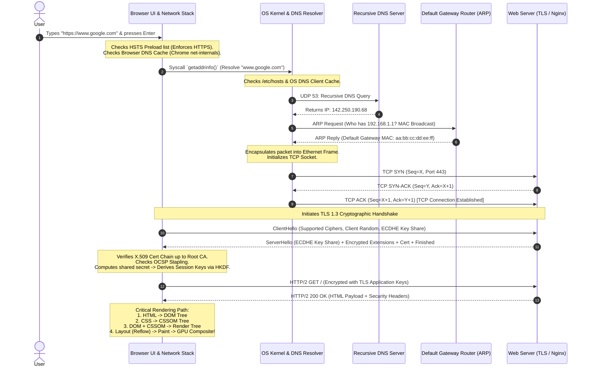

# The Complete URL-to-Render Architecture: What Happens When You Type a URL?

## 1. Topic & Definition
*"What happens when you type `https://www.google.com` into your browser address bar and press Enter?"* is the quintessential senior technical interview question.

It tests full-stack cross-domain mastery spanning:
- Browser internal navigation & HSTS security
- Operating System system calls & socket buffers
- Networking (DNS hierarchy, ARP Layer-2 resolution, TCP 3-way handshakes, routing)
- Cryptography (TLS 1.3 handshake, Diffie-Hellman PFS, X.509 PKI, OCSP stapling)
- Server infrastructure (Load balancers, reverse proxies, WAFs)
- Browser rendering engine (Critical Rendering Path: DOM, CSSOM, Render Tree, Layout, Paint, GPU Compositing).

---

## 2. End-to-End Architectural Sequence Diagram



---

## 3. Step-by-Step Technical Execution Breakdown

### Step 1: URL Parsing, Autocomplete, and HSTS Check
1. **Input Evaluation:** The browser determines whether the input is a valid URL or a search query string.
2. **HSTS Preload List:** The browser consults its hardcoded **HTTP Strict Transport Security (HSTS)** list. If `google.com` is present, the browser automatically rewrites the request to `https://` internally before sending a single network packet, preventing SSL-stripping attacks.

### Step 2: The Multi-Tier DNS Resolution Hierarchy
1. **Browser Cache:** Checks internal DNS cache (TTL: 1–2 minutes).
2. **OS Resolver Cache:** Checks Windows DNS cache (`ipconfig /displaydns`) or Linux `systemd-resolved`.
3. **Hosts File:** Checks local static mappings (`/etc/hosts` or `C:\Windows\System32\drivers\etc\hosts`).
4. **Recursive DNS Resolver (ISP / 8.8.8.8 / 1.1.1.1):**
   - If not cached, the Recursive Resolver queries the **Root Nameserver (`.`)**.
   - Root delegates to the **TLD Nameserver (`.com`)**.
   - TLD delegates to the **Authoritative Nameserver (`ns1.google.com`)**.
   - Authoritative server returns the `A` record (IPv4) or `AAAA` record (IPv6).

### Step 3: Layer-2 Resolution via ARP
1. The OS knows the destination IP (`142.250.190.68`) is outside the local subnet (`192.168.1.0/24`).
2. The packet must be sent to the **Default Gateway Router IP** (`192.168.1.1`).
3. If the gateway's MAC address is not in the local **ARP Table** (`arp -a`), the OS broadcasts an **ARP Request** (`ff:ff:ff:ff:ff:ff`: *"Who has 192.168.1.1?"*).
4. The router replies with its physical Layer-2 MAC address.

### Step 4: TCP 3-Way Handshake
1. Client sends **`SYN`** (Synchronize) packet with Initial Sequence Number (ISN) $X$, TCP window scale, and Maximum Segment Size (MSS: typically 1460 bytes).
2. Server responds with **`SYN-ACK`** with its own ISN $Y$ and acknowledgement $X + 1$.
3. Client responds with **`ACK`** acknowledging $Y + 1$. TCP state transitions to `ESTABLISHED`.

### Step 5: TLS 1.3 Cryptographic Handshake (1-RTT)
1. **ClientHello:** Client sends supported cipher suites (`TLS_AES_256_GCM_SHA384`), client random, and an **ECDHE Key Share** (pre-computing its Diffie-Hellman public key using Curve25519).
2. **ServerHello:** Server selects the cipher, sends its own ECDHE key share, and begins encrypting all subsequent handshake packets immediately.
3. **Certificate & Verification:** Server sends its X.509 public certificate. The client validates:
   - Digital signature chain up to a pre-installed trusted Root CA.
   - Hostname matches Common Name (CN) / Subject Alternative Name (SAN).
   - Validity dates (`NotBefore`, `NotAfter`).
   - Revocation status via **OCSP Stapling** embedded in the handshake.
4. **Master Secret Derivation:** Both sides compute the shared Diffie-Hellman secret, deriving ephemeral symmetric encryption keys via HKDF (HMAC-based Key Derivation Function).

### Step 6: HTTP Request, WAF, and Reverse Proxy
1. Browser sends an encrypted **HTTP/2 GET** request utilizing multiplexed binary frames over a single TCP stream.
2. Ingress traffic hits the server infrastructure:
   - **Cloudflare / AWS CloudFront CDN:** Evaluates edge cache.
   - **WAF (Web Application Firewall):** Inspects payloads for SQLi, XSS, and bot signatures.
   - **Reverse Proxy (Nginx / HAProxy):** Terminates TLS, load-balances requests across internal private IP app servers.

### Step 7: HTTP Response & Security Headers
Server returns `HTTP/2 200 OK` with HTML payload and mandatory security headers:
- `Strict-Transport-Security: max-age=31536000; includeSubDomains; preload`
- `Content-Security-Policy: default-src 'self'; script-src 'self' cdn.google.com`
- `X-Frame-Options: DENY`
- `X-Content-Type-Options: nosniff`
- `Set-Cookie: session_id=...; Secure; HttpOnly; SameSite=Strict`

### Step 8: Browser Critical Rendering Path
1. **DOM Tree Construction:** HTML parser converts raw bytes $\to$ characters $\to$ tokens $\to$ nodes $\to$ **Document Object Model (DOM)**.
2. **CSSOM Tree Construction:** CSS parser processes stylesheets into the **CSS Object Model (CSSOM)**.
3. **Render Tree:** Combines DOM and CSSOM, filtering out invisible nodes (`display: none`).
4. **Layout (Reflow):** Computes exact geometry, screen coordinates, and bounding box dimensions for every visible element.
5. **Painting:** Fills in pixels (colors, borders, shadows, text rasterization).
6. **Compositing:** The GPU composites independent layers together and renders the final frame onto the physical display monitor.

---

## 4. Key Differences Matrix: HTTP/1.1 vs HTTP/2 vs HTTP/3

| Feature | HTTP/1.1 | HTTP/2 | HTTP/3 |
| :--- | :--- | :--- | :--- |
| **Transport Layer** | TCP (Port 80/443) | TCP (Port 443) | **QUIC over UDP (Port 443)** |
| **Data Framing** | Plaintext ASCII text | Binary Framing | Binary Framing |
| **Multiplexing** | No (Head-of-Line blocking) | **Yes (Multiple streams over 1 TCP)**| **Yes (Native independent UDP streams)**|
| **TCP HOL Blocking** | Yes | Yes (1 dropped packet stalls all streams)| **Eliminated (Only affected stream stalls)**|
| **Handshake Latency**| 2 RTT (TCP) + 2 RTT (TLS 1.2) = 4 RTT | 1 RTT (TCP) + 1 RTT (TLS 1.3) = 2 RTT | **0-RTT or 1-RTT Combined QUIC+TLS** |

---

## 5. Cybersecurity Relevance, Threats & Attack Vectors

```
+------------------------------------+---------------------------------------------------------------+
| Pipeline Stage                     | Specific Threat Vector & Defensive Control                    |
+------------------------------------+---------------------------------------------------------------+
| **Keystroke / Browser Stage**      | Malicious browser extensions / Keyloggers (Compromises URL)   |
| **DNS Resolution**                 | DNS Spoofing / Cache Poisoning (Mitigated by DNSSEC & DoH)    |
| **Layer-2 ARP Resolution**         | ARP Poisoning / Spoofing (Mitigated by Dynamic ARP Inspection)|
| **TCP Handshake**                  | SYN Flood DDoS (Mitigated by SYN Cookies)                     |
| **TLS Handshake**                  | SSL Stripping (Mitigated by HSTS Preload)                     |
| **DOM / Rendering Phase**          | Stored/Reflected XSS (Mitigated by Content Security Policy)  |
+------------------------------------+---------------------------------------------------------------+
```

---

## 6. Interview Takeaways & Rapid-Fire Q&A

### 60-Second Elevator Pitch
> *"When a user inputs a URL, the browser first consults its HSTS preload list to enforce HTTPS, then resolves the hostname through a tiered DNS cache (browser, OS, hosts file, recursive resolver). The OS resolves the default gateway's Layer-2 MAC address via ARP, initiates the TCP 3-way handshake on port 443, and executes the 1-RTT TLS 1.3 cryptographic handshake using ECDHE to establish Perfect Forward Secrecy. Once authenticated via X.509 certificate validation and OCSP stapling, the browser transmits an encrypted HTTP/2 GET request. The server's reverse proxy processes the request, returning an HTTP 200 payload with security headers like CSP and HSTS. Finally, the browser parses the response through the Critical Rendering Path: building the DOM and CSSOM, assembling the Render Tree, calculating geometric Layout, painting pixel data, and utilizing the GPU to composite the rendered webpage."*

### Candidate Traps & Common Mistakes
- **Trap 1:** Saying "the browser sends an ARP request for google.com's IP". *Correction:* ARP is strictly a local Layer-2 broadcast protocol; the ARP request is for the *Default Gateway Router's IP*, not Google's public IP!
- **Trap 2:** Confusing Layout with Painting. *Correction:* Layout calculates element geometry and physical screen coordinates (reflow); Painting fills in visual pixels like colors and text.
- **Trap 3:** Forgetting HSTS. *Correction:* Mentioning the HSTS preload list in the very first sentence immediately signals senior-level security awareness to interviewers.

### Expected Follow-Up Questions
1. *What is Head-of-Line (HOL) blocking in HTTP/2 and how does HTTP/3 resolve it?*
   - HTTP/2 multiplexes multiple data streams over a single TCP connection. If a single packet is dropped on the network, TCP halts all streams until that packet is retransmitted. HTTP/3 runs over QUIC/UDP, isolating streams so that a dropped packet only pauses its specific stream without stalling others.
2. *What is OCSP Stapling?*
   - Instead of every client independently querying a Certificate Authority's OCSP server to check certificate revocation (which slows connection times and leaks user browsing privacy), the web server periodically fetches and cryptographically staples the CA's signed revocation status directly into the TLS handshake.
