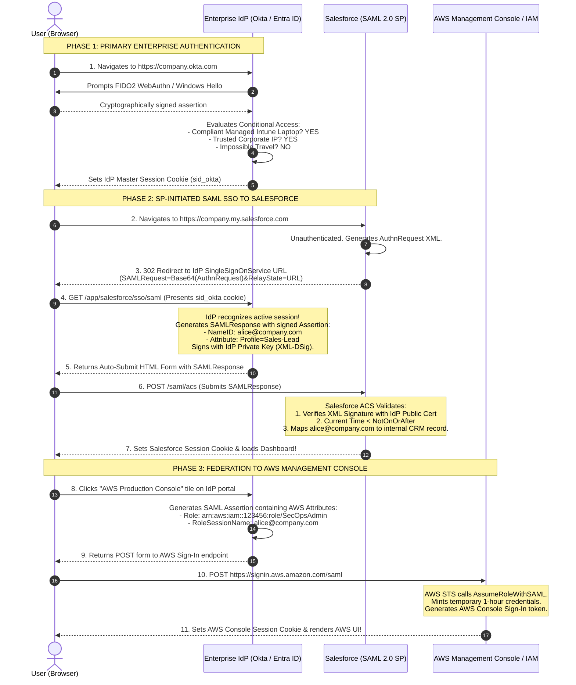

# Cross-Application Enterprise SSO: End-to-End Federation Walkthrough

## 1. Topic & Definition
In modern enterprise environments, employees do not maintain separate credentials for individual corporate tools. Instead, a single enterprise authentication session at a centralized **Identity Provider (IdP — e.g., Okta, Microsoft Entra ID)** federates identity across dozens of heterogeneous Software-as-a-Service (SaaS) and Infrastructure-as-a-Service (IaaS) platforms.

This walkthrough tracks the complete end-to-end operational flow of an enterprise employee (**Alice**) authenticating once via **FIDO2 Passkey MFA** and seamlessly accessing both **Salesforce (via SAML 2.0)** and the **AWS Management Console (via AWS IAM Identity Center and SAML/OIDC Federation)**, followed by coordinated **Single Logout (SLO)**.

---

## 2. End-to-End Architectural Federation Workflow



---

## 3. Detailed Forensic Message Dissection

### A. The Salesforce SAML `AuthnRequest` (Sent by SP)
```xml
<samlp:AuthnRequest xmlns:samlp="urn:oasis:names:tc:SAML:2.0:protocol"
                    ID="_d7a12b4e-9812-4fbc-b412"
                    Version="2.0"
                    IssueInstant="2026-10-09T18:00:00Z"
                    Destination="https://company.okta.com/app/salesforce/sso/saml"
                    AssertionConsumerServiceURL="https://company.my.salesforce.com/saml/acs">
    <saml:Issuer xmlns:saml="urn:oasis:names:tc:SAML:2.0:assertion">
        https://company.my.salesforce.com
    </saml:Issuer>
</samlp:AuthnRequest>
```

### B. The AWS SAML Role Attribute Mapping (Sent by IdP)
To assume an IAM role in AWS via SAML federation, the IdP embeds specific AWS attributes within the assertion:
```xml
<saml2:Attribute Name="https://aws.amazon.com/SAML/Attributes/Role">
    <saml2:AttributeValue>
        arn:aws:iam::123456789012:role/EnterpriseSecOpsAdmin,arn:aws:iam::123456789012:saml-provider/OktaProvider
    </saml2:AttributeValue>
</saml2:Attribute>
<saml2:Attribute Name="https://aws.amazon.com/SAML/Attributes/RoleSessionName">
    <saml2:AttributeValue>alice.smith@company.com</saml2:AttributeValue>
</saml2:Attribute>
```

---

## 4. Single Logout (SLO): Coordinated Enterprise Session Termination

When Alice clicks "Sign Out" at the end of her workday, terminating the session requires coordinating across all connected service providers:

```
+------------------------------------+---------------------------------------------------------------+
| Logout Methodology                | Execution Mechanics & Security Guarantee                      |
+------------------------------------+---------------------------------------------------------------+
| **Local Application Logout**       | Alice logs out of Salesforce only. Salesforce session ends,   |
| (Default Partial Logout)           | but IdP session remains active. (High risk on shared kiosks!) |
+------------------------------------+---------------------------------------------------------------+
| **Front-Channel SLO**              | IdP renders hidden iframes triggering logout URLs across each |
| (Browser-mediated)                 | SP simultaneously. Prone to failure if browser blocks cookies.|
+------------------------------------+---------------------------------------------------------------+
| **Back-Channel SLO**               | IdP makes direct server-to-server HTTPS POST calls to each    |
| (Enterprise Gold Standard)         | registered SP's logout endpoint, terminating all sessions     |
|                                    | reliably regardless of browser state.                         |
+------------------------------------+---------------------------------------------------------------+
```

---

## 5. Cybersecurity Relevance, Threats & Attack Vectors

### 1. Insecure Role Attribute Manipulation (Privilege Escalation)
- **Vulnerability:** If an attacker compromises an administrative account inside the Identity Provider (Okta), they modify the SAML attribute mapping for their own account, inserting the ARN of the AWS `AdministratorAccess` role.
- **Exploitation:** AWS STS trusts assertions signed by the IdP's certificate blindly. When the attacker presents the modified SAML assertion, AWS logs the attacker into the production AWS account with full cloud root privileges!
- **Defense:** Implement tight RBAC on IdP administration, require multi-admin approval (dual-custody) for SAML attribute modifications, and configure AWS IAM Permission Boundaries.

### 2. SAML Certificate Expiration Outages
- **Operational Risk:** SAML federation relies on X.509 public signing certificates. If the certificate expires, signature verification fails instantly across all connected enterprise apps, locking thousands of employees out of work simultaneously.
- **Defense:** Monitor certificate expiration dates via automated synthetic health checks (EventBridge / Datadog) and configure overlapping dual-certificate rollover configurations 30 days prior to expiration.

---

## 6. Interview Takeaways & Rapid-Fire Q&A

### 60-Second Elevator Pitch
> *"Enterprise federated Single Sign-On allows users to authenticate once with a trusted Identity Provider (IdP) like Okta or Microsoft Entra ID and access diverse cloud applications without managing individual passwords. In an SP-Initiated SAML flow to Salesforce, the application redirects the user with an AuthnRequest to the IdP. The IdP verifies active session cookies and conditional access policies, then returns a digitally signed SAML XML assertion containing the user's NameID and role attributes via an HTTP POST form binding to the Salesforce ACS endpoint. For cloud infrastructure like AWS, the assertion includes mapped IAM Role ARNs that AWS STS evaluates via `AssumeRoleWithSAML` to mint temporary 1-hour session credentials. Complete security governance requires enforcing Back-Channel Single Logout (SLO) to coordinate session termination across all federated services simultaneously."*

### Candidate Traps & Common Mistakes
- **Trap 1:** Assuming SP-initiated and IdP-initiated SSO have identical security profiles. *Correction:* IdP-initiated SSO lacks request correlation (`InResponseTo`), making it vulnerable to assertion replay and CSRF; SP-initiated is vastly superior.
- **Trap 2:** Believing AWS stores enterprise user passwords. *Correction:* In SAML federation, AWS stores zero passwords; AWS relies entirely on the cryptographic signature of the IdP assertion to issue temporary STS credentials.
- **Trap 3:** Overlooking Single Logout (SLO). *Correction:* Terminating an application session does not kill the IdP session; without SLO, subsequent users on the same machine can access other corporate apps without authentication.

### Expected Follow-Up Questions
1. *What is the role of the Assertion Consumer Service (ACS) URL in SAML?*
   - The ACS URL is the specific endpoint on the Service Provider (e.g., `https://salesforce.com/saml/acs`) responsible for receiving, parsing, and verifying the incoming signed SAMLResponse HTTP POST form from the browser.
2. *How does AWS verify that an incoming SAML assertion is legitimate?*
   - AWS STS validates the XML digital signature against the public X.509 certificate pre-uploaded into the AWS IAM Identity Provider configuration, and verifies that the `Audience` matches `https://signin.aws.amazon.com/saml`.
