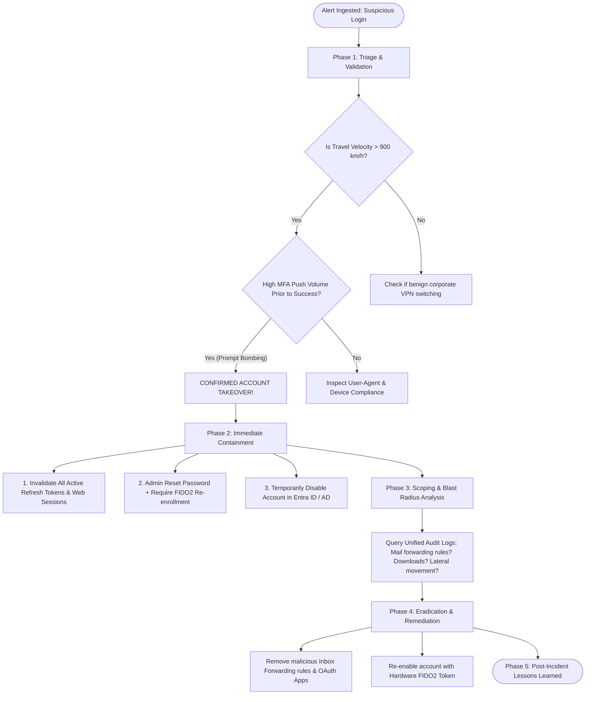

# Incident Playbook: Investigating Suspicious Login Alerts

## 1. Scenario & Trigger Definition
A high-severity alert triggers in the Security Operations Center (SOC) from Microsoft Entra ID Protection / Okta Identity Threat Protection:
- **Alert Title:** `Atypical Travel (Impossible Travel) and MFA Prompt Bombing Detected`
- **Target Principal:** `bob.johnson@enterprise.com` (Senior Financial Controller)
- **Telemetry Indicators:**
  - `14:02:15 UTC`: Successful login from IP `198.51.100.42` (New York, US - Known corporate VPN).
  - `14:28:40 UTC`: 14 consecutive failed MFA push notifications within 3 minutes from IP `203.0.113.88` (Lagos, Nigeria - Tor Exit Node / Data Center ASN).
  - `14:31:55 UTC`: 15th MFA push **ACCEPTED** from IP `203.0.113.88`.
  - `14:32:10 UTC`: Successful login; user accesses Exchange Online and downloads 12 SharePoint finance spreadsheets.

---

## 2. Forensic Investigation Flowchart



---

## 3. Step-by-Step Incident Response Execution

### Phase 1: Triage and Verification
1. **Calculate Travel Velocity:**
   - Distance between New York and Lagos: $\approx 8,400\text{ km}$.
   - Elapsed time: $26.5\text{ minutes}$ ($0.44\text{ hours}$).
   - Calculated speed: $v = \frac{8,400}{0.44} \approx 19,000\text{ km/h}$.
   - **Conclusion:** Mathematically impossible; confirms an unauthorized entity possesses the primary credentials.
2. **Analyze MFA Telemetry:**
   - Review MFA logs: 14 consecutive denials followed by a sudden approval indicates **MFA Fatigue (Prompt Bombing)**—the attacker harassed the employee until they inadvertently clicked "Approve" to silence the notifications.
3. **Inspect IP Reputation:**
   - Query Threat Intel (VirusTotal, AbuseIPDB): IP `203.0.113.88` is a known hosting provider / proxy node.

---

### Phase 2: Immediate Containment (SLA: < 15 Minutes)
Execute rapid containment commands to sever attacker access immediately:

```powershell
# 1. Immediately revoke all active refresh tokens and browser sessions in Microsoft Entra ID
Revoke-AzureADUserAllRefreshToken -ObjectId "bob.johnson@enterprise.com"

# 2. Disable the user account in on-premises Active Directory
Set-ADUser -Identity "bjohnson" -Enabled $False

# 3. Block account sign-in in Microsoft 365
Set-MsolUser -UserPrincipalName "bob.johnson@enterprise.com" -BlockCredential $True
```

---

### Phase 3: Scoping and Blast Radius Analysis
Determine what the adversary executed during the compromised window:

1. **Email Rule Inspection (Persistence Check):** Attackers routinely create forwarding rules to silently siphon invoices and sensitive emails:
   ```powershell
   # Inspect for unauthorized Inbox Forwarding or Deletion rules
   Get-InboxRule -Mailbox "bob.johnson@enterprise.com" | Select-Object Name, Description, ForwardTo, MoveToFolder
   ```
2. **Audit Log Forensics (Microsoft Purview / Unified Audit Log):**
   - Query operations during the active compromise window:
     - `FileDownloaded` on SharePoint/OneDrive: What files were exfiltrated?
     - `MailItemsAccessed` / `SearchQuery`: What emails were searched?
     - `ConsentToApplication`: Did the attacker authorize a malicious OAuth app (Illicit Consent Grant)?

---

### Phase 4: Eradication & Remediation
1. Purge all unauthorized inbox rules discovered during scoping.
2. Invalidate any newly registered third-party OAuth enterprise applications.
3. Require the employee to physically verify their identity with the IT service desk via out-of-band video call.
4. Execute a password reset and issue a hardware **FIDO2 YubiKey**, revoking SMS/Push authenticator methods.

---

### Phase 5: Post-Incident Lessons Learned & Hardening
1. **Enforce Number Matching in MFA:** Enable mandatory number matching in Microsoft Entra ID / Duo so users cannot blindly click "Approve" without typing the 2-digit number displayed on the login screen.
2. **Deploy Risk-Based Conditional Access:** Configure Conditional Access policies to automatically block authentication requests originating from anonymous IP proxies, Tor nodes, or atypical travel locations.

---

## 4. Key Differences Matrix: Account Takeover Scenarios

| Attack Vector | Initial Foothold | MFA Bypass Mechanism | Primary Evidence In Logs |
| :--- | :--- | :--- | :--- |
| **MFA Fatigue** | Credential Stuffing / Leaked Pass | Harassing victim with push notifications | High volume of rejected MFA pushes before success |
| **AiTM Reverse Proxy**| Phishing email to Evilginx portal | Steals post-auth session cookies | Single successful login; NO failed MFA pushes |
| **SIM Swapping** | Social engineering cellular carrier | Diverts SMS OTPs to attacker phone | Legitimate SMS code entered on first attempt |
| **Session Hijacking** | Infostealer malware on laptop | Steals local browser SQLite cookie files | No authentication event logged; session appears from new IP |

---

## 5. Interview Takeaways & Rapid-Fire Q&A

### 60-Second Elevator Pitch
> *"When investigating a suspicious login alert involving impossible travel and MFA fatigue, speed is paramount. Triage begins by calculating geographic velocity to rule out legitimate corporate VPN switching, followed by inspecting MFA attempt logs for repetitive push patterns. If confirmed, immediate containment mandates revoking all active refresh tokens and terminating active web sessions via `Revoke-AzureADUserAllRefreshToken` while disabling the account. Scoping focuses on post-exploitation persistence: querying the Unified Audit Log for unauthorized email forwarding rules, file downloads, and malicious OAuth application grants. Eradication involves purging malicious rules, rotating passwords out-of-band, and upgrading the user to phishing-resistant FIDO2 Passkeys with mandatory number matching."*

### Candidate Traps & Common Mistakes
- **Trap 1:** Resetting the password without invalidating active sessions. *Correction:* Active session cookies remain valid even after a password change; you must explicitly revoke refresh tokens and kill active sessions.
- **Trap 2:** Overlooking email forwarding rules. *Correction:* Attackers immediately set hidden inbox forwarding rules to maintain stealth persistence after password resets.
- **Trap 3:** Calling the user on the phone number registered in their account. *Correction:* In SIM-swap scenarios, calling the phone number connects you directly to the attacker; use out-of-band verified corporate directory channels.

### Expected Follow-Up Questions
1. *What is an Illicit Consent Grant attack in Microsoft 365?*
   - An attack where an adversary tricks a user into granting permissions to a rogue third-party OAuth app. The app obtains API access tokens to read the victim's emails and files directly through Microsoft Graph API, persisting even after the user changes their password.
2. *How does MFA Number Matching defeat prompt bombing?*
   - By presenting a random 2-digit number on the login screen that the user must manually enter into their mobile authenticator app, making it impossible for a victim to accept a prompt triggered by an attacker without seeing the attacker's physical screen.
