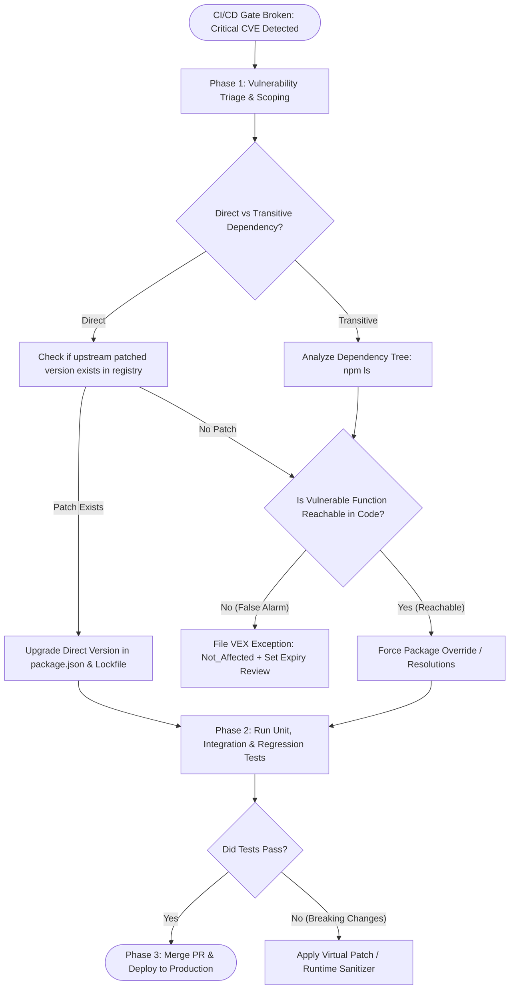

# Remediation Playbook: Vulnerable Dependencies in CI/CD Pipelines

## 1. Scenario & Trigger Definition
An enterprise CI/CD pipeline fails during the automated Pull Request security gate:
- **Pipeline Stage:** `security-sca-check`
- **Tool:** Snyk / Trivy / Dependabot
- **Alert:** `BUILD FAILED: 1 CRITICAL Vulnerability Detected`
- **Component:** `jsonwebtoken` version `8.5.1` (Transitive dependency introduced via `auth-service-sdk`)
- **CVE Identification:** `CVE-2022-23529` (CVSS 9.8 - Remote Code Execution / Insecure Key Object Deserialization)
- **Deployment Status:** **Blocked**. Pipeline halts pull request merge until vulnerability is resolved or formally mitigated.

---

## 2. Dependency Triage & Remediation Flowchart



---

## 3. Step-by-Step Technical Remediation Execution

### Phase 1: Vulnerability Triage & Dependency Tree Mapping
1. **Determine Dependency Lineage:**
   ```bash
   # Trace which top-level library imported the vulnerable package
   npm ls jsonwebtoken
   # Output:
   # backend-api@2.4.0
   # └─┬ auth-service-sdk@1.2.0
   #   └── jsonwebtoken@8.5.1 (CRITICAL CVE-2022-23529)
   ```
   - **Triage Result:** `jsonwebtoken` is a **Transitive Dependency** pulled in by `auth-service-sdk`.
2. **Perform Reachability Analysis:**
   - Review code: Does `backend-api` invoke the vulnerable function (`jwt.verify` passing an untrusted complex key object)?
   - If the application only passes standard PEM string keys, the exploit vector is unreachable at runtime. However, enterprise security standards mandate upgrading libraries to eliminate dormant risk.

---

### Phase 2: Upgrading and Overriding Transitive Dependencies

#### A. Upgrading Direct Dependencies
If the package is a direct dependency, upgrade within Semantic Versioning boundaries:
```bash
npm install jsonwebtoken@9.0.0 --save
npm audit
```

#### B. Forcing Transitive Overrides (When Parent Library Has No Upstream Release)
Often, the maintainer of the parent library (`auth-service-sdk`) has not yet released a new version. To force the dependency tree to use the secure patched version without waiting for the vendor, declare an **Override / Resolution**:

In `package.json`:
```json
{
  "dependencies": {
    "auth-service-sdk": "^1.2.0"
  },
  "overrides": {
    "jsonwebtoken": "^9.0.0"
  }
}
```
Run lockfile regeneration:
```bash
npm install
git add package.json package-lock.json
git commit -m "security(deps): override jsonwebtoken to 9.0.0 to remediate CVE-2022-23529"
```

---

### Phase 3: Automated Testing & Regression Verification
Dependency updates can introduce breaking API changes. The CI pipeline must execute comprehensive automated validation:
1. **Unit Tests:** Verifies individual module functionality.
2. **Integration Tests:** Verifies token issuance and verification end-to-end.
3. **Lockfile Integrity:** Ensure `package-lock.json` or `poetry.lock` is committed to Git to guarantee that CI runners, staging, and production run identical, reproducible dependency builds.

---

### Phase 4: Documenting Temporary Exceptions via VEX
When an upstream patch does not exist and no override is immediately feasible, but the vulnerability is provably unreachable in the application, engineers generate a **VEX (Vulnerability Exploitability eXchange)** document:

```json
{
  "$schema": "https://cyclonedx.org/schema/vex-1.0.json",
  "vulnerabilities": [
    {
      "id": "CVE-2022-23529",
      "analysis": {
        "state": "not_affected",
        "justification": "vulnerable_code_not_in_execute_path",
        "detail": "Application strictly validates keys as strings; object deserialization sink is never invoked.",
        "expires": "2026-11-09T00:00:00Z"
      }
    }
  ]
}
```
- Ingesting the VEX manifest into the CI scanner (Trivy/Snyk) suppresses the failure gate until the expiration date, allowing urgent production deployments while maintaining an auditable tracking record.

---

## 4. Key Differences Matrix: Semantic Versioning Operators

| Operator | Syntax Example | What Updates It Permits | Security & Stability Tradeoff |
| :--- | :--- | :--- | :--- |
| **Exact Pinning** | `"1.4.2"` | **Zero updates** (Only 1.4.2) | **Maximum Stability**; requires manual security patch bumps |
| **Tilde (`~`)** | `"~1.4.2"` | Patch releases only ($1.4.2 \le v < 1.5.0$)| Safest auto-update; pulls bug/security fixes |
| **Caret (`^`)** | `"^1.4.2"` | Minor & Patch ($1.4.2 \le v < 2.0.0$) | Standard default; risk of unexpected minor breaking changes |
| **Wildcard (`*`)**| `"*"` / `"latest"`| Any release (including Major breaks) | **CATASTROPHIC ANTI-PATTERN**; destroys build reproducibility |

---

## 5. Cybersecurity Relevance, Threats & Attack Vectors

### 1. The Poisoned Dependency Update (Malicious Minor Version)
- **Mechanism:** Attackers compromise an npm/PyPI maintainer's account and publish a minor version bump (e.g., from `1.2.4` to `1.2.5`) containing a cryptocurrency stealer.
- **Exploitation:** Applications using loose versioning (`^1.2.0`) automatically download the infected package during their next CI build.
- **Defense:** **Mandate Lockfile Pinning**. CI pipelines must execute `npm ci` (clean install from lockfile) rather than `npm install`, ensuring builds only install the exact cryptographically hashed versions recorded in `package-lock.json`.

---

## 6. Interview Takeaways & Rapid-Fire Q&A

### 60-Second Elevator Pitch
> *"Remediating vulnerable dependencies in CI/CD requires balancing security risk against production stability. When an automated SCA scan halts a build, we first triage whether the vulnerability is a direct or transitive dependency and perform reachability analysis to verify if the vulnerable function is actually executed. For direct dependencies, we upgrade to the patched version within Semantic Versioning constraints. For transitive dependencies where upstream parents have not released updates, we force dependency resolutions via package overrides in `package.json`. In production environments, pipelines must enforce `npm ci` over `npm install` to build strictly from locked, cryptographically hashed dependencies. If no patch exists and code is unaffected, we file an auditable VEX statement with an explicit expiration date to unblock the deployment safely."*

### Candidate Traps & Common Mistakes
- **Trap 1:** Running `npm audit fix --force` blindly. *Correction:* `--force` updates packages across major version boundaries, routinely breaking production application APIs and causing outages.
- **Trap 2:** Not committing the lockfile (`package-lock.json`). *Correction:* Without the lockfile in Git, every developer machine and CI runner resolves slightly different versions, creating catastrophic environment drift.
- **Trap 3:** Suppressing security scanner alerts permanently without review. *Correction:* Never silence a CVE with global ignore flags; use structured VEX declarations with strict expiration review dates.

### Expected Follow-Up Questions
1. *What is the difference between `npm install` and `npm ci`?*
   - `npm install` can update `package-lock.json` and resolve newer compatible versions based on semver ranges; `npm ci` strictly installs the exact versions and hashes listed in the existing lockfile, throwing an error if the lockfile and `package.json` are out of sync.
2. *What is Reachability Analysis in SCA?*
   - A static analysis technique that checks whether the specific vulnerable function or class within an imported library is actually called or imported by the application's execution path.
