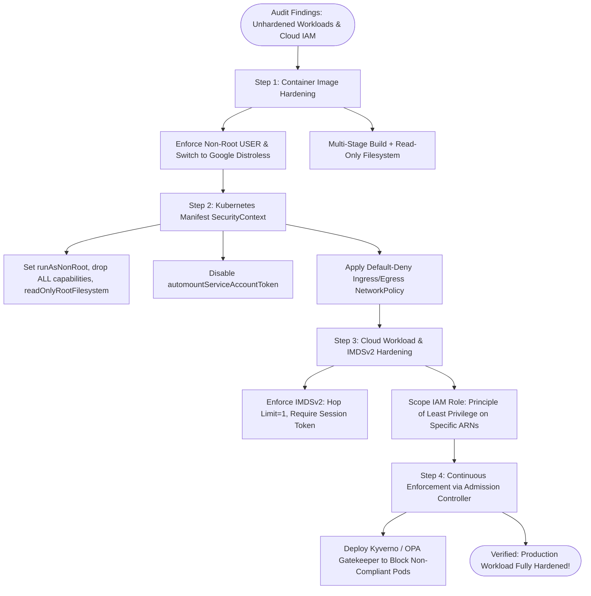

# Hardening Playbook: Securing Docker Containers and Cloud Workloads

## 1. Scenario & Trigger Definition
A comprehensive enterprise security audit by the Cloud Security Posture Management (CSPM) and Container Security platform identifies three critical vulnerabilities across production infrastructure:
1. **Container Risk:** Production billing microservice containers run as **root (UID 0)** with full default Linux capabilities on an unpatched base image.
2. **Kubernetes Risk:** Workloads in the `production` namespace operate with **no NetworkPolicies** on an unrestricted flat network with default ServiceAccount tokens mounted.
3. **Cloud Workload Risk:** The underlying AWS EC2 worker instances run **IMDSv1 (Instance Metadata Service v1)** with an attached IAM role granting wildcard permissions (`s3:*` on `*`), leaving the infrastructure critically vulnerable to SSRF credential theft.

---

## 2. Workload Hardening Lifecycle Flowchart



---

## 3. Step-by-Step Technical Hardening Execution

### Step 1: Dockerfile Transformation (Minimalist Non-Root)
Replace the monolithic, unprivileged base image with a hardened Google Distroless multi-stage build:

```dockerfile
# Hardened Production Dockerfile
FROM golang:1.23-alpine AS builder
WORKDIR /app
COPY go.mod go.sum ./
RUN go mod download
COPY . .
# Build statically linked binary with stripped debug symbols
RUN CGO_ENABLED=0 GOOS=linux go build -ldflags="-s -w" -o server .

# Final Stage: Distroless Static (Zero shell, zero OS package tools)
FROM gcr.io/distroless/static-debian12:nonroot
WORKDIR /app
COPY --from=builder /app/server .
USER nonroot:nonroot
ENTRYPOINT ["/app/server"]
```

---

### Step 2: Kubernetes Workload Hardening (`securityContext`)
Harden the Kubernetes `Deployment` manifest to eliminate privilege escalation, drop kernel capabilities, and enforce an immutable filesystem:

```yaml
apiVersion: apps/v1
kind: Deployment
metadata:
  name: billing-api
  namespace: production
spec:
  replicas: 3
  template:
    spec:
      # PREVENTS UNNECESSARY API SERVER TOKEN INJECTION
      automountServiceAccountToken: false
      securityContext:
        runAsNonRoot: true
        runAsUser: 65532
        runAsGroup: 65532
        fsGroup: 65532
        seccompProfile:
          type: RuntimeDefault
      containers:
      - name: billing-api
        image: enterprise-registry.corp/billing-api:2.1.0
        securityContext:
          allowPrivilegeEscalation: false
          readOnlyRootFilesystem: true
          capabilities:
            drop:
            - ALL
        volumeMounts:
        - name: ephemeral-tmp
          mountPath: /tmp
      volumes:
      - name: ephemeral-tmp
        emptyDir:
          medium: Memory # RAM-backed tmpfs for required temporary scratch files
```

---

### Step 3: Kubernetes Network Isolation (Default-Deny Policy)
Isolate the workload from lateral cluster snooping:

```yaml
apiVersion: networking.k8s.io/v1
kind: NetworkPolicy
metadata:
  name: isolate-billing-api
  namespace: production
spec:
  podSelector:
    matchLabels:
      app: billing-api
  policyTypes:
  - Ingress
  - Egress
  ingress:
  # Permit strictly incoming traffic from the ingress API Gateway on port 8080
  - from:
    - podSelector:
        matchLabels:
          app: api-gateway
    ports:
    - protocol: TCP
      port: 8080
  egress:
  # Permit strictly outbound traffic to the Postgres DB on port 5432
  - to:
    - podSelector:
        matchLabels:
          app: postgres-db
    ports:
    - protocol: TCP
      port: 5432
  # Permit internal DNS resolution (Kube-DNS / CoreDNS)
  - to:
    - namespaceSelector: {}
      podSelector:
        matchLabels:
          k8s-app: kube-dns
    ports:
    - protocol: UDP
      port: 53
```

---

### Step 4: Cloud Workload Hardening: Enforcing IMDSv2
In AWS, the Instance Metadata Service (IMDS) at `169.254.169.254` provides temporary IAM role credentials.
- **The IMDSv1 Flaw:** In IMDSv1, a simple HTTP GET request fetches credentials: `GET http://169.254.169.254/latest/meta-data/iam/security-credentials/role`. Any Server-Side Request Forgery (SSRF) flaw in web applications allows attackers to steal these credentials!
- **The IMDSv2 Fix:** IMDSv2 requires **session-oriented authentication** via an initial `PUT` request with a mandatory `X-aws-ec2-metadata-token-ttl-seconds` header, followed by a signed `GET` request. Simple SSRF payloads cannot forge custom PUT headers!

```bash
# Enforce IMDSv2 and restrict hop limit to 1 (blocks container-to-host traversal)
aws ec2 modify-instance-metadata-options \
    --instance-id i-0123456789abcdef0 \
    --http-tokens required \
    --http-put-response-hop-limit 1 \
    --http-endpoint enabled
```
*(Setting `hop-limit=1` ensures the packet TTL drops to 0 if forwarded across container network bridges, preventing containerized workloads from querying host metadata!).*

---

## 4. Key Differences Matrix: IMDSv1 vs IMDSv2

| Feature | IMDSv1 (Legacy) | IMDSv2 (Modern Standard) |
| :--- | :--- | :--- |
| **Request Protocol** | Simple `GET` request | **Session-oriented `PUT` token + `GET`** |
| **SSRF Vulnerability**| **Critically Vulnerable** (Exploited in Capital One breach)| **Resistant** (SSRF cannot forge PUT headers) |
| **Network Hop Limit** | Unlimited by default | **Configurable (Enforce Hop Limit = 1)** |
| **WAF / Reverse Proxy Protection**| Bypassable | Native (WAFs block custom PUT headers by default) |

---

## 5. Interview Takeaways & Rapid-Fire Q&A

### 60-Second Elevator Pitch
> *"Hardening containerized cloud workloads requires defense-in-depth spanning the image, the Kubernetes runtime, and the underlying cloud instance metadata. At the container image level, we enforce non-root execution (`USER nonroot`) on minimal Google Distroless base images to eliminate shells and package managers. Within Kubernetes, we declare strict `securityContext` settings—dropping all Linux capabilities, disabling `allowPrivilegeEscalation`, and mandating `readOnlyRootFilesystem`—coupled with default-deny CNI NetworkPolicies to prevent lateral movement. On the cloud infrastructure level, we enforce IMDSv2 with a network hop limit of 1 to defeat SSRF credential theft and replace wildcard IAM permissions with least-privilege, ARN-scoped resource policies."*

### Candidate Traps & Common Mistakes
- **Trap 1:** Forgetting to configure a writable `/tmp` when using `readOnlyRootFilesystem`. *Correction:* Many runtimes crash if they cannot write temporary pid or lock files; always mount a RAM-backed `emptyDir: { medium: Memory }` volume to `/tmp`.
- **Trap 2:** Leaving IMDSv1 enabled on EC2 instances. *Correction:* IMDSv1 is a primary contributor to cloud breaches; enforce `http-tokens: required` on all instances.
- **Trap 3:** Assuming `runAsNonRoot: true` in Kubernetes automatically assigns a user. *Correction:* If the Dockerfile defines `USER 0` (root), setting `runAsNonRoot: true` in K8s simply causes the pod to crash with a `CreateContainerConfigError`; you must explicitly supply `runAsUser: <uid>` or configure the user in the Dockerfile.

### Expected Follow-Up Questions
1. *Why does setting the IMDSv2 hop limit to 1 protect Kubernetes containers on an EC2 node?*
   - Containers run inside their own network namespace behind a virtual bridge (`veth`/`cbr0`). Traversing the bridge decrements the packet's IP TTL by 1. With a hop limit of 1, the packet expires before leaving the host network stack, preventing containerized pods from reaching the host's EC2 metadata service.
2. *What is Seccomp `RuntimeDefault` in Kubernetes?*
   - It applies the container runtime's built-in Seccomp profile (e.g., containerd default), which blocks approximately 40+ dangerous Linux system calls (such as `reboot`, `sys_ptrace`, and `kexec_load`), reducing the kernel attack surface.
