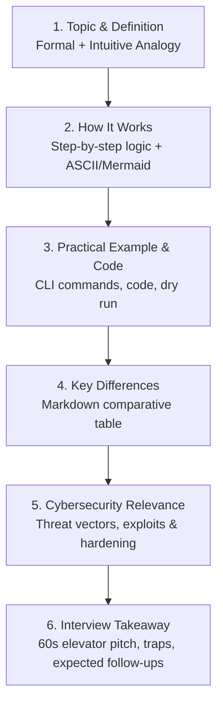

# Repository Architecture & File Blueprint
## Cybersecurity Technical Round Preparation Framework

This repository is an engineered preparation suite designed specifically for foundational and advanced **Cybersecurity Technical Interviews**. It covers the complete syllabus defined in [`context.txt`](file:///c:/Users/ASUS/Desktop/Tomorrow/context.txt), organized into an intuitive, modular, and interview-optimized file tree.

---

## 1. Design Principles & Pedagogical Methodology

The architecture follows five core design principles:

1. **Modular Domain Isolation:**  
   Each of the 7 core domains sits in its own numbered top-level directory (`01-core-cs` to `07-practical-scenarios-and-interview-playbooks`), preventing cognitive overload and enabling targeted study sprints.
2. **Standardized 6-Stage Pedagogy:**  
   Every single topic file follows the unified structure specified in [`templates/topic-template.md`](file:///c:/Users/ASUS/Desktop/Tomorrow/templates/topic-template.md):
   - **Stage 1:** Topic & Definition (Formal + Intuitive Analogy)
   - **Stage 2:** How It Works (Step-by-step logic + ASCII/Mermaid flows)
   - **Stage 3:** Practical Examples, Commands & Code (Dry runs, syntax, snippets)
   - **Stage 4:** Key Differences & Comparative Tables (De-confusing similar terms)
   - **Stage 5:** Cybersecurity Relevance & Threat Vectors (Abuse cases & hardening)
   - **Stage 6:** Interview Takeaway (Elevator pitch, traps, expected follow-ups)
3. **Dedicated Section QA & Revision Sheets:**  
   Each major section contains an `interview-qa.md` file featuring realistic scenario questions, grading criteria, and golden answers.
4. **Rapid-Access Cheat Sheets (`cheatsheets/`):**  
   Night-before-interview summaries (port matrices, crypto comparisons, OWASP cheat sheets, CLI syntaxes) for rapid retrieval.
5. **Practical Hands-On Artifacts (`scripts/`):**  
   Runnable Python/Bash scripts demonstrating socket connections, JWT decode/validation, log parsing, and SQL injection defense.

---

## 2. Complete File & Directory Map

```text
Tomorrow/
├── README.md                                                     # Master Dashboard, Progress Tracker & Global Index
├── ARCHITECTURE.md                                               # Architecture Blueprint & Repository Guide
├── context.txt                                                   # Master Prompt & Syllabus Definition
│
├── 01-core-cs/                                                   # DOMAIN 1: Core Computer Science
│   ├── README.md                                                 # Domain 1 Syllabus, Study Plan & Checklist
│   ├── 01-operating-systems/
│   │   ├── README.md                                             # OS Module Overview & Concept Map
│   │   ├── 01-kernel-user-mode-and-system-calls.md              # Kernel, Ring levels, System Calls & Context Switches
│   │   ├── 02-processes-threads-and-ipc.md                      # Process states, PCB, Threads vs Processes, IPC mechanisms
│   │   ├── 03-concurrency-synchronization-and-deadlocks.md      # Mutex, Semaphores, Race conditions, 4 Deadlock conditions
│   │   ├── 04-cpu-scheduling-algorithms.md                     # FCFS, SJF, SRTF, Priority, Round Robin & Starvation
│   │   ├── 05-memory-management-and-virtual-memory.md           # Paging, Segmentation, TLB, Page faults & Replacement
│   │   ├── 06-stack-heap-and-buffer-internals.md                 # Stack vs Heap, Fragmentations, Swapping & Memory Safety
│   │   └── 07-file-systems-permissions-privilege-escalation.md  # Linux/Windows permissions, DAC, SUID, PrivEsc vectors
│   ├── 02-dbms-and-sql/
│   │   ├── README.md                                             # DBMS Module Overview
│   │   ├── 01-rdbms-fundamentals-and-key-types.md               # Primary, Foreign, Candidate, Composite, Integrity
│   │   ├── 02-sql-syntax-queries-and-joins.md                   # Joins with diagrams, Group By, Having, Subqueries
│   │   ├── 03-normalization-1nf-to-bcnf.md                      # Anomalies, Normal forms walkthrough with examples
│   │   ├── 04-acid-properties-and-transactions.md               # Concurrency issues: Dirty, Non-repeatable, Phantom reads
│   │   ├── 05-indexes-and-query-optimization.md                 # Clustered vs Non-clustered, B-Trees, Execution plans
│   │   └── 06-sql-injection-and-database-security.md            # SQLi variants, Parameterized queries, DB hardening
│   ├── 03-oop-and-design-patterns/
│   │   ├── README.md                                             # OOP Module Overview
│   │   ├── 01-oop-four-pillars.md                               # Encapsulation, Abstraction, Inheritance, Polymorphism
│   │   ├── 02-polymorphism-interfaces-and-composition.md        # Static vs Dynamic, Overloading vs Overriding, Abstract classes
│   │   ├── 03-solid-principles-with-code-examples.md            # S-O-L-I-D deep dive with Python/Java examples
│   │   └── 04-secure-coding-and-vulnerability-mitigation.md     # Input validation, Fail-safe defaults, Memory sanitization
│   ├── 04-dsa-for-security/
│   │   ├── README.md                                             # DSA Module Overview
│   │   ├── 01-core-data-structures-overview.md                  # Arrays, Lists, Stacks, Queues, Hash Tables, Trees, Graphs
│   │   ├── 02-algorithmic-complexity-big-o.md                   # Time/Space complexity, sorting, searching, recursion
│   │   └── 03-dsa-in-security-tools-and-threat-detection.md     # Tries for routing/IPs, Hash tables for bloom filters, Log processing
│   └── interview-qa.md                                           # Core CS Technical Interview Q&A + Coding Prompts
│
├── 02-networking/                                                # DOMAIN 2: Networking Fundamentals
│   ├── README.md                                                 # Domain 2 Syllabus & Roadmap
│   ├── 01-osi-and-tcpip-models/
│   │   ├── README.md                                             # Models Overview
│   │   ├── 01-osi-seven-layers-deep-dive.md                     # Functions, data units, protocols & devices per layer
│   │   └── 02-encapsulation-decapsulation-and-sockets.md        # PDU traversal, Headers, Ports, Sockets & MAC/IP mapping
│   ├── 02-ip-addressing-and-subnetting/
│   │   ├── README.md                                             # Addressing Overview
│   │   ├── 01-ipv4-vs-ipv6-and-special-ranges.md                # Public/Private, Loopback, APIPA, Link-local, IPv6 format
│   │   ├── 02-cidr-subnet-calculations-worked-examples.md       # Step-by-step subnet math, Network/Broadcast/Usable IP calculations
│   │   └── 03-nat-pat-vlans-and-segmentation.md                 # Static/Dynamic NAT, PAT (Overload), VLAN tagging & microsegmentation
│   ├── 03-protocols-and-handshakes/
│   │   ├── README.md                                             # Protocols Overview
│   │   ├── 01-tcp-vs-udp-and-tcp-internals.md                   # TCP 3-way handshake, 4-way teardown, Flags, SYN flood
│   │   ├── 02-dns-resolution-records-and-attacks.md             # Recursive vs Iterative, A/AAAA/CNAME/MX/TXT/PTR, DNS poisoning
│   │   ├── 03-dhcp-dora-process-and-spoofing.md                 # Discover-Offer-Request-Ack, Leases, Rogue DHCP
│   │   ├── 04-arp-and-arp-cache-poisoning.md                    # ARP resolution, Gratuitous ARP, MITM poisoning
│   │   ├── 05-http-https-and-tls-handshake.md                   # HTTP methods, headers, status codes, TLS 1.3 handshake, PKI
│   │   └── 06-common-network-protocols-port-matrix.md           # SSH, Telnet, SMTP, POP3, IMAP, SNMP, LDAP, SMB, RDP, Kerberos
│   ├── 04-network-security-devices/
│   │   ├── README.md                                             # Devices Overview
│   │   ├── 01-firewalls-types-and-packet-filtering.md           # Packet filter, Stateful inspection, Proxy, Next-Gen (NGFW)
│   │   ├── 02-ids-vs-ips-and-signature-vs-anomaly.md            # Snort/Suricata, inline vs passive, false positives/negatives
│   │   ├── 03-proxies-reverse-proxies-and-wafs.md               # Forward vs Reverse proxy, CDN, WAF L7 inspection
│   │   └── 04-vpns-wireless-wpa3-and-zero-trust.md              # IPsec vs SSL VPN, WPA2 vs WPA3 4-way handshake, Zero Trust (ZTA)
│   ├── 05-network-attacks-and-diagnostics/
│   │   ├── README.md                                             # Attacks & Troubleshooting Overview
│   │   ├── 01-sniffing-spoofing-mitm-and-ddos.md                # ARP spoof, DNS spoof, Session hijacking, Amplification attacks
│   │   ├── 02-wireshark-tcpdump-and-packet-analysis.md          # Capture filters, Display filters, Flow analysis, Detecting attacks
│   │   ├── 03-nmap-scanning-techniques-and-port-states.md       # SYN scan, FIN scan, Idle scan, Version detection, NSE scripts
│   │   └── 04-network-troubleshooting-systematic-playbook.md    # Ping, Traceroute, Netstat, SS, Dig, Nslookup, Telnet/Curl
│   └── interview-qa.md                                           # Networking Interview Q&A + Packet Walkthroughs
│
├── 03-cybersecurity-fundamentals/                                # DOMAIN 3: Cybersecurity Fundamentals
│   ├── README.md                                                 # Domain 3 Syllabus & Overview
│   ├── 01-principles-and-governance/
│   │   ├── README.md                                             # Governance Overview
│   │   ├── 01-cia-triad-and-parkerian-hexad.md                  # Confidentiality, Integrity, Availability + Authenticity/Possession
│   │   ├── 02-security-controls-classification.md               # Administrative, Technical, Physical | Preventive, Detective, Corrective
│   │   ├── 03-threat-actors-and-kill-chain.md                   # APTs, Insider threats, Cyber Kill Chain, MITRE ATT&CK
│   │   ├── 04-risk-management-cvss-and-cve.md                   # Likelihood x Impact, CVSS v3.1 scoring, CVE vs CWE
│   │   └── 05-frameworks-nist-csf-and-iso27001.md               # Identify, Protect, Detect, Respond, Recover; ISMS controls
│   ├── 02-cryptography-and-pki/
│   │   ├── README.md                                             # Cryptography Overview
│   │   ├── 01-symmetric-vs-asymmetric-encryption.md             # AES (CBC/GCM) vs RSA, ECC, key length equivalencies
│   │   ├── 02-hashing-salting-and-key-stretching.md             # SHA-256, Argon2, bcrypt, PBKDF2, Rainbow tables, collisions
│   │   ├── 03-digital-signatures-and-certificates.md            # Hash + private key, X.509 format, Root CAs, CRL & OCSP
│   │   ├── 04-key-exchange-diffie-hellman-and-pfs.md            # DH math, ECDHE, Ephemeral keys, Perfect Forward Secrecy
│   │   └── 05-encryption-vs-hashing-vs-encoding-vs-tokenization.md # Crucial comparison table and real-world misuse
│   ├── 03-threats-and-malware/
│   │   ├── README.md                                             # Threats Overview
│   │   ├── 01-social-engineering-tactics.md                     # Phishing, Spear-phishing, Whaling, Vishing, Smishing, Pretexting
│   │   ├── 02-malware-taxonomy-and-behavior.md                  # Viruses, Worms, Trojans, Ransomware, Rootkits, Fileless
│   │   ├── 03-password-attacks-and-cracking.md                  # Brute force, Dictionary, Spraying, Stuffing, Hashcat/John
│   │   └── 04-post-exploitation-and-lateral-movement.md         # Privilege escalation, Mimikatz/LSASS, Pass-the-Hash, Exfiltration
│   ├── 04-web-application-security/
│   │   ├── README.md                                             # Web Security Overview
│   │   ├── 01-owasp-top-10-comprehensive-guide.md               # A01 to A10 broken down with code examples and remediations
│   │   ├── 02-sql-injection-deep-dive.md                        # In-band, Blind (Boolean/Time), Error-based, Remediation
│   │   ├── 03-cross-site-scripting-xss.md                       # Stored, Reflected, DOM-based, CSP headers, Contextual encoding
│   │   ├── 04-csrf-and-ssrf-mechanisms.md                       # Anti-CSRF tokens, SameSite cookies, Cloud metadata SSRF
│   │   └── 05-broken-access-control-and-idor.md                 # IDOR, Vertical/Horizontal escalation, API security best practices
│   ├── 05-soc-defenses-and-operations/
│   │   ├── README.md                                             # SOC Operations Overview
│   │   ├── 01-siem-architecture-and-log-sources.md              # Log ingestion, parsing, correlation rules, Splunk/Elastic
│   │   ├── 02-edr-vs-antivirus-vs-xdr.md                        # Behavioral telemetry, process trees, memory scanning, quarantine
│   │   ├── 03-incident-response-phases-nist-sp800-61.md         # Preparation, Detection/Analysis, Containment, Eradication, Recovery, Lessons
│   │   └── 04-threat-hunting-and-forensic-fundamentals.md       # Volatility memory analysis, Autopsy disk forensics, IOCs vs TTPs
│   └── interview-qa.md                                           # Security Fundamentals Interview Questions & Scenarios
│
├── 04-identity-and-access-management/                            # DOMAIN 4: IAM & Directory Services
│   ├── README.md                                                 # Domain 4 Syllabus & Overview
│   ├── 01-iam-foundations/
│   │   ├── README.md                                             # Foundations Overview
│   │   ├── 01-identity-terminology-and-lifecycle.md             # Principal, Account, Service Account, Provisioning/Deprovisioning
│   │   ├── 02-aaa-framework-and-pam.md                          # Authn vs Authz vs Accounting, JIT access, Vaulting, Rotation
│   │   └── 03-access-control-models-rbac-abac-mac-dac.md        # Role-based, Attribute-based, Mandatory (Bell-LaPadula), Discretionary
│   ├── 02-authentication-and-tokens/
│   │   ├── README.md                                             # Auth & Tokens Overview
│   │   ├── 01-multi-factor-authentication-and-passkeys.md       # Knowledge/Possession/Inherence, TOTP (RFC 6238), FIDO2/WebAuthn
│   │   ├── 02-json-web-tokens-jwt-architecture.md               # Header.Payload.Signature, alg:none attacks, JWKS validation
│   │   └── 03-sessions-cookies-and-token-security.md            # HttpOnly, Secure, SameSite, Revocation strategies, Token storage
│   ├── 03-sso-and-federation-protocols/
│   │   ├── README.md                                             # SSO Overview
│   │   ├── 01-single-sign-on-architecture.md                    # Central IdP, Trust relationships, User experience vs Single Point of Failure
│   │   ├── 02-oauth-20-framework-and-grant-types.md             # Auth Code + PKCE, Client Credentials, Refresh tokens, Scopes
│   │   ├── 03-openid-connect-oidc-identity-layer.md             # ID Token, UserInfo endpoint, Claims, OIDC vs OAuth 2.0
│   │   └── 04-saml-20-enterprise-federation.md                  # SAML assertions, IdP-initiated vs SP-initiated, XML Signature attacks
│   ├── 04-directory-services-kerberos/
│   │   ├── README.md                                             # Directory Services Overview
│   │   ├── 01-active-directory-and-ldap-architecture.md         # Forest, Domain, OU, GPO, LDAP search filters, LDAPS (Port 636)
│   │   ├── 02-kerberos-authentication-protocol.md               # AS-REQ/REP, TGS-REQ/REP, AP-REQ/REP, Tickets, KDC architecture
│   │   └── 03-active-directory-attacks-and-defenses.md          # Kerberoasting, AS-REP roasting, Pass-the-Ticket, Golden/Silver tickets
│   └── interview-qa.md                                           # IAM & Auth Protocols Interview Q&A
│
├── 05-ai-and-ml-in-cybersecurity/                                # DOMAIN 5: AI & Machine Learning in Cybersecurity
│   ├── README.md                                                 # Domain 5 Syllabus & Overview
│   ├── 01-machine-learning-fundamentals/
│   │   ├── README.md                                             # ML Fundamentals Overview
│   │   ├── 01-ai-vs-ml-vs-dl-vs-genai.md                        # Taxonomy, Relationship diagram, Capabilities & boundaries
│   │   ├── 02-learning-paradigms-and-algorithms.md              # Supervised, Unsupervised, Semi-supervised, RL; Trees, Logistic, K-Means
│   │   ├── 03-data-preprocessing-and-feature-engineering.md     # Scaling, Encoding, Normalization, Data leakage, Concept drift
│   │   ├── 04-bias-variance-overfitting-regularization.md        # High bias vs High variance, L1/L2 regularization, Cross-validation
│   │   └── 05-model-evaluation-metrics-for-security.md          # Confusion matrix, Precision vs Recall trade-off in SOC, F1, ROC-AUC
│   ├── 02-deep-learning-and-transformers/
│   │   ├── README.md                                             # Deep Learning Overview
│   │   ├── 01-neural-networks-and-backpropagation.md            # Perceptrons, Weights, Biases, Activation (ReLU/Sigmoid), Gradient Descent
│   │   ├── 02-cnns-rnns-and-sequence-modeling.md                # Convolutions for malware opcodes, LSTMs for network flow sequences
│   │   └── 03-transformer-architecture-and-self-attention.md    # Encoder-Decoder, Multi-head Attention, Embeddings, Context windows
│   ├── 03-generative-ai-and-llm-security/
│   │   ├── README.md                                             # GenAI Security Overview
│   │   ├── 01-llm-mechanisms-pretraining-and-rag.md             # Tokenization, Temperature/Top-p, Fine-tuning vs RAG, Vector databases
│   │   ├── 02-owasp-top-10-for-llm-applications.md              # LLM01 Prompt Injection, Insecure Output, Model DOS, Excessive Agency
│   │   ├── 03-prompt-injection-and-jailbreak-mechanisms.md      # Direct vs Indirect injection, System prompt bypass, Multi-modal exploits
│   │   └── 04-ai-guardrails-and-secure-agent-design.md          # Input/output filters, NeMo Guardrails, Sandboxed tools, Least privilege
│   ├── 04-ai-for-cyber-operations/
│   │   ├── README.md                                             # AI in Cyber Operations Overview
│   │   ├── 01-ai-assisted-soc-triage-and-threat-intel.md        # Automated triage, Alert correlation, Entity risk scoring, Phishing NLP
│   │   ├── 02-user-and-entity-behavior-analytics-ueba.md        # Baseline behavior modeling, Peer grouping, Anomaly detection algorithms
│   │   ├── 03-adversarial-ml-evasion-and-poisoning.md           # Perturbation attacks, Clean-label poisoning, Model extraction
│   │   └── 04-offensive-ai-threats-and-countermeasures.md       # AI phishing generation, Deepfakes, Automated vulnerability discovery
│   └── interview-qa.md                                           # AI & Cyber ML Interview Q&A
│
├── 06-devops-and-devsecops/                                      # DOMAIN 6: DevOps, Cloud & DevSecOps
│   ├── README.md                                                 # Domain 6 Syllabus & Overview
│   ├── 01-git-version-control/
│   │   ├── README.md                                             # Git Overview
│   │   ├── 01-git-architecture-and-object-model.md              # Blobs, Trees, Commits, Tags, Working tree, Staging index, HEAD
│   │   ├── 02-branching-merge-rebase-and-workflows.md           # Merge vs Rebase, Conflict resolution, PR workflows, Branch protection
│   │   └── 03-git-security-and-secret-prevention.md             # Git leaks, .gitignore best practices, GPG commit signing, BFG cleaner
│   ├── 02-scripting-and-automation/
│   │   ├── README.md                                             # Scripting Overview
│   │   ├── 01-bash-scripting-and-linux-cli-tooling.md           # Grep, Sed, Awk, Pipes, Cut, Tr, Chmod, File descriptors, Subshells
│   │   ├── 02-python-automation-for-security-tasks.md           # Log parsers, HTTP API querying, Subprocess safety, Exception handling
│   │   └── 03-safe-execution-and-credential-hygiene.md          # Shell injection avoidance, Env variables vs hardcoding, File permissions
│   ├── 03-cicd-and-devsecops/
│   │   ├── README.md                                             # CI/CD Overview
│   │   ├── 01-cicd-pipeline-architecture-and-stages.md          # Build, Test, Scan, Package, Deploy, Monitor, Rollback strategies
│   │   ├── 02-security-testing-sast-dast-sca.md                 # Static vs Dynamic analysis, Dependency vulnerability scanning
│   │   ├── 03-software-supply-chain-and-sboms.md                # Software Bill of Materials (CycloneDX/SPDX), Sigstore, Slsa levels
│   │   └── 04-infrastructure-as-code-iac-security.md           # Terraform/CloudFormation, Policy as Code (OPA/Checkov), Drift detection
│   ├── 04-containers-and-kubernetes/
│   │   ├── README.md                                             # Containers Overview
│   │   ├── 01-containers-vs-vms-and-docker-internals.md         # Linux namespaces (pid, net, mnt), cgroups, OverlayFS, Containerd
│   │   ├── 02-dockerfile-security-and-image-hardening.md        # Multi-stage builds, Non-root users, Distroless images, Docker scan
│   │   ├── 03-kubernetes-architecture-and-core-objects.md       # Master/Worker nodes, Pods, Deployments, Services, Ingress, Namespaces
│   │   └── 04-kubernetes-cluster-and-workload-security.md       # K8s RBAC, Network Policies, Pod Security Standards, Admission Webhooks
│   ├── 05-cloud-computing-and-cloud-security/
│   │   ├── README.md                                             # Cloud Overview
│   │   ├── 01-cloud-service-models-and-shared-responsibility.md # IaaS vs PaaS vs SaaS, Security accountability matrix
│   │   ├── 02-cloud-identity-iam-and-least-privilege.md         # IAM Roles, AssumeRole, Policies, Federation, Workload Identity
│   │   ├── 03-cloud-networking-and-security-boundaries.md       # VPCs, Subnets, Security Groups vs NACLs, PrivateLink, Gateways
│   │   ├── 04-encryption-kms-and-cloud-storage-security.md      # S3/Blob permissions, Server-side encryption, KMS keys, Key rotation
│   │   ├── 05-cloud-monitoring-logging-and-cspm.md              # CloudTrail, CloudWatch, GuardDuty, CSPM vs CWPP vs CIEM
│   │   └── 06-cloud-provider-cross-reference-matrix.md          # AWS vs Azure vs GCP side-by-side service mapping
│   └── interview-qa.md                                           # DevOps & Cloud Security Interview Q&A
│
├── 07-practical-scenarios-and-interview-playbooks/               # DOMAIN 7: End-to-End Walkthroughs & Playbooks
│   ├── README.md                                                 # Domain 7 Syllabus & Overview
│   ├── 01-end-to-end-workflows/
│   │   ├── README.md                                             # Workflows Overview
│   │   ├── 01-browser-url-to-page-render-deep-dive.md           # Keystroke -> DNS -> TCP Handshake -> TLS -> HTTP GET -> DOM Render
│   │   ├── 02-client-server-tcp-and-https-connection.md         # Complete packet flow, SYN/ACK, TLS 1.3 ClientHello, Cipher negotiation
│   │   ├── 03-user-authentication-login-to-authorization.md     # Password submit -> bcrypt verify -> Session/JWT mint -> RBAC check
│   │   └── 04-cross-application-enterprise-sso-workflow.md      # User -> App -> IdP redirect -> Auth -> SAML/OIDC claim -> Session grant
│   ├── 02-incident-investigation-playbooks/
│   │   ├── README.md                                             # Playbooks Overview
│   │   ├── 01-investigating-a-suspicious-login-alert.md         # Geolocation anomaly, impossible travel, MFA fatigue, token replay
│   │   ├── 02-investigating-phishing-and-endpoint-malware.md     # Email headers analysis, attachment sandboxing, process execution trees
│   │   ├── 03-troubleshooting-failed-network-connections.md     # 5-step triage: DNS, Ping, Traceroute, Port check, TCP handshake packet inspection
│   │   ├── 04-remediating-vulnerable-ci-cd-dependencies.md      # SCA alert triage, SemVer impact, patch vs isolate, verification
│   │   └── 05-securing-docker-and-cloud-workloads.md            # Container breakout mitigations, IMDSv2 protection, IAM scoping
│   └── 03-comprehensive-mock-interview/
│       ├── README.md                                             # Mock Interview Overview
│       ├── 01-rapid-fire-technical-questions.md                 # 50 fast-paced conceptual questions with 2-sentence answers
│       ├── 02-cross-domain-scenario-challenges.md               # Complex scenarios combining OS + Net + IAM + Cloud + DevOps
│       └── 03-interviewer-red-flags-and-pro-tips.md             # How candidates fail technical rounds and how to succeed
│
├── cheatsheets/                                                  # Quick-Reference Cheat Sheets
│   ├── 01-top-50-ports-and-protocols.md                         # Port, Protocol, Transport, Cleartext vs Encrypted
│   ├── 02-cryptography-and-hashes-matrix.md                     # Algorithms, Key sizes, Block sizes, Attack resistance
│   ├── 03-owasp-top-10-quick-reference.md                       # Risk, Definition, Attack snippet, Mitigation
│   ├── 04-essential-cli-commands.md                             # Linux, Windows, PowerShell, Nmap, OpenSSL, Git, Docker commands
│   └── 05-difference-tables-compendium.md                       # Every "X vs Y" comparison in one fast revision document
│
├── scripts/                                                      # Hands-on Scripts & Demonstration Tools
│   ├── network_troubleshooter.py                                 # Automated DNS, ping, TCP port probe diagnostic script
│   ├── log_parser_threat_detector.py                             # Python regex parser for detecting SQLi & brute force in logs
│   ├── jwt_analyzer.py                                           # Decodes and validates JWT tokens, inspects claims and algorithms
│   └── subnet_calculator.py                                      # CLI IP/CIDR subnet calculator calculating usable ranges & masks
│
└── templates/
    └── topic-template.md                                         # Master reusable topic template (Stage 1 to Stage 6)
```

---

## 3. Standard Topic Schema (Stage 1 to 6)

Every topic in the repository must conform to the 6-stage framework:



---

## 4. Cross-Domain Synergy & Connectivity

The sections are carefully ordered to build upon one another:
- **Core CS (OS & Memory)** provides the foundation for understanding buffer overflows, race conditions, and kernel vs user space.
- **Networking** builds on sockets and packets to explain transport protocols, firewalls, and MITM attacks.
- **Cybersecurity Fundamentals** leverages OS and Networking to explain cryptography, web exploitation, and SOC defense.
- **IAM** connects web security with enterprise identity, token architectures (JWT/SAML), and Active Directory.
- **AI/ML** introduces both modern defensive threat detection (UEBA) and new offensive attack surfaces (OWASP LLM Top 10).
- **DevOps & Cloud** wraps everything into automated pipelines, containers, and modern cloud boundaries.
- **Practical Scenarios** unifies all six domains into realistic end-to-end interview discussions and incident investigations.
