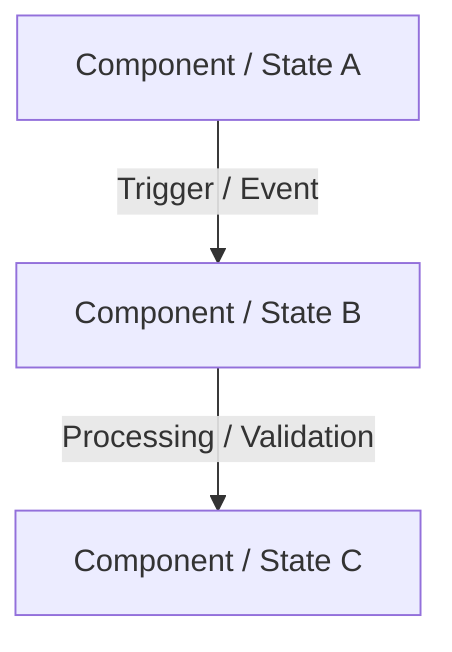

# [Topic Name]

> **Domain:** [e.g., Core Computer Science / Networking / Cybersecurity / IAM / AI-ML / DevOps]  
> **Sub-Domain:** [e.g., Operating Systems / Protocols / Cryptography / CI-CD]  
> **Difficulty Level:** [Foundational / Intermediate / Advanced]  
> **Status:** [ ] Draft | [ ] In Review | [x] Completed  

---

## 1. Topic & Definition
- **Formal Definition:** Concise, industry-standard definition.
- **Plain English / Analogy:** An intuitive mental model explaining what it is to someone new.
- **Why It Matters:** Why this mechanism exists, the problem it solved historically, and where it is applied today.

---

## 2. How It Works (Mechanism & Architecture)
- **Step-by-Step Execution:** Sequential walkthrough of the process or algorithm.
- **Visual Diagram:**



*Or ASCII Diagram:*
```text
+----------------+          Step 1: Request          +----------------+
|     Client     | --------------------------------> |     Server     |
|                | <-------------------------------- |                |
+----------------+          Step 2: Response         +----------------+
```

---

## 3. Practical Example, Commands & Code
Provide practical hands-on examples: CLI commands, code snippets, SQL queries, or network captures.

### Command Line / Tool Example
```bash
# Example syntax with flags explained
command -flag argument
```

### Code / Query Snippet
```python
# Minimal, runnable example illustrating core logic
def example_logic():
    pass
```

### Dry Run / Worked Execution
| Step | Variable / Register / State | Action / Transition | Expected Output / State Change |
| :--- | :-------------------------- | :------------------ | :----------------------------- |
| 1    | Initial                     | Setup               | Ready                          |
| 2    | Processed                   | Transform           | Result                         |

---

## 4. Key Differences & Comparisons
Highlight confusingly similar concepts with a sharp comparison table:

| Dimension / Feature | [Concept A] | [Concept B] |
| :------------------ | :---------- | :---------- |
| **Primary Purpose** | ...         | ...         |
| **OSI / Architecture Layer** | ... | ...        |
| **Speed / Overhead**| ...         | ...         |
| **Security Implication** | ...    | ...         |

---

## 5. Cybersecurity Relevance & Threat Vectors
- **Attack Surface:** How attackers exploit or abuse this concept (e.g., misconfiguration, bypass, exhaustion, injection).
- **Vulnerabilities & CVEs:** Associated weakness classes (CWE) or historical attacks.
- **Defenses & Hardening:** How engineers secure it (principle of least privilege, input validation, encryption, monitoring).

---

## 6. Interview Takeaway (What to Say & How to Answer)
### 🎙️ The 60-Second "Elevator Pitch" Answer
> *"If an interviewer asks 'Explain [Topic]', deliver this structured answer..."*

### ⚠️ Common Traps & Misconceptions
- **Trap 1:** What amateur candidates often confuse or say incorrectly.
- **Trap 2:** Edge cases interviewers love to probe.

### ❓ Follow-Up Questions Expected
1. **Q:** *Expected follow-up question?*  
   **A:** Golden response bullet points.
2. **Q:** *Edge case scenario question?*  
   **A:** Golden response bullet points.

---
*Next Topic Link:* [Next Topic Title](file:///path/to/next-file.md) | *Back to Section Index:* [Section Index](file:///path/to/section/README.md)
